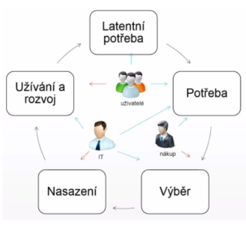
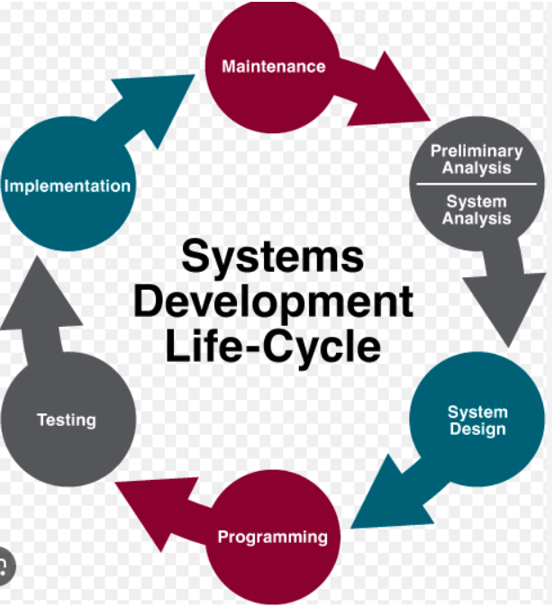
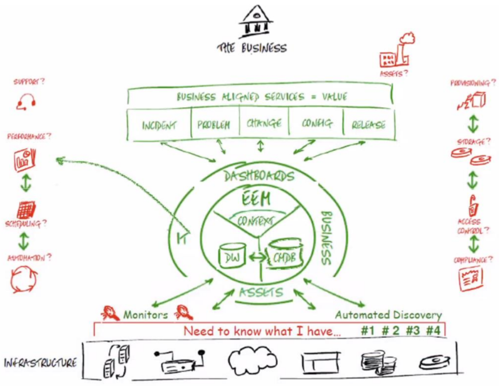
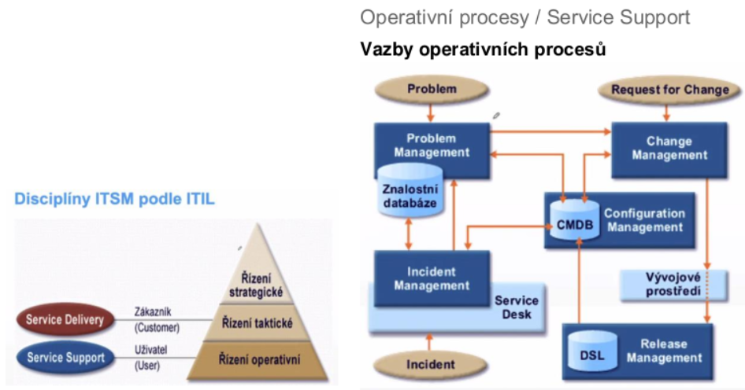
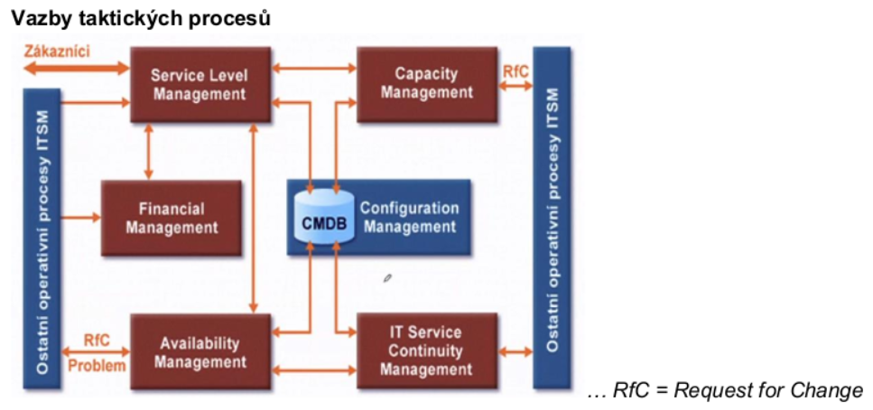

### 09 - Přehled činností při provozu sw (IS/IT) produktu. Řízení, dodávka a podpora IT služeb (ITSM), řízení změn a incidentů, související metodiky (ITIL a další). [KIV/ASWI, KIV/EITM]

- cinnosti pri provozu SW (IS/IT) produktu

  

  - zacne to latentni (skrytou) potrebou uzivatelu mit nejakou funkcionalitu
  - z toho vykrystalizuje pojmenovana potreba
  - pri vyberu se hledi na to jaky prinos bude mit konkretni reseni pro uzivatele (IT resi architekturu a integraci, technicke reseni, bezpecnost, atd)
  - management resi cenu
  - IT to pote nasadi
  - po nejake dobe -> inovacni cyklus ci trvale odebrani systemu
  - planovani IS
    - identifikace potreb
    - vnitrni vlivy (strategie firmy, fuze - muze vest ke sjednoceni vicero systemu)
    - vnejsi vlivy - legislativa (napr zavedeni EET - nutne reagovat)
    - planovani financi a zdroju (napr kde se system nasadi atd)
    - koordinace projektu - ve firme toho muze bezet spoustu a je potreba to nejak koordinovat
    - zpusob porizeni - krabicove reseni vs reseni na miru?
    - ROI (= Return on Investment) - navratnost investic
  - analyza IS
    - detailni analyza potreb, funkci, parametru - muze byt casto obtizne
    - ustanoveni realizacniho tymu, pracovni skupiny - u velkych zmen (velkych systemu) na analyze pracuje cely tym
    - identifikace omezeni - napriklad finance, cas, lide, atd.
  - vyber reseni a dodavatele (nakup)
    - poptavka, RFI (= Request For Information)
    - vyberove rizeni (muzeme chtit PoC, PoT)
  - dodavka, implementace IS
    - implementace - dny az roky
      - metodiky vyvoje SW z ASWI
    - soucinnost
    - customizace
    - integrace se stavajicimi systemy
    - migrace dat
    - QA (= quality assurance testing), testovani
    - UAT (= uzivatelske akceptacni testy)
    - zaskoleni lidi
    - predani
  - postimplementacni podpora
    - doladeni systemu (tydny az mesice)
    - L1 podpora - uzivatelska (helpdesk)
    - L2 podpora - systemova (admin)
    - L3 podpora - aplikacni (vyvojar) - zmena kodu
  - provoz a podpora
    - radove roky
    - implementace dilcich zmen
    - aktualizace, patchovani bezpecnostnich chyb a bugu
    - monitoring (vykon, spolehlivost)
    - helpdesk, servicedesk, ITIL
      - helpdesk = zameren na bug-fix
      - servicedesk = zameren i na RQI a request for new services
    - reportovani chyb
    - sledovani nakladu (cena za energii a provoz)
  - ukonceni, migrace
    - doziti
    - zamrazeni investic
    - priprava akvizice noveho systemu
    - casto opomijena faze zivotniho cyklu IS (musi byt brana v potaz uz pri navrhu aby bylo na konci jednoduche vyradit system z provozu)

  

- ITSM (= IT Service Management)
  - ITSM je pristup k IT managementu  ktery zajistuje lepsi shodu mezi IT a zakaznikem tim ze zakaznikum umoznuje
    - definovat dodavane IT polozky jako sluzby ktere jsou popsany v jazyce zakazniku a uzivatelu
    - definovat jak budou tyto sluzby dodany zakaznikovi
      - funkcionalita, dostupnost, kapacita, bezpecnost, podpora, zmenove rizeni, atd.
    - pochopit dusledky pro business pokud IT sluzba selze
    - prioritizovat IT aktivity na zaklade techto dusledku
  - je to spise disciplina nebo mnozina aktivit ktere organizace provadi za ucelem navrhu, implementace, dodani, operace a podpory IT systemu
  - ITSM neni zas tak technologicky orientovany
    - je spise orientovany na potreby zakazniku a IT sluzby pro zakazniky
  - existuje vicero ITSM frameworku => treba ITIL
    - ITSM frameworky lze take vnimat v sirsim kontextu management standardu
    - ISO 9000 je kvality management standard ktery je v podstate obecnejsi obsahlejsi variantou ISO 20000 service management standardu
      - ten byl podstatnou cast sve existence v podstate stejny jako ITIL

  

  - mame nejakou infrastrukturu, jejiz soucasti jsou IT assets (servery, uloziste, ...)
    - monitorovani
  - nad tim mame databaze
    - CMDB - configuracni management DB - jak jsou prvni (assets)
  - nad tim nejaky IT nebo business context - dashboardy atd pomoci kterych muzeme zkoumat performance, security, atd.

- ITIL (= Information Technology Infrastructure Library)
  - ITIL je rozsahly a procesne orientovany framework pro ITSM
    - implementace ITSM
  - zalozeny na best-practices z oblasti ITSM
  - v soucasnosti de-facto mezinarodnim standardem pro oblast ITSM
  - duvody zavedeni ITIL v podniku
    - chceme IT uchopit spravne aby fungovalo levne a spravne
    - standardizace IT
  - ITIL resi
    - vydefinovani procesu potrebnych pro zajisteni ITSM
    - zasady pro implementaci procesu
  - ITIL NEresi
    - konkretni podobu organizacni struktury
    - projektovou metodiku implementace ITSM
  - ITIL v2 (existuje uz asi v5)
    - ma 8 knih (kazda popisuje nejakou cast ITILu)
    1) Service Support & Service Delivery
       - jadro ITIL
       - jsou o rizeni, dodavce a podpore IT sluzeb
       - obsahuje popis 10 zakladnich procesu ITSM a funkce Service Desku
    2) ICT Infrastructure management
       - popisuje vsechny aspekty rizeni ICT infrastruktury (identifikace pozadavku, instalace, udrzba, ...)
    3) Application management
       - zahrnuje vsechny procesy zivotniho cyklu aplikace (studie proveditelnosti, vyvoj, testovani, ...)
    4) Security Management
       - proces planovani a rizeni bezpecnosti informaci a IT sluzeb
    5) Business perspective
       - urceno zejmena vedoucim pracovnikum obchdnich a provoznich useku, aby porozumeli "best practices" pro ITSM
    6) Planning to Implement Service Management
       - urcena predevsim clenum implementacnich tymu - zabyva se problematikou implementace a zlepsovani procesu ITSM v podnikovem prostredi
    7) Software Asset Management
       - procesy rizeni, kontroly a ochrany SW majetku (velmi uzce spojeny s Configuration Management a Release Management)
  - ITIL procesy

    

    - rizeni
      - strategicke: viz strategie rizeni podniku - nejvyssi management; dlouhodobe
      - takticke: middle (day-to-day) management; strednedobe
      - operativni: kratkodobe
    - operativni procesy
      - incidenty jsou nejaka selhani / spatne veci, ktere uzivatele davaji do service desku
        - napr. v podobe ticketu?
      - ten se snazime v ramci incident managementu co nejrychleji vyresit
        - vyuziva se pritom znalostni DB (napr jak se restartuji servery)
        - kdyz se incidenty prilis opakuje, tak se z nich stane problem => problem management se pak snazi zabranit tomu aby vznikly dalsi incidenty
          - tak ze se vytvori nejaky pozadavek na zmenu a zada jej do change managementu
      - vsechny managementy jsou napojeny na CMDB (= Configuration Management Database), kde jsou ulozeny konfigurace celeho IT
        - nemusi to byt jen relacni DB, ale treba Wiki page, ...
        - napojeni na DSL (= Definitive Software Library) kde jsou vsechny instalacky a binarky ze vsech releasu
          - neco jako Conan a Artifactory?
      - z pohledu ITIL je vyvojove prostredi jen black box - neresi ho podrobneji
      - Service Desk
        - "single point of contact" pro adresovani pozadavku uzivatelu (rozhrani pro uzivatele)
        - zajistuje obnovu standardni dodavky sluzby s minimalnim dopadem na zakazniky
          - plni roli 1. urovne podpory
          - koordinuje 2. a 3. uroven podpory
      - Configuration Management
        - podpora ostatnich procesu poskytovanim informaci o konfiguracnich polozkach infrastruktury a o jejich dokumentaci
        - sprava CMDB (konfiguracni DB) - info o vsech konfiguracnich polozkach ICT infrastruktury a vztazich mezi nimi
      - Incident Management
        - obnovit normalni provoz sluzby (co nejrychleji s minimalizaci dusledku vypadku sluzby na provoz)
        - zajistovat aby sluzby byly dodavany v kvalite dle SLA (= Service-level agreement)
        - snaha o co nejrychlejsi reseni - neresi PROC (to resi Problem Management)
        - incident = neplanovane presuseni IT sluzby nebo snizeni jeji kvality ci dostupnosti
      - Problem Management
        - analyzuje incidenty, snazi se nalezt pricinu a iniciuje kroky vedouci k naprave (zabranuje opakovani incidentu)
        - stara se o znalostni DB (informace o predchozich incidentech a jejich reseni)
          - informace v ni ulozene zpristupnuje specialistum podpory procesu IM a pracovnikum SD
        - => zajistuje svoji cinnosti stabilitu infrastruktury
        - problem = pricina jednoho nebo vice incidentu
      - Change Management
        - zajistuje hladkou a nakladove efektivni implementaci schvalenych zmen
        - vstup z problem managementu nebo "rozhrani" Change Request
        - odpovida za
          - rizeni odehu change requestu
          - schvalovani a planovani zmen
          - koordinaci implementace zmen
        - => zajistuje svoji cinnosti flexibilitu infrastrukutry
      - Release Management
        - zajistuje nasazeni novych verzi HW, SW do produkcniho prostredi
        - spravuje DSL (= Definitive Software Library)
          - uloziste autorizovanych verzi SW a dokumentaci (licence, release notes, binarky, ...)
        - RM a CM tvori hranici mezi produkcnim a vyvojovym prostredim

    - takticke procesy / service delivery
      - jsou o uroven vys
      - definuji vztah se zakaznikem

      

      - SLM (= Service Level Management) definuje sluzbu vuci zakaznikovi
        - kolik, co, jak, v jake kvalite
      - Financial Management
        - IT musi mit nejaky rozpocet
        - ridi kolik nas ty sluzby stoji - aby se vedelo kolik penez je potreba na provoz IT a taky jak nacenit sluzby at uz jsou zakaznici externi nebo ne
      - SLM je take napojeny na CMDB, kde jsou evidovane i samostatne poskytovane sluzby (service catalog)
      - Capacity Management
        - abychom vedeli jak jsme na tom s kapacitou, kdy nam napr dojde misto na disku -> aby k tomu nedoslo
        - dalsi priklad: otevreni nove pobocky: CM (capacity management) musi zajistit navyseni kapacity
      - Service Level Management
        - udrzovani a zlepsovani kvality IT sluzeb a vytvaret pozitivni vztah se zakazniky
        - klicovy proces celeho ITSM, protoze tvori spojovaci clanek mezi poskytovatelem a odberatelem IT sluzeb
        - vyjednavani o obsahu a uzavirani
          - Service Level Agreements (SLA)
            - dohoda o urovni poskytovanych sluzeb
            - popis poskytovane sluzby (rozsah, uroven, kvalita)
          - Operation Level Agreement (OLA)
            - dohoda o urovni provoznich sluzeb
            - dohoda mezi poskytovatelem sluzeb IT a dalsi soucasti teze organizace (zbozi, sluzby, odpovednosti)
          - Underpinning Contracts (UC)
            - dokument pravniho charakteru (SLA a OLA jsou dohody) uzavreny s externim dodavatelem
      - Capacity Management
        - zajisteni optimalni kapacity ICT infrastruktury
        - napr.: otevreme novou pobocku pro 200 lidi -> musime pro ne mit kapacitu v systemech, licence, ...
        - hledani rovnovahy mezi existujici kapacitou a porizeni dodatecne kapacity
      - Availability Management
        - zajistuje nakladove optimalni dostupknost IT sluzeb
        - stezejni aktivitou je planovani, mereni a sledovani dostupnosti IT sluzeb
        - dosupnost neda koupit...dostupnost musi byt designovana, implementovana, merena a rizena
      - IT service continuity management
        - zajisteni obnovy funkcnosti ICT infrastruktury po vaznem (rozsahlem) vypadku
        - klicove aktivity
          - zpracovani analyzy obchodnich dopadu globalniho vypadku a minimalizace rizik z nej plynoucich
          - vyvoj a implementace kontingencich planu (tj. planu obnovy klicovych systemu)
        - spolehlivost provozu - zkratky
          - HA = high availability
          - BCDC = business continuity data center - zalozni lokalita kde je mozne provizorne provozovat sluzby v pripade vypadku
          - DPR = disaster recovery plan
            - RPO = recovery point objective
              - jak vzdaleny je bod v minulosti ke kteremu se dokazeme obnovit (treba kdyz delame denni zalohy tak max o 1 den)
            - RTO = recovery time objective
              - za jak dlouho se obnovime po havarii
      - Finantial Management
        - sprava rozpoctu IT
        - nakladove efektivni sprava ICT majektu a zdroju pouzivanych pri poskytovani IT sluzeb

- alternativy k ITIL (spis souvisejici veci)
  - COBIT - mezinarodne uznavany ramec IT governance
    - operuje na vyssi urovni nez ITIL (spise na strane businessu)
  - FitSM - framework pro ITSM
  - TOGAF - framework pro EA (= Enterprise Architecture)
