### 10 - Strategické řízení firem, poslání a role IT v organizaci, tvorba strategie IT/IS. Koncepce a metody řízení IT -- Enterprise architektura (EA) a IT governance. [KIV/EITM]

- podnik
  - = ekonomicko-pravni subject
  - = zakladni jednotka ekonomiky zalozena na vyrobe produktu/poskytovani sluzeb
  - = usporadany soubor zdroju pomoci nihz podnikatel/vlastnik zhodnoceuje vlozene prostredky
- cile
  - primarni cil: zhodnoceni prostredku vlozenych vlastniky (=> zisk)
  - odvozeny cil: maximalizace hodnoty podniku
  - dilci cile: ovlivnene zajmovymi skupinami
- strategicke rizeni
  - strategie = dlouhodoby pohled/smer vyvoje podniku (koncept/abstrakce sdilena vsemi zainteresovanymi stranami)
  - strategicke rizeni = vrcholove rizeni rozvoje podniku jako celku v delsim casovem horizontu
    - proces kde se urcuji dlouhodobe cile a zamery
    - zamereni se na rozsahy jednotlive cinnosti podniku
    - hlavni smysl: vsichni zamestnanci vi jake jsou spolecne cile a chovaji se tak aby se naplnili
  - integrovany model procesu strategickeho rizeni

  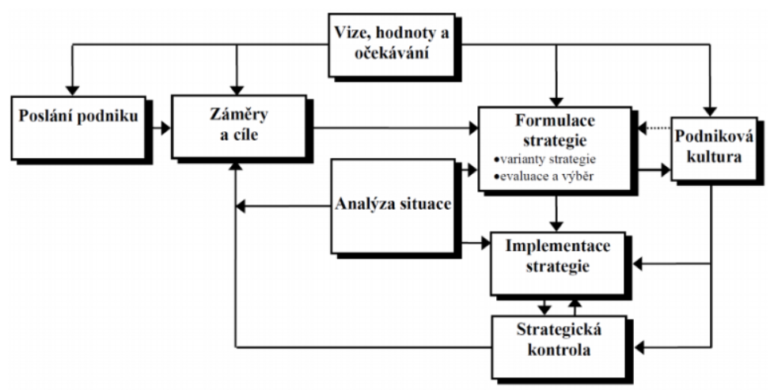

- poslani podniku
  - = "kdo jsme, co delame a kam smerujeme"
  - = vyjadreni zakladniho smyslu a ucelu existence podniku (proc byla firma zalozena?)
  - otazky ktere mohou byt pouzity pro formulaci poslani podniku:
    - kdo jsou zakaznici?
    - jake jsou nase vyrobky/sluzby?
    - na jakem trhu soutezime?
    - jake jsou nase zakladni hodnoty?
  - v obecne rovine je to vize a mise podniku
    - vize = cim by mel podnik byt (zameruje se na budoucnost)
      - napr: Tesla chce aby se lidi v budoucnu prepravovali vyhradne elektromobily
    - mise = zpusob jak se firma snazi naplnovat to, ceho chce dosahnout - jak se dostat do idealniho stavu (viz vize)
- zamery & cile
  - konkretizace vize (stanovim si urcite cile ktere mi dohromady tvori misi za ucelem naplneni vize)
  - cile
    - ceho chce podnik dosahnout (v kratkodobem i dlouhodobem horizontu)
    - operativni vymezeni zameru
    - musi byt v souladu se zamerenim podniku
    - SMART cile
      - Specific (specificky)
      - Measurable (meritelny)
      - Attainable (dosazitelny)
      - Realistic (realisticky)
      - Timely (casove vymezitelny)
      - napriklad: "do 4 let se naucim spalenky na uroven B1"
        - specificky: naucit se spalensky
        - meritelny: uroven B1
        - dosazitelny: za 4 roky se to da, asi?
        - realisticky: je to realisticky cil - muzu si zapsat kruzy spanelstiny
        - casove vymezeny: do 4 let
  - zamery
    - zahrnuji financni i nefinancni zajmy ruznych zajmovych skupin
    - umoznuji a podporuji zduvodnene kompromisy napr u protichudnych cilu
    - napriklad snizovani nakladu + zachovani dobrych vztahu se zamestanci
  - jednotlive zamery mi davaji dohromady cile? Cile mi pak davaji dohromady misi, coz je zpusob naplneni vize?

- hledani (tvorba) podnikove strategie

  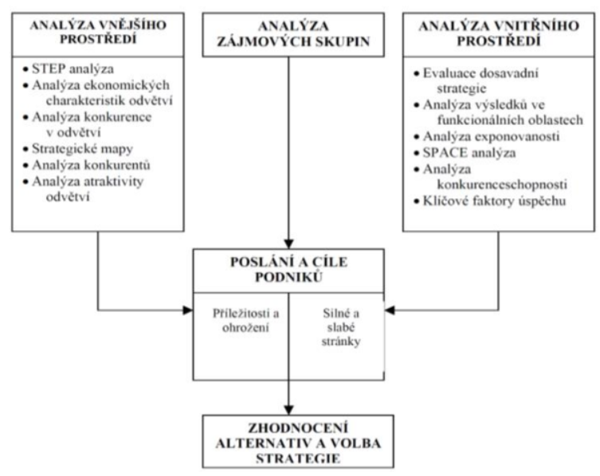

  - musim analyzovat jak vnejsi prostredi (STEP, Porterova analyza) tak i vnitrni (SWOT, analyza jednotlivych funkcionalich oblasti), plus jeste musim analyzovat zajmove skupiny
  - z toho musim udelat nejake zhodnoceni ruznych rizik a prilezitosti, tak abych mohl vhodne regulovat (upravit strategii rizeni podniku)
  - analyza vnejsiho prostredi
    - Porterova analyza peti sil
      - vychazi ze systematickeho popisu vlivu pusobicich na jednotlive podniky na trhu

      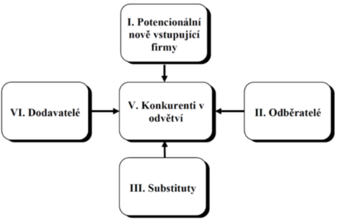

      - model je postaven na nasledujicich peti faktorech
        1) rivalita mezi konkurenty (stred diagramu)
        2) vyjednavaci sila dodavatelu
           - schopnost ovlivnit cenu a dodavane mnozstvi (napr omezeni dodavky plynu)
        3) vyjednavaci sila odberatelu
           - schopnost ovlivnit cenu a poptavane mnozstvi (napr vse koupi jedna firma protoze si to muze financne dovolit)
        4) ohrozeni ze strany novych konkurentu
           - napr OpenAI vs Google
           - Amazonizace: do urcitych odvetvi vstoupi Amazon a postupne ho cele ovladne a vytlaci ostatni firmy
        5) ohrozeni ze strany novych substitutu
           - produkt jineho typu ktery ale uspokojuje stejnou potrebu
           - napriklad kun -> auto nebo Android -> Apple

    - STEP analyza
      - zkouma ruznorode faktory ktere mohou ovlivnt danou organizaci z jejiho bezprostredniho okoli
      - to jake faktory firmu nejvice ovlivnuji vzdy zalezi na tom co firma dela, na jakem trhu se pohybuje atd.
      - Socialni (spolecenske) faktory
        - zpusob zivota lidi vcetne zivotnich hodnot
        - napriklad uroven vzdelani, pristupy k praci (Amerika vs Cina)
      - Technologicke faktory
        - souviseji s vyvojem vyrobnich prostredku ci materialu, procesu a know-how
        - napriklad objevy/vynalezy, zmeny technologii, vladni vydaje na vedu a vyzkum (viz ChatGPT)
      - Ekonomicke faktory
        - pusobeni a vliv ekonomiky
        - inflace, trend a vyvoje HDP (pouziva se k vyjadreni vykonnosti ekonomiky), nezamestnanost, uroky, atd.
      - Politicke
        - napr: stabilita vlady, regulace zahranicniho obchodu, dane, ochrana zivotniho prostredi, atd.
      - vyhodnoceni faktoru je zalozeno na zodpovezeni nasledujicich otazek
        - a) ktere z vnejsich faktoru maji vliv na podnik?
        - b) jake jsou mozne ucinky techto faktoru?
        - c) ktere z nich jsou v blizke budoucnosti nejdulezitejsi?
      - da se pouzit napr i pri expandaci firmy do jine zeme (nevime jake) -> udelame si statistiku jednotlivych faktoru (data se daji najit online); priradime vahu jednotlivym faktorum => vazenym prumerem vybereme nejlepsi zemi pro expandaci.

  - analyza vnitrniho prostredi
    - analyza vysledku v jednotlivych funkcionalnich oblastech
      - zakladni metoda
      - oblasti
        - vyroba (napr naklady a prodejni cena vyrobku, efektivita postupu)
        - finance (trendy trzeb, zisk)
        - marketing
        - uroven rizeni a lidske zdroje (kvalifikace pracovniku; fluktuace = jak moc se ve firme stridaji zamestnanci)
        - vyzkum a vyvoj (R&D = Research and Development) - cile a atmosfera podniku ve vztahu k vyzkumu, navratnost investic
    - Bostonska matice
      - = jedna se o tzv porfolio metodu
      - podstatou je hodnoceni jednotlivych produktu ve dvou dimenzich
        - a) relativni podil na trhu - pomer trzeb firmy a nejvetsiho konkurenta
        - b) mira rustu v danem odvetvi - zvysujici se trzby za jednotlive produkty

        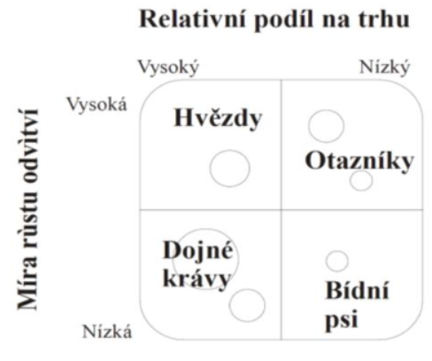

      - dojne kravy = nepotrebuji vysoke investice, jsou zakladem ziskovosti
      - hvezdy = silne v porovnani s konkurenci, ale casto potrebuji velke investice aby si udrzely pozici vuci konkurentum, maji potencial ze se z nich stanou dojne kravy
      - otazniky = je treba je nadejne podporovat aby se s nich staly hvezdy (reklama, dilci inovace), vetsinou se jedna o pocatecni bod pro zacinajici podniky
      - bidni psi = produkty jiz bez potencialu => utlumit vyrobu, stahnout z trhu (viz Yahoo vyhledavac?)
      - bezny cyklus
        - produkt zacne jako otaznik, pak se z stanou hezdou, po nejake dobe odvetvi prestane rust -> stane se dojnou kravu a na konci cyklu se z nej stane bidny pes

    - SWOT analyza
      - podstatou je identifikovat silne a slabe stranky uvnitr organizace a poznat klicove prilezitosti a hrozby ktere na organizaci pusobi zvenci
      - interni
        - tykaji se nasi firmy, nasich znalosti, naseho pristupu a naseho produktu
        - Strengths - adekvatni financni zdroje, dobra povest, lepsi reklamni kampan (nez jine firmy)
        - Weaknesses - nejasny strategicky zamer, nedokonala distribucni sit, nevyuzite kapacity, vysoke naklady
      - externi
        - tykaji se vnejsiho prostredi, pozice na trhu, konkurence, atd.
        - opportunities - vstup na novy trh, rozsirit nabidku vyrobku, rychly rust
        - threats - konkurence s nizsimi naklady, pomaly rust trhu, menici se potreby zakazniku
      - vysledkem je vymezeni pozice na trhu!!

      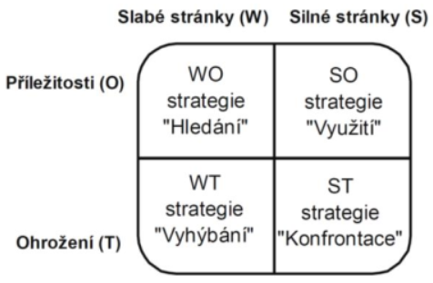

      - SO (strategie vyuziti)
        - vyuziti silnych stranek ke zhodnoceni prilezitosti objevujici se na vnejsim prostredi
        - idealni stav (v realu prakticky nedosazitelny)
      - WO (strategie hledani)
        - strategie zamerena na odstraneni slabych stranek vyuzitim prilezitosti, ktere podnik ma...
        - napriklad nabor novych kvalifikovanych sil (zamestnancu)
      - ST (strategie konfrontace)
        - tyto strategie jsou vyuzity pokud ma podnik dostatecne zdroje (vyhody) na primou konfrontaci s konkurenci
      - WT (strategie vyhybani)
        - patri mezi obranne strategie
        - zamerene na odstraneni slabych stranek a na vyhnuti se nebezpeci z venci
        - napriklad omezeni vydaju nebo vyhlaseni bankrotu
      - obecne nam tyto metody pomohou si polozit ty spravne otazky a z toho by pak mela vykristalizovat volba strategie rizeni podniku

  - analyza zajmovych skupin
    - aby se stala strategie uspesnou je nutne zajistit aby nebyla v rozporu se zajmy rozhodujicich zajmovych skupin
    - cilem je:
      - identifikovat relevantni zajmove skupiny
      - identifikovat a otestovat predpoklady o zajmovych skupinach
        - 2 typy zakladnich predpokladu -> podporujici a omezujici strategii
    - kontexty analyzy vlivu zajmovych skupin
      - kulturni kontext
        - porozumeni hodnotam, ktere spolecnost uznava
        - nazory, hodnoty a meneni lidi uvnitr podniku
        - vlivy na podnik lze rozlisit na
          - hodnoty spolecnosti (ruzne napr v Japonsku a USA)
          - organizovane skupiny (odbory, cirkev, politicke strany, atd.)
      - politicky kontext
        - posuzujeme jak ruzna ocekavani jednotlivcu nebo skupin mohou ovlivnit ucel podniku (bezny je konflikt ve vztahu k aspektum podnikove strategie)
        - priklady konfliktu zajmu
          - rust rodinneho podniku muze vest ke ztrate kontroly, bude-li nutno najmout profesionalni manazery
          - vsup na masove trhy muze vest ke snizeni kvality produkce
      - eticky kontext
        - tyka se vlivu podniku na chovani jednotlivcu a na hodnoty sdilene spolecnosti
    - zajmove skupiny: majitele, management, zamestanci, dovatele, odberatele, mistni komunita, atd.
    - vysledek analyzy zajmovych skupin

      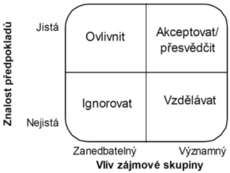

- volba strategie
  - samotna volba vysledne strategie je procesem ktery se sklada z nasledujicich korku:
    - a) generovani alternativnich strategii
      - napr pomoci brainstrormigu = technika skupinove kreativity na generovani co nejvice napadu na dane tema
      - zrejme/jasne alternativy
        - pouze rozvijeni/drobna uprava soucasne strategie (novy produkt, novy reklamni program ktery zmeni image vyrobku)
        - kreativni alternativy
          - novy pristup k reseni problemu (opusteni dosavadnich stereotypu)
    - b) porovnani a hodnoceni strategickych alternativ
      - kriteria
        - prijatelnost (plni ocekavani pro relevantni zajmove skupiny?)
        - vhodnost (je vhodna pro podminky prostredi a kterem se podnik nachazi?)
        - realizovatelnost (da se strategie realizovat z dostupnych zdroju?)
        - poskytnuti vyhody (poskytuje nam strategie nejakou konkurencni vyhodu?)
    - c) vyber alternativy jako budouci strategie
      - napriklad pomoci skupinoveho hlasovani

- organizacni struktura firmy
  - "firma je kdyz vezmete hromady lidi a penez a date je do jednoho domecku"
  - zakladni modely

    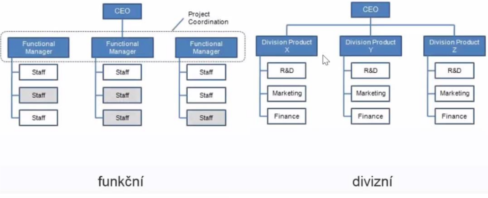

    - funkcni
      - oddeleni podle toho co delaji
      - napriklad vyroba, zakaznicka podpora, marketing, finance, HR, R&D, atd.
    - divizni
      - "zvetseni" funkcniho
      - vzniknout jakesi firmy ve firmach (divize) ktere jsou do urcite miry autonomni
      - vedeni resi spise strategicke cile a neresi operacni (dilci) zalezitosti
    - maticova (evolucni)

        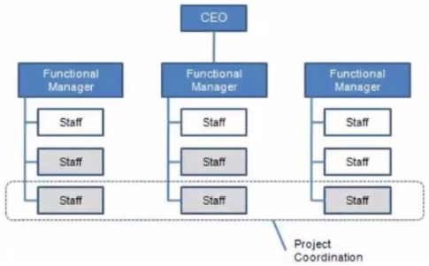

      - nekdy je potreba delat projekty napric funkcni organizacni strukturou (napr. projekt ve kterem je zapojeno jak marketingove tak financni oddeleni)
        - = cross-functional teams?
      - projektove / produktove vrstvy
        - produktova vrstva: cilem je vytvoreni co nejlepsiho produktu s co nejvetsim mnozstvim funkcionality
        - projektova vrstva: cilem je dokoncit projekt v cas, neprekrocit rozpocet a dodrzit normy a standardy
        - skupina zamestnancu se presouva mezi zakaznikami atd.
        - problem - clovek muze mit vice nez 1 sefa
        - velmi casta u velkych korporatu

- teorie vitality
  - pojednava o tom jake vlastnosti by mel podnik splnovat, tak aby se udrzel na trhu
  - kazda firma musi byt uzitecna (musi delat neco co lide opravdu potrebuji)
  - zaroven to ta firma musi delat efektivne aby mela nejaky zisk a mohla napr platit zamestance
  - musi si zajistit stabilitu napriklad tim ze bude mit vice nez jednoho odberatele ("vice noh businessu")
  - zaroven musi byt schopna reagovat na zmeny (vyhlasky, nove trendy v technologiich atd)

  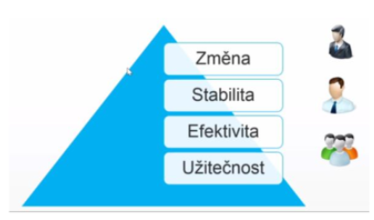

- firemni hirearchie a rozhodovani
  - procesy rozhodovani
    - majority rule (hlasovani)
    - consensus (presvedcovani, shoda nad jednim nazorem) -> nutnost dlouhych meetingu
    - hirearchicky (chain of command)
    - kazdy zpusob ma sve vyhody napriklad v rychlosti rozhodovani
  - firemni hirearchie
    - top management
    - middle management
    - operations
  - vlastnicka struktura
    - "porad do toho muze kecat ten komu to patri"
    - na vsechny vyse uvedene veci ma vliv vlastnicka struktura
    - fyzicka osoba
    - s.r.o (jednatele)
    - a.s. (spravni dozorci rada)
  - role:
    - CEO (= Chief Excecutive Officer) - reditel
      - na vrcholu ekosystemu
      - dohlizi na vykonny tym
      - obvykle je pouze jeden CEO ve firme
    - CFO (= Chief Financial Officer) - financni reditel
      - odpovedny za financni rizika spolecnosti
      - dohlizi zda tym dela chytra financni rozhodnotu
    - CIO (= Chief Information Officer)
      - odpovedny za rizeni provozu a vyvoje v oblasti informatiky v ramci firmy
      - sleduje cile organizace a zajistuje jejich podporu informacnimi a komunikacnimi technologiemi
      - provadeni nakladnych analyz ICT a rizeni bezpecnosti a rizik v oblasti IT
    - COO (= Chief Operating Officer)
      - analyza dat, segmentace zakazniku
      - mereni efektivity produkce
      - komunikacni strategie
    - CMO  (= Chief Marketing Officer)
      - obstarani a zachovani zakazniku
      - pruzkum trhu a sprava znacky
      - reklama
    - CTO (= Chief Technology Officer)
      - koordinace technickych zalezitosti vyroby, vyzkumu a vyvoje
      - realizuje technologickou strategii
    - politicke role
      - generalni reditel (xicht firmy)
      - vice prezident pro xxx
        - ma na starost danou oblast
        - spise analyza, resi smerovani businessu, poradni sbor pro exekutivu
  - dalsi terminy
    - decision maker (D.M.)
    - influencer: ten kdo neco chce (neni to D.M. ale snazi se ho ovlivnit)
    - LOB (line of business) manager: manazer v nejakem useku; snazi se naplnit nejaky plan
      - LOB je obecny pojem ktery popisuje produkty/sluzby nabizene podnikem
      - napriklad spolecnost vyrabi pevne disky => LOB muze byt "datove uloziste"
    - process owner: ten kdo je zodpovedny za dany proces
  - rizeni
    - strategicke: viz strategie rizeni podniku - nejvyssi management; dlouhodobe
    - takticke: middle (day-to-day) management; strednedobe
    - operativni: kratkodobe

- strategie rizeni IT
  - jak uchopit IT? jak jej ridit a jak jej rozvijet?
  - ITS = Information Technology Strategy
    - dlouhodoby plan ktery vychazi z business strategie (globalni strategie podniku)
    - mela by byt dostatecne flexibilni aby se dokazala prizpusobovat menicim se podminkam a cilum
      - obecne IT se silene rychle rozviji
    - cile:
      - zvysovat vykonost podniku
      - podporovat dosazeni strategickych cilu
      - ziskat pro podnik konkurencni vyhodu
    - jedna se o kontinulani proces ktery musi byt neustale vyvijen a udrzovan; zaroven se porat musi dodrzovat integrina na nekolika urovnich (podle MDIS)
      - integrace vizi
        - sjednoceni pohledu vrcholoveho vedeni na vyznam IT
      - integrace podniku s okolim
        - podpora procesu ktere presahuji hranice podniku (vztahy s partnery, menici se trh, ...)
      - integrace internich podnikovych procesu
        - zefektivneni - cas, zdroje
      - tehcnologicka integrace (HW - site, SW)
      - metodicka integrace
        - tvorba jednotne metodiky vyvoje, provozu a udrzby IS
  - co je strategie?
    - vize - proc to delame
    - strategice - co delame
    - taktika - jak to delame
    - (+ operativni rizeni)

  - stary a novy model IT

    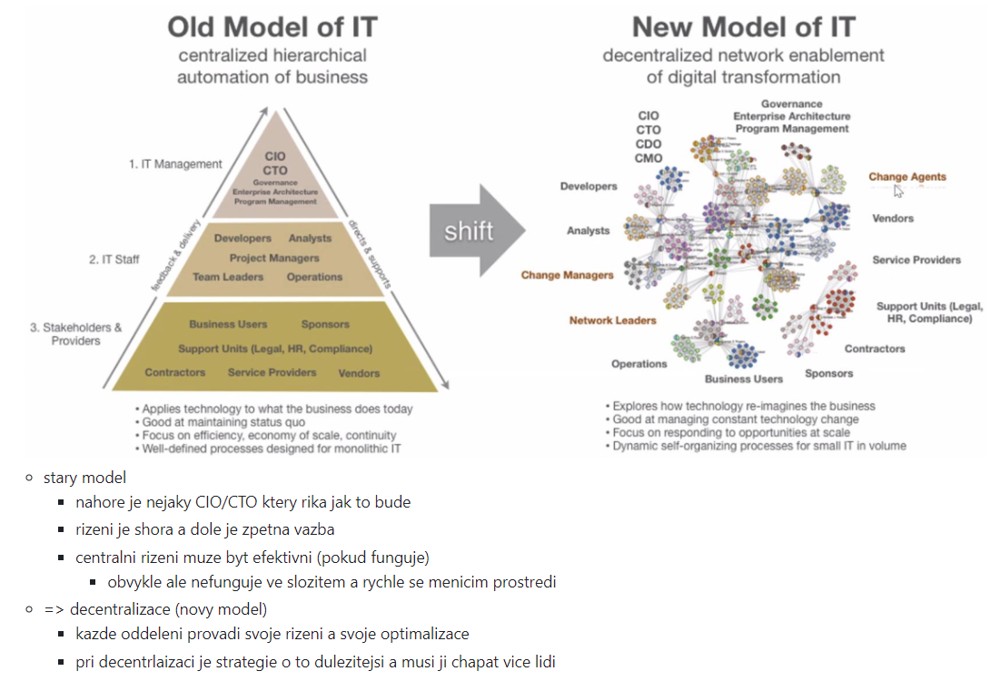

    - stary model
      - nahore je nejaky CIO/CTO ktery rika jak to bude
      - rizeni je shora a dole je zpetna vazba
      - centralni rizeni muze byt efektivni (pokud funguje)
        - obvykle ale nefunguje ve slozitem a rychle se menicim prostredi
    - novy model
      - => decentralizace
      - kazde oddeleni provadi svoje rizeni a svoje optimalizace
      - pri decentrlaizaci je strategie o to dulezitejsi a musi ji chapat vice lidi
  - business strategie
    - IT strategie by mel byt podrizena business strategii
    - business strategie proto ale musi byt dospela a IT musi vybirat nejlepsi mozne nastroje
    - zapis napr pomoci strategicke map
      - rozkresleni celeho businessu (dodavatele, odberatele + jejich perspektivy, vnitrek firmy, atd.)
    - zapis strategie IT

      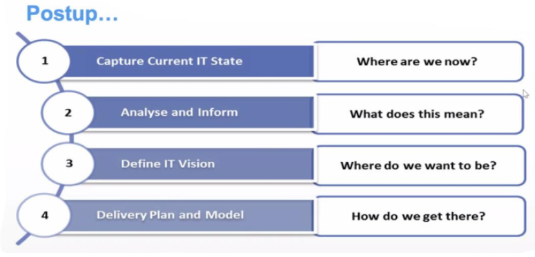

      1) zachyceni soucasneho stavu IT - "Kde jsme"
      2) Anaylza - "Co to pro nas znamena? Je to dobre nebo spatne?"
      3) Definice IT vize - "Kde chceme byt?" (realisticky cil; SMART cil?)
      4) Jak toho dosahneme (nastaveni pravidel, procesu, projekty, ...)

      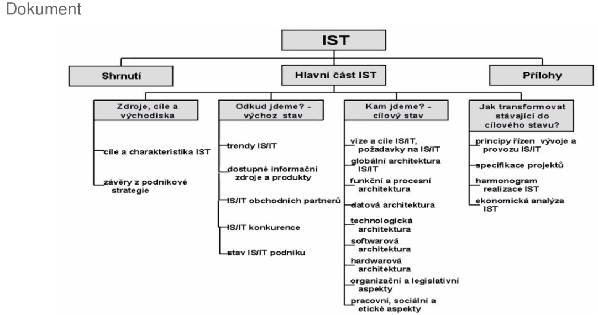

  - role IT v podniku (ruzne pohledy)
    - "motor/strojovna"
      - auto bez motoru nejede, dulezita komponenta - toto asi neni moc dobry pristup, lepsi je kdyz se na IT divame jako na takovy enabler co nam usnadnuje a zefektivnuje veci a procesy
    - poskytovatel sluzeb
      - IT poskytuje firme sluzby
    - soucast businessu
      - rozpusteni IT do jednotlivych LOB - neni samostatne IT oddeleni ale kazda jednotka ma sve IT (jako maticova struktura organizace firmy) => lide z IT jsou blize businessu
    - "kazdy sve IT"
      - bez centralniho rizeni, hrozi shadow IT

  - shadow IT
    - lidi/oddeleni pouzivaji co potrebuji bez ohledu na IT dane firmy
    - pripadne IT ve firme kde neni rizeno IT
    - pokuseni dostupnych SaaS aplikaci (Software as a service = platime si preplatne => sluzba)
    - par zamestancu zacne pouzivat Google Drive
    - uchopeni
      - hrozba: unik dat, ztrata znalosti (napr. kdyz zamestnanec odejde)
      - discovery
      - IT-manage
        - prevzit na tim kontrolu
        - zajisteni veci jako je sprava, zalohovani, security, atd.

    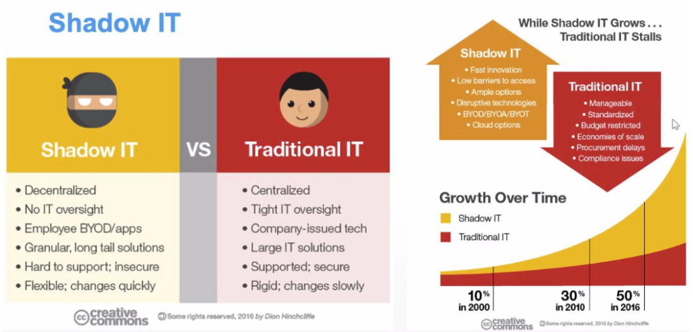

- EA (= Enterprise Architecture)
  - paralela: stavime dum (architektura, to co vetsinou delame my) vs stavime mesto (enterprise architektura)
  - muzeme postavit pekny dum, ale kdyz chybi utilities, doprava, obchody...tak to neni uplne ono
  - proto se musi rict tady bude ulice tady bude parkoviste protoze tohle se pak v ramci jednotlivych stavebnich bloku uz neresi, povazuje se to za dane
  - EA je jako urbanisticka koncepce
  - jednotlive systemy a aplikace mohou byt dobre/uzitecne/mit dobre funkce a parametry ale jde o to jak je pouzivat dohromady -> jak efektivne pouzivat data z jednoho systemu v druhem a jak je spravovat
  - EA rekne: takhle budeme delat autentizaci (treba LDAP), databaze, takhle zalohovani a pote bude snaha se drzet zvolene platformy
    - zavedeni nove platformy znamena ze budeme muset najmout lidi kteri to budou schopni spravovat
  - EA se dela hlavne ve vetsich firmach
  - EA neni IT disciplina
    - je na pomezi IT businessu a managementu
    - spis je to takovy zavazek mezi IT a businessem
  - zakladni struktura
    - EA umoznuje IT ve firme rozdelit na nejake kusy, se kterymi pote muzeme lepe pracovat (metoda rozdel a panul)
    - tyto kusy mohou byt standardizovane
    - vetsinou se podinikove IT da rozdelit na 4 zakladni vrstvy

    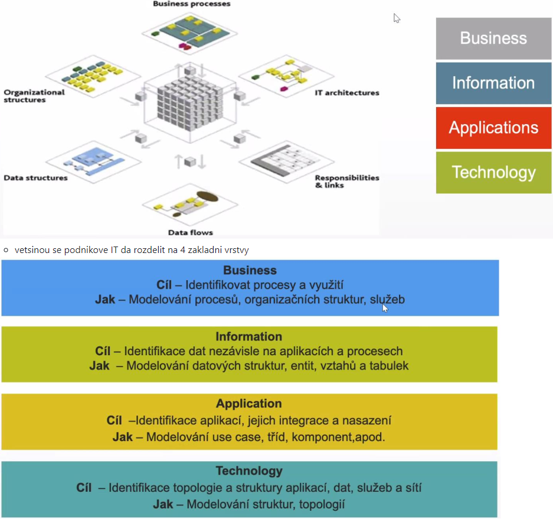

    1) business
        - identifikace a modelovani business procesu
        - organizacni struktura spolecnosti
        - silne se prolina s tradicnim managementem (je pristupny i osobam mimo IT)
    2) information
        - vytvari se datovy model spolecnosti zahrnujici definici nejdulezitejsich informacnich entit
        - neresi konkretni implementace v podobe aplikace
    3) appplication
        - aplikacni portfolio (aplikace pouzivane ve spolecnosti) jejich integrace a nasazeni
    4) technology
        - technicka stranka IT
        - site, HW

  - frameworky
    - zachman
      - jeden z prvnich frameworku ktery se zabyval komplexnim popisem cele organizace jako celku
      - diva se na organizaci z ruznych pohledu
        - 6 urovni popisu (prespektivy)
          - scope - rozsah (planner)
          - business model - business procesy a tak (owner)
          - system logic - design (designed)
          - technology model - programovaci jazyk, IO zarizeni, ... (builder)
          - As build (pohled subcontraktora)
          - funkci (actual system)
        - 6 pohledu na organizaci (kazda perpektiva odpovida na "stejne otazky")
          - data
          - funkce
          - umisteni
          - lide
          - cas
          - motivace

      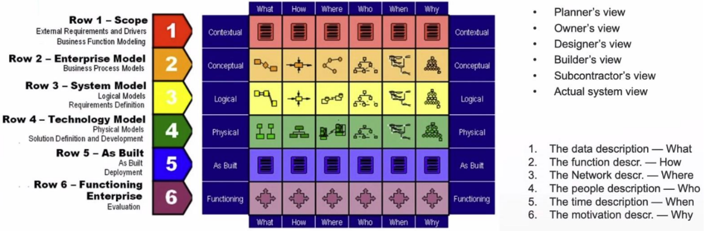

      - 6x6=36 bunek
        - = ruzne pohledy na to jak ty systemy namalovat nebo popsat
        - trochu podoba s UML ale vice pohledu
        - nektere veci v UML nenamalujeme
          - napr kde mame servery, jak vypadaji procesy, kudy tecou data, aplikace, atd.
    - dalsi frameworky
      - TOGAF
      - FEA (EA pro federalni vladu USA)

- IT governance
  - termin ktery se pouziva pro celkovy pristup k rizeni IT procesu, jehoz cilem je sladit businessovou cast a IT cast organizace
    - je to o strategickem rizeni IT
  - governance vs management
    - management
      - soustredeni se na poskytovani sluzeb a produktu IT a na ucinne rizeni a provoz IT
      - odpovednosti stredniho a nizsiho vedeni
      - stara se predevsim o: plany, beh, monitorovani
      - mezinarodne uznavany ramec: ITIL
    - governance
      - snaha definovat strategicke cile IT v souladu s potrebami a zajmy cele organizace
      - odpovednost nejvyssiho vedeni
      - stara se predevsim o: evaluaci potreb businessu, pokyny, monitoring
      - mezinarodne uznavany ramec: COBIT (Control Objectives for Information and related Technology)

  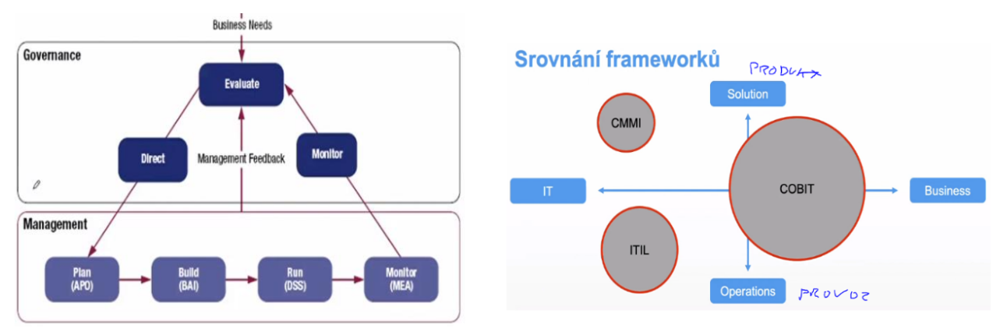

  - COBIT (= Control Objectives for Information and related Technology)
    - je procesne orientovany - snazi se definovat co v tom IT delame - s vazbou na IT zdroje, pozadavky businessu
    - zavadi metriky
    - umoznuje hodnoceni zralosti procesu ("takhle se to dela zakladne; takhle se to dela pokrocile")
    - domeny
      - celkem 4 domeny!!
        - plan and organize
        - acquire and implement
        - service and support
        - evaluate
      - domeny vyjmenovavaji procesy co vse mame ridit - podobne jako ITIL (ale je jich mnohem vic)
      - ke kazdemu procesu rika jake jsou IT cile, ke kazdemu cili rika jake metriky puzit pro hodnoceni stavu
    - COBIT je rozsahla komplikovana vec, ale ve velkych firmat nic moc jineho nezbyva nez to delat podle neceho takoveho..nejak se ty veci musi ridit a je lepsi to delat standardizovane podle znameho frameworku
    - BSC (= Balanced Scorecards)
      - = vyrovnany prehled vysledku
      - management zalozeny na metrikach, ktery se snazi prosazovat strategicke cile
    - dimenze planovani (metriky)
      - zakaznik: "jak jsme na tom v ocich zakaznika?"
      - finance - financni uspech pdniku
      - procesy - "ktere procesy je treba zlepsit, abcyhom uspokojili zakazniky a akcionare?"
      - uceni se a rust - spokojenost zamestnancu, jejich vzdelavani a rozvijeni dovednosti
    - cyklus
      - co budu merit
      - volba referencnich hodnot
      - korektivni zasahy
    - rika:
      - jsou tady nejake indikatory ktere muzeme merit a podle nich tu firmu muzeme ridit - a meli bychom je ridit vyrovnane - nemuzeme se zamerit jen na finanancni ukazatel, protoze se napr muze zvysovat nespokojenost zakazniku, ktera se po case objevi...ale zase spokojenost zakazniku samotna nam nic nevydela => proto balancovani
