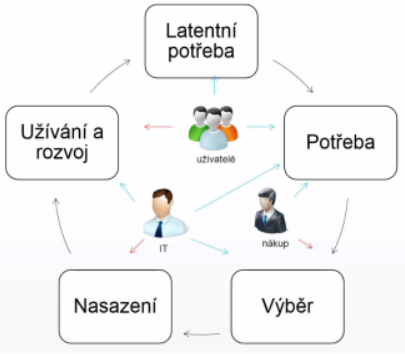
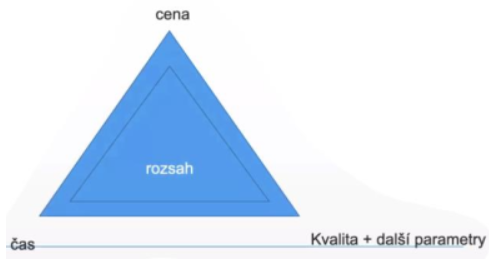

### 11 - Proces akvizice IS/IT systému. Výběrové řízení, poptávka a nabídka, výběr a nákup řešení, studie proveditelnosti, PoC, PoT, poptávkové řízení (RFI, RFP, RFQ).[KIV/EITM]

- proces akvizice IS/IT systemu
  - akvizice = ziskani, porizeni

  

  - zacne to latentni (skrytou) potrebou uzivatelu mit nejakou funkcionalitu
  - z toho vykrystalizuje pojmenovana potreba
  - pri vyberu se hledi na to jaky prinos bude mit konkretni reseni pro uzivatele (IT resi architekturu a integraci, technicke reseni, bezpecnost, atd)
  - management resi cenu
  - IT to pote nasadi
  - po nejake dobe -> inovacni cyklus ci trvale odebrani systemu
  - planovani IS
    - identifikace potreb
    - vnitrni vlivy (strategie firmy, fuze - muze vest ke sjednoceni vicero systemu)
    - vnejsi vlivy - legislativa (napr zavedeni EET - nutne reagovat)
    - planovani financi a zdroju (napr kde se system nasadi atd)
    - koordinace projektu - ve firme toho muze bezet spoustu a je potreba to nejak koordinovat
    - zpusob porizeni - krabicove reseni vs reseni na miru?
  - analyza IS
    - detailni analyza potreb, funkci, parametru - muze byt casto obtizne
    - ustanoveni realizacniho tymu, pracovni skupiny - u velkych zmen (velkych systemu) na analyze pracuje cely tym
    - identifikace omezeni - napriklad finance, cas, lide, atd.
  - vyber reseni a dodavatele (nakup)
    - poptavka, muze byt i RFI (= Request For Information)
    - vyberove rizeni
  - dodavka, implementace IS
    - implementace - dny az roky
    - soucinnost
    - customizace
    - integrace se stavajicimi systemy
    - migrace dat
    - QA (= quality assurance testing), testovani
    - UAT (= uzivatelske akceptacni testy)
    - zaskoleni lidi
    - predani
  - postimplementacni podpora
    - doladeni systemu (tydny az mesice)
    - L1 podpora - uzivatelska (helpdesk)
    - L2 podpora - systemova (admin)
    - L3 podpora - aplikacni (vyvojar) - zmena kodu
  - provoz a podpora
    - radove roky
    - implementace dilcich zmen
    - aktualizace, patchovani bezpecnostnich chyb a bugu
    - monitoring (vykon, spolehlivost)
    - helpdesk, servicedesk, ITIL
      - helpdesk = zameren na bug-fix
      - servicedesk = zameren i na RQI a request for new services
    - reportovani chyb
    - sledovani nakladu (cena za energii a provoz)
  - ukonceni, migrace
    - doziti
    - zamrazeni investic
    - priprava akvizice noveho systemu
    - casto opomijena faze zivotniho cyklu IS (musi byt brana v potaz uz pri navrhu aby bylo na konci jednoduche vyradit system z provozu)

- obchodni parametry dodavky
  - kdyz neco porizujeme tak nas zajimaji 4 parametry
    - cena
      - porizovaci
      - provozni
      - celkove (TCO = Total cost of ownership), navratnost investic (ROI = Return on Investment)
    - velikost
      - rozsah (scope)
      - slozitost
    - cas
    - kvalita + dalsi parametry (napr vhodnost)

  

  - parametry jsou provazane => zlepseni jednoho parametru obvykle znamena ustupek jinde (trade-off)

- studie proveditelnosti
  - chceme zjisit jaka jsou moznosti reseni pri porizovani IS
  - obsahuje
    - metadata (historie uprav, zkratky, klicova slova, obsah, ...)
    - kontaktni udaje (zadavatel projektu, zpracovatel studie)
    - uvod / executive summary
      - => jasne se z toho pochopi o cem studie je a JAK DOPADNE
    - soucasny stav
      - k cemu, jak a kde se to pouziva
      - jaka je architektura
      - jake jsou systemove naroky
      - existuji nejaka API?
    - problem (= pozadavky)
    - analyza - mozne zpusoby reseni; popis jednotlivych variant
      - funkcionalita, technologie, architektura
      - SWOT
      - analyza rizik (+ jak jim predejit; mitigace)
        - riziko = { ppst, dopad }
        - mitigace
          - ignorovat (kdyz je mala ppst)
          - prijmout (kdyz nastane tak tomu budeme nejak celit -> pripraveny protokol jak)
          - protiopatreni (napr hasici system v serverovne)
          - delegovat (napr pojisteni, danovy poradce zodpovedny za chyby, atd.)
      - odhad lidskych zdroju, casu, financni odhad, harmonogram (hruby plat projektu)
    - zaver
    - muze take obahovat zkousky, testy nebo prototypy (PoC, PoT)

- RFI (= Request For Information)
  - "kdyz chceme neco po trhu"
  - "mame problem a hledame reseni"
  - jeste uplne nevime co chceme
  - resime nejaky problem => oslovime par firem a firmy vy nam reknete jake produkty v teto oblasti mate, jake s nimi mate zkusenosti + reference
  - prvni faze RFP (= Request For Proposal (poptavka))
  - odpovedi mohou mit ruzny format
    - studie proveditelnosti
    - case study = studie jednoho nebo vice pripadu za ucelem aplikace ziskanych poznatku
      - napr pouziti MongoDB pro high-performance aplikace
  - obsah
    - zadavatel
    - problem
    - ramcove pozadavky, omezeni
    - cenova predstava (pouze orientacni)
    - casova predstava (harmonogram)
    - kriteria vyberu
    - kriteria na uchazece (kvalifikace + reference)
    - struktura odpovedi

- RFP (= Request For Proposal (poptavka))
  - zadavatel chce realizovat nakup
  - obsah
    - metadata (historie uprav, zkratky, klicova slova, obsah, ...)
    - zadavatel + kontakt pro dotazy
    - predmet poptavky (muze vychazet ze studie proveditelnosti)
      - problem
      - preferovane reseni (pokud existuje)
      - ramcove pozadavky, omezeni
      - predpokladany casovy rozsah
      - cenova predstava
    - doba a misto plneni
    - platebni podminky
    - misto, zpusob a termin doruceni nabidek
    - termin otevreni obalek a zpusob
    - KRITERIA HODNOCENI NABIDEK
    - riteria na uchazece - kvalifikacni pozadavky + reference
    - povinnosti - dodavatel, zadavatel
    - struktura odpovedi (aby je slo lepe porovnavat, nejlepe treba sablona)

- RFQ (= Request For Quotation (nabidka))
  - odpovd na poptavku
  - obsah
    - metadata
    - zakladni informace o projektu
      - zadavatel
      - dodavatel
      - projekt - predmet nabidky
    - executive summary - shrnuti nabidky
      - strucne vysvetleni toho jako to planujeme udlat, za kolik, atd.
    - popis reseni
    - diskuze splneni pozadavku zadavatele
      - prokazani kvalifikace
      - obraty
      - certifikace
      - reference
    - navrhovany harmonogram realizace
    - cenova nabidka
    - prilohy
      - navrh smlouvy o dilo
      - cestne prohlaseni - ze jsme se seznamili s pozadavky, udaje jsou pravdive, splnujeme pozadavky, ...
      - vypis z trestniho rejstriku
      - vypis z obchodniho rejstriku
      - reference na predchozi projekty (zadavatel + kontakt)

- obchodni dokumenty
  - certifikace
    - statni normalizacni certifikace - v IT moc nejsou
    - oborove certifikace (nezavisla organizace) - napr ISO
    - certifikovane reseni (vendorem)
      - napr. vlaky a Siemens
  - reference
    - dokald toho ze neco umime
    - davaji se do priloh
    - zdroje - verohodne a aktualni!
    - typy zdroju
      - slepe ("vyznamny telekomunikacni operator v CR")
      - zakaznicka (vyjmenovani zakaznik - "ABC s.r.o")
    - zakaznici to berou casto jako marketing (zejmena pokud se implementovalo neco zajimaveho nebo revolucniho)
  - case study
    - muze byt forma zpracovani reference - uvadi jak jsme uspesne implementovali nejake reseni pro firmu xy
    - marketingovy material

- hodnoceni nabidek
  - vhodny je metodicky postup -> dopredu vime jak budeme postupovat
  - kriteria - napr financni, vykonove, atd => vypocet celkoveho hodnoceni
    - soucet bodu, vahy, vzorce
  - tvrda a mekka kriteria
    - tvrda = cena, kvalita vyjadrena poctem vadnych kusu, ...
    - mekka = ergonomie, umelecky dojem => obecne nejlze exaktne merit

- PoT (= Proof of Technology)
  - demonstrujeme funkcnost reseni s generickymi (predgenerovanymi) daty
  - technlogicke nebo produktove DEMO
  - ukazka funkcnosti (kompletniho) reseni
  - overeni pro dane prostredi
    - technicke: OS, integreace
    - trzni: jazyk, velikost zakaznika
  - obvykle zdarma - dodavatel ma nejake demo se kterym obchazi zakazniky
  - trvani: hodiny az dny

- PoC (= Proof of Concept)
  - demonstruje funkcnost reseni uz s daty konkretniho zakaznika
  - overeni vhodnosti reseni pro konkretniho zakaznika
  - overeni predpokladu (TOC = total cost of ownership a ROI = return on investment)
  - identifikace problemovych mist a rizik implementacniho projektu
  - zjisteni odhadu pracnosti a slozitosti
  - upresneni pozadavku zakaznika
  - obvykle placene
  - trvani: dny az tydny

- hlavni rozdil mezi PoT a PoC
  - PoC - zamereny vice na business (libi se zakaznikovi, plni jeho potreby?)
  - PoT - zamereny na technologie (funguje to technologicky?)

- zakon o verejnych zakazkach
  - = porizovani IT z verejnych penez
  - upravuje postupy pri zadavani VZ (= verejna zakazka) -> soutez o navrh
  - duraz je kladen na transparentnost - veskere dokumenty jsou verejne, vcetne smlouvy s viteznym uchazecem
  - zakaz diskriminace
  - zadavetele, kteri se musi ridit zakonem o VZ
    - ti co utraceji verejne penize - CR, CNB, statni prispevkove organizace, kraje, obce, ...
    - CENTRALNI ZADAVATEL - zajistuji vyberove rizeni pro mensi organizace jako skoly
  - rozsah
    - maleho rozdahu - do 2 milionu pro sluzby nebo do 6 milionu pro stavby
      - nemusi se provaded zadavaci rizeni ale porad plati transparentnost, rovnost a zakaz diskriminace
    - podlimitni
    - nadlimitni - radove stovky milionu
      - vyznamna zakazka
        - nad 50 milionu - schvaluje zastupitelstvo samospravy
        - nad 300 milionu - schvaluje vlada
    - druhy rizeni (podle rozsahu zakazky)
      - zjednodusenne podlimitni rizeni
      - otevrene - muze se prihlasit kdokoliv
      - uzsi rizeni - jen osloveni uchazeci
      - jednaci rizeni bez uverjneni - kdyz se vi ze je z povahy veci jen jeden uchazec
        - -> timto zpusobem se jich provadi nejvice

- zjednodusenne podlimitni rizeni
  - zadavatel nesmi komunikovat s pontencialnimi dodavateli -> jen zverejni vyzvu
  - predpoklady
    - zakladni kvalifikacni predpoklady
      - nebyl odsouzen
      - neni v likvidaci
      - nema danove nedoplatky
    - profesni kvalifikacni predpoklady
      - vypis z obchodniho rejstriku
      - doklad o odborne zpusobilosti (zivnostensky list)
    - ekonomicke & financni kvalifikacni pozadavky
      - pojistna smlouva (ze kdyz neco rozbijou tak to uhradi?)
      - udaj o celkovem obraru
    - technicke kvalifikacni pozadavky
      - reference
      - nekdy muze stacit pouze cestne prohlaseni dodavatele (potvrzeni odberatelu ze s dodavateleme maji dobrou zkusenost muze byt narocne)
      - popis technickeho vybaveni a techniku (ze na to mame lidi a techniku, ze mame PC a ne jen nejake tamagotchi)
  - hodnotici kriteria
    - ekonomicka vyhodnost nabidky (nejnizsi nabidkova cena nebo celkove zivotni naklady = TCO)
    - dalsi dilci kriteria s relevantni vahou
    - postup vypoctu je UVEDEN V POPTAVCE vcetne hodnoticich kriterii
  - doruceni nabidky, otevirani obalek
    - zalepena obalka s napisem "VEŘEJNÁ ZAKÁZKA, NEOTVÍRAT"
    - otevreni pred komisi
      - verejne => moznost ucasti dodavatelu
      - zapis o podanich nabidkach a cenach
