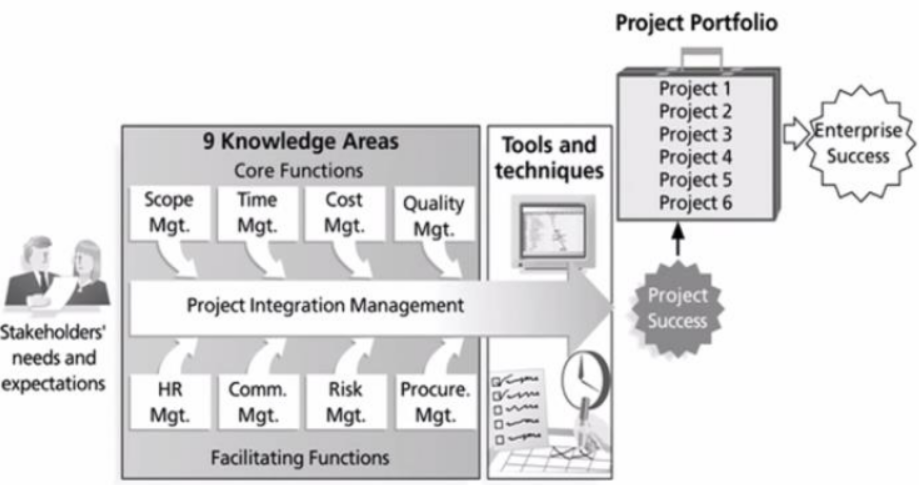
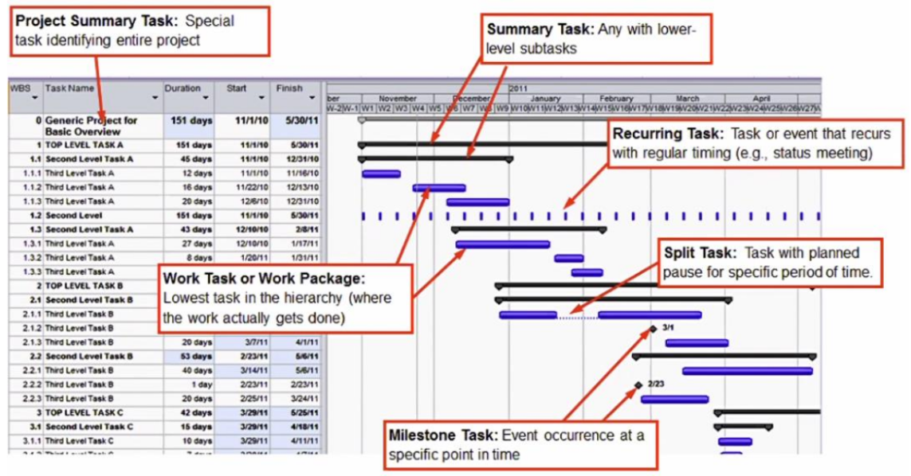
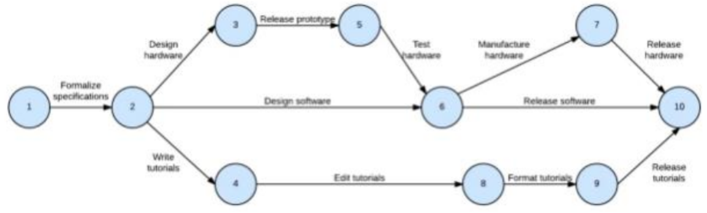
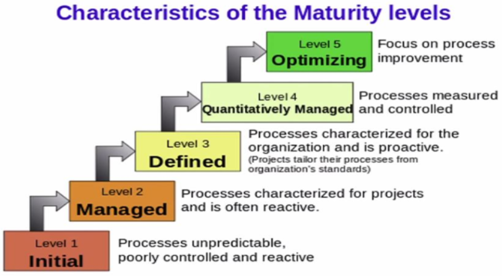
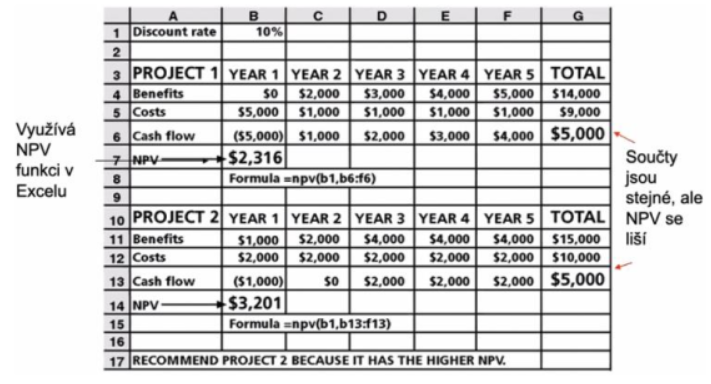
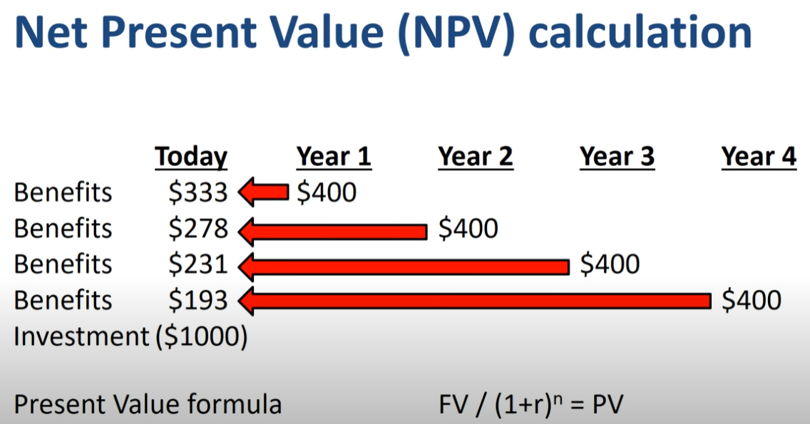
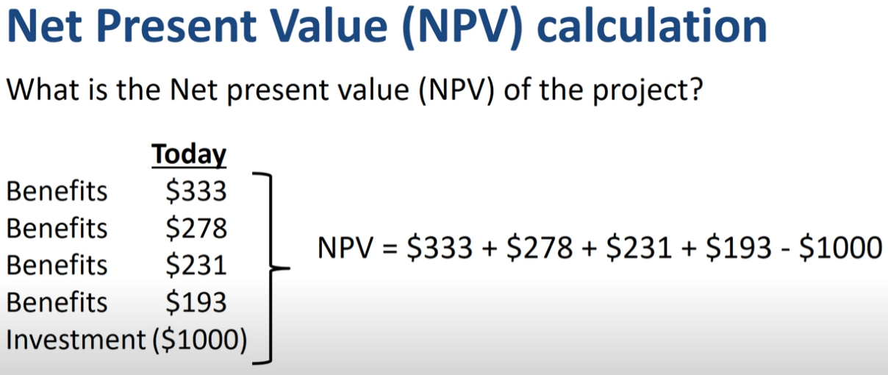
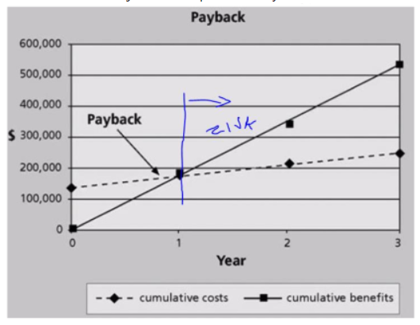
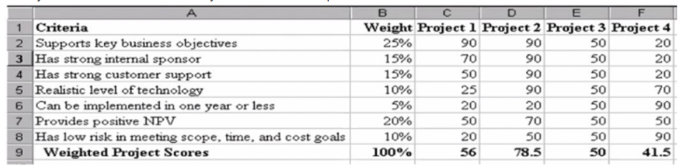

### 12 - Projektové a multiprojektové řízení, projektová kancelář, metody hodnocení projektů, PMBOK. [KIV/EITM, (KIV/ASWI)]

- projektove rizeni
  - projekt
    - docasne usili podstoupene s cilem vytvorit unikatni produkt, sluzbu nebo vysledek
    - casove, nakladove a zdrojove omezeny proces koordinovanych cinnosti
    - projektovy trojuhelnik: cas, naklady (cena), kvalita
      - dve strany trojuhelnika urcuji tu 3. (obsah trojuhelnik = rozsah)
  - projektovy management
    - proces ve kterem se vyuzivaji zdroje k realizaci projektu
    - jedna se o zpusob planovani a realizace aktivit, tak aby bylo dosazeno nadefinovanych cilu
  - proces vs projekt
    - proces = znama OPAKOVANA cinnost (zname postup i reseni)
    - projekt = unikatni, prvek neznama, nezname reseni/postup jak dousahnout cile
  - artefakt
    - entita, ktera vznikla behem projektoveho rizeni
      - dokumenty, grafy, kod, meziprodukty, dema, zapisy ze schuzek, ...
    - typy artefaktu jsou typicky definovane zvolenou metodikou (RUP, Scrum, ...) a take v jake fazi projektu se nachazime
  - milnik (milestone)
    - pevne stanovena mista v planu projektu, ukazuji projektovy pokrok
    - vetsinou po dokonceni faze projektu
  - faze projektu a jejich artefakty
    - faze zahajeni
      - vize projektu (ucel a duvod projektu z hlediska zainteresovanych osob = stakeholderu)
      - seznam rizik
      - klicove pozadavky (jen ty hlavni; ne do detailu)
      - plan projektu, komunikacni plan, plan rizeni, plan rizeni zmen
      - milnik: LCO (= Lifecycle Objectives)
    - faze planovani
      - specifikace pozadavku
      - popis architektury a infrastruktury
      - milnik: LCA (= Lifecycle Architecture)
    - faze realizace/implementace
      - plan iterace
      - vyvojove artefakty (dokumentace, UML, kod, ..)
      - beta verze
      - monitoring (burndown chart, velocity, ...)
      - milnik: IOC (= Initial Operational Capability)
    - faze ukonceni
      - plan nasazeni
      - predavaci / akceptacni / testovaci protokoly
      - release produktu
      - milnik: GA, REL (= Genaral Availability / Product release)

  - zivotni cyklus projektu
    - prediktivni (plan od zacatku)
      - vodopad - jasne definovana linearni faze
      - obtizne zmeny
      - vetsinou u smluv o dilo (pevne dany cas a rozsah)
    - adaptivni (mame casove omezene iterace -> ridime rozsah)
      - iterace zahrnuje maly zivotni cyklus jehoz dulezitou casti je i planovani dalsich iteraci
      - spiralove modely, RUP, agilni metodiky (SCRUM)

  - kriticke faktory uspechu
    - podpora vedeni - top management commitment
      - zajisti potrebne zdroje, schvaleni unikatnich potreb
      - zajisteni soucinnosti lidi z cele organizace
    - zkuseny PM (= project manager)
    - jasne cile
    - minimalizace rozsahu (viz rizeni rozsahu)
    - standardni prostredi
    - formalni metodika
    - spolehlive odhady
    - ZAPOJENI UZIVATELU!!
    - DOBRA KOMUNIKACE!

  - faktory neuspechu
    - nerealisticke terminy (prilis optimismu)
    - menici se pozadavky (=> proto zavadime agilni metodiky)
    - malo zdroju
    - rizika (predvidatelna i nepredvidatelna)
    - spatne projektove rizeni, komunikace, rizeni zmen
    - technicke potize

  - role projektoveho managera
    - pozadavky na PM
      - organizacni dovednosti
      - orientace v oblasti a musi v ni mit kompetenci
      - znat standardy, predpisy, atd.
      - umet pracovat s lidmi, vest lidi, motivovat lidi
    - cinnosti PM
      - definovat rozsah + stakeholdery
      - vytvorit detailni seznam ukolu (WBS = Work breakdown structure)
      - odhadovani casu
      - planovani prace
      - vyhodnoceni pozadavku a rizik
      - zajisteni potrebnych zdroju
      - rizeni zmen
  
  - metodiky rizeni projektu
    - metodika
      - zpusob rizeni projektu (postup?)
      - cilem metodiky je zvysit ppst uspechu projektu a snizit riziko ze bude spatne rizen!!
      - "vim, co mam delat" + "delam to co mam delat" + "umim to odlozit"
    - slozeni metodiky
      - principy-koncepty
      - procesy
      - praktiky
      - role
      - artefakty
      - nastroje
    - priklady
      - waterfall
      - iterativni (RUP)
      - agilni (rizeni riziky a pozadavky zakaznika)
      - lean (LSD = lean sw development => snazi se identifikovat a eliminovat zdroje plytvani v prubehu celeho vyvojoveho procesu)
      - (agilni metodiky jsou jedodussi - maji pouze malo pravidel)

- PMBOK
  - = souhrn znalosti o tom jak delat projekty
  - = Project Management Body Of Knowledge
  - mezinarodne uznavany standard rizeni projektu
  - zakladem jsou rozpoznatelne znalostni oblasti
    - sada pojmu, poznatku, procesu, technik, ktere tvori oblast projektoveho rizeni

  

  - PMBOK definuje 9 oblasti rizeni projektu
    1) rizeni rozsahu projektu
        - co se ma/nema udelat a jak se to ma udelat
        - prostrednictvim pozadavku
        - MoSCoW
          - M = must have
          - S = should have
          - C = could have
          - W = won't have
        - priorita (1-3 urovne)
        - typy
          - funkci
          - mimo funkcni (skalovatelnost, pouzity typ DB, ...)
          - business
          - legislativni
          - systemove
          - pozadavky na zmeny (pridani, modifikace, odstraneni, ...)
        - WBS = Work Breakdown Structure
          - detailni rozklad pracovnich ukolu do hirearchie
          - 1-6 urovni
          - polozky v prvni urovni se navyvaji Work packages
        - zmenove rizeni
          - proces jak menit za pochodu pozadavky a tedy rozsah projektu

    2) rizeni casu projektu
        - proces zahrnuje
          - definovani aktivit - co je treba vykonat k dosazeni cile
            - aktivita (task / ukol / cinnost) je nejaka atomicka jednotka prace
            - ma nejake odhadovane trvani, potrebne zdroje (to ve WBS nebyva)
          - sestaveni planu - na zaklade nezavislosti aktivit, zdroju a trvani
          - rizeni planu - dohled a rizeni zmen v projektovem planu
        - usporadani aktivit tak aby to daval smysl - PDM diagramy, PERT diagramy, gant diagramy, kriticka cesta, ...
        - Precedence Diagram Method (PDM)
          - aktivity jsou reprezentovany boxy, sipky znaci zavislosti mezi nimi
          - umoznuje vypocet kriticke cesty
        - Ganttuv diagram (oblibenejsi)
          - pri vetsim poctu aktivit je prehlednejsi nez PDM

          

        - PERT (Program Evaluation and Review Technique)
          - kruhy spojene sipkami
          - pouziva se k rizeni slozitych akci majici nahodnou povahu
            - doba trvani akce se chape jako nahodna velicina
          - je to zobecneni kriticke cesty
            - nejkratsi doba projektu ktera je realna => kdykoliv prodlouzim task ktery je na kriticke ceste dojde k prodlouzeni celeho projektu

          

    3) rizeni nakladu projektu
        - naklad je zdroj ktery vydavame (obetujeme) za ucelem doszeni nejakeho vysledku nebo ziskani neceho na oplatku
        - obvykle v peneznich jednotkach (muze byt i cas)
        - zajistuje ze je projekt dokoncen v ramci rozpoctu
        - zpracovava rozpocet projektu vychazejiciho z podrobneho rozpisu praci, odhadu, nakladu na zdroje a to v celem zivotnim cyklu projektu
        - slovnik
          - prime - lze je snadno spojit s projektem, aktivitami pri jeho realizaci
          - neprime - neprimo spojene s projektem ale souvisi s jeho realizaci
          - sunk cost - naklady za zruseni celeho projektu - pokud bychom se rozhodli projekt zrusit a uz v nem nepokracovat

    4) rizeni lidskych zdroju projektu
        - cilem je ziskani co nejvetsiho uzitku od zapojenych lidi
        - proces zahrnuje
          - planovani - jake role a dovednosti budou potreba (DB specialista, konzultant, tester, ...)
          - nabor - ziskani vhodnych lidi uvnitr nebo vne organizace
          - rozvoj dovednosti - individualnich a skupinovych
          - rizeni projektoveho tymu - sledovani vyvoje a motivace clenu, zpetna vazba, reseni konfliktu, koordinace zmen

    5) rizeni kvality projektu
        - kvalita = souhrn prvku, ktere prispivaji k dosazeni pozadavku nebo ocekavanych potreb (napr splnuji normu)
        - proces zahrnuje
          - planovani kvality
            - identifikace relevantnich parametru produktu/sluzby a jak jich dosahnout (funkcnost, spolehlivost, udrzovatelnost)
          - zajisteni kvality (QA = quality assurance)
            - zahrnuje aktivity ktere souviseji s dosazenim a urdzenim nastavene urovne kvality (napr ruzne typy testovani)
          - rizeni kvality
            - monitorovani specifickych vystupu projektu a hledani cest, jak celkovou kvalitu zlepsit

    6) rizeni rizik projektu
        - identifikace rizik a jejich ppst + analyza (ohodnoceni) jejich dopadu
        - mitigace
          - ignorovat
          - prijmout (az nastane tak to budu resit -> je treba mit dopredu pripraveny plan jak)
          - protiopatreni
          - delegovat (viz studie proveditelnosti - napr. pojisteni)

    7) rizeni komunikace projektu
        - definice komunikacnich toku mezi vsemi zucastnenymi stranami
        - funguje na zaklade organizacnich struktur
        - u vetsich projektu se dela RAM (= Responsibility Assignment Matrix)
        - tymy x aktivity z WBS, kdo je zodpovedny a kdo pracuje/implementuje

    8) rizeni obstaravani projektu
        - procesy potrebne k nakupu ci ziskani produktu, sluzeb nebo vysledku potrebnych od subdodavatelu
        - procesy
          - priprava a uzavirani smluv
          - vyberove rizeni a vyjednani smluvnich podminek
          - administrace smluv vcetne monitoringu a dokumentace zpusobu zajisteni dodavky, reseni zmenovych pozadavku

    9) rizeni integrace
        - rizeni 1-8 dohromady
        - metodiky a techniky spojene s planovanim a realizaci projektu se zamerenim na provazanost jednotlivych procesu
        - dobry PM
          - musi koordinovat vsechny znalostni oblasti napric celym zivotnim cyklem projektu
          - musi videt big picture!

- modely vyspelosti projektoveho rizeni
  - CMMI (= Capability Maturity Model Integration)
    - model kvality organizace prace urceny pro vyvojove tymy
    - model ma 5 urovni zralosti a prostrednictvim auditu se hodnoti na jake urovni kvalita tymu je

    

    - initial - Ad-hoc procesy (neprediktovane reaktivni)
    - managed - projekty jsou planovane, monitorovane
    - defined - proaktivni, pouziti standardnich postupu
    - quantitatively managed - sbiraji se namerena staticka data a na jejich zaklade se rozhoduje
    - optimizing - stabilni a flexibilni, zamereni na vylepseni

- multiprojektove rizeni
  - PPM (= Project Portfolio Management)
    - = vice projketove rizeni
  - kdyz ma firma projektu vic, je potreba to trochu standardizovat (stejny styl rizeni, procesy, nastroje, ...) aby bylo mozne napriklad presouvat lidi tam kde je to prave potreba, dalo se na to dohlizet, snizily se naklady, atd.
  - rizeni paralelne probihajicich projektu ktere sdili stejnou zakladnu zdroju
  - hlavni ukoly
    - dosahnuti uspokojiveho plneny prubeznych cilu u vsech probihajicich projektu
    - optimalizace vyuziti zdroju
    - prioritizovat projekty
    - sjednotit rizeni, procey, nastroje
  - projektove metriky
    - cas
    - cena
    - rozsah - pocet naplanovanych / dokoncenych ukolu
    - slozitost - pocet funkcionalit
  - PMO (= Project Management Office)
    - = projektova kancelar
    - skupina lidi nebo samostatne oddeleni v ramci organizace kde jsou udrzovany a definovany standardy projektoveho rizeni
    - dohlizi na probihajici projekty a uchovava vystupy ukoncenych projektu pro budouci uziti (analyza)
    - projektova kancelar (PMO) vs Enterprise architektur (EA)
      - projektova kancelar resi dodavku projektu, ne jestli "ma smysl"

- jak vybirat projekty => metody hodnoceni projektu
  - podle toho co prinesou a jestli naplnuji vizi firmy
  - NPV (= Net Present Value)
    - cista soucasna hodnota
    - lze pouzit jako kriterium
    - i kdyz prinesou dva projekty stejny vysledny zisk, NPV bude lepsi u projektu, ktery je ziskovy drive
    - metoda nebere v uvahu budouci zisk nebo ztratu za uvazovanym okamzikem (greedy algoritmus?)

    

    

    

  - ROI (= Return On Investment )
    - vztazene k nejake dobe (napr. 3 roky)
    - vyjadruje se v %
    - cim vetsim, tim lepsi -> lepe se zuroci nase naklady
    - `ROI = (benefits - costs) / costs`
      - relativne vuci ztratam

  - payback analysis
    - payback = navratnost
    - doba za kterou se vrati ciste naklady v cistych prijmech
    - chceme co nejmensi (napr. 1-2 roky)

    

  - WSM (= Weighted Scoring Model)
    - projekt ohodnotime vice kriterii
    - kazdemu priradime vahu (soucet musi byt 1)
    - vynasobime a secteme (cim vyssi hodnota tim lepsi)

    
