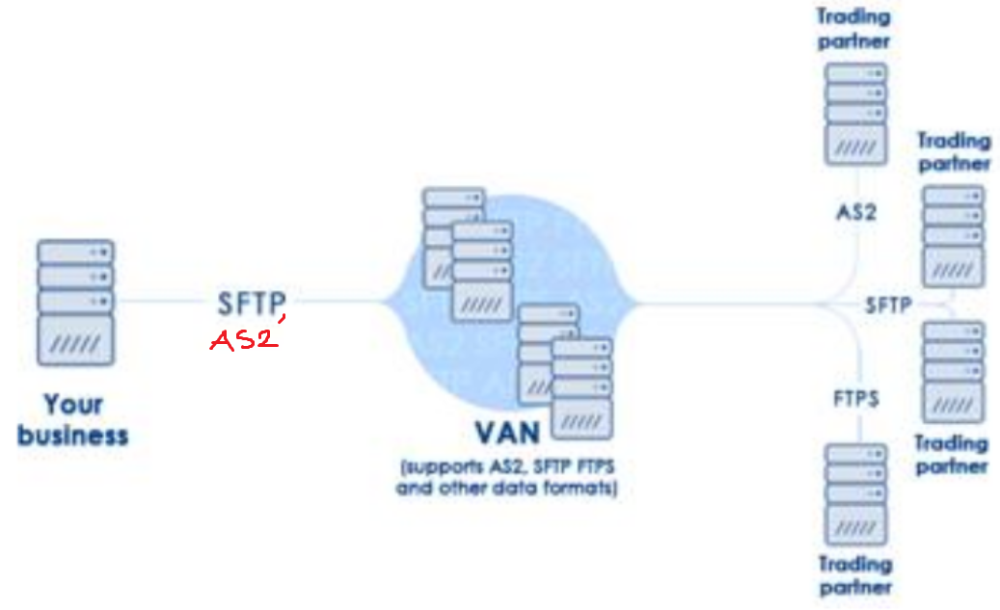

### 13 - Způsoby integrace informačních systémů, přístupy a technologie pro jednotlivé vrstvy. [KIV/EITM, (KIV/PIA)]

- integrace je proces spojovani ruznych SW komponent a subsystemu (resp. jinych sistemu) v jeden funkci celek - komplxni integrovany IS
- systemy jsou vetsinou vicevrstve
  - datova vrstva
  - aplikacni vrstva (business logika)
  - prezentacni vrstva
- => systemu mam vice a muzeme integrovat na vsech vrstvach

- integrace na datove vrstve
  - pravdepodobne nejsnazsi
  - predavani souboru, sql export / import, atd.
  - cilem je
    - eliminovat redundance a nekonzistence dat
    - poskytnuti aplikacim pristup k datum ostatnich systemu
      - treba i pohledem na celopodnikova data pomoci DW (= Data Warehouse?)

   

  - data -> vyznam (hodnota napr 1.5) -> informace -> kontext (napr 1.5 stupne) -> znalosti (napr se zvysujicim tlakem roste teplota)
  - zakladni postupy
    - prenos souboru
    - sdilena DB / sdilene soubory (nutno resit soubeh viz distribuovane systemy)
    - datove pumpy (vyber nejakych dat a jejich prenost jinam -> typicky DB -> DB)
    - replikace dat (kopirovani a udrzba DB objektu ve vice databazich)
    - EDI (= Electronic Data Interchange)
    - ETL (= Extraction, Transformation, Loading)

  - EDI (= Electronic Data Interchange)
    - napr americka firma si od japonske firmy objednava nejaky dil -> potrebuje se: objednavka, povrzeni objednavky, zpravy ridici dodavku, faktura, reklamace => to vse je nutne standardizovat
    - moderni zpusob komunikace mezi dvema nezavislymi subjekty pri ktere dochazi k vymene standardnich strukturovanych obchodnich a jinych dokumentu elektronickou formou
    - obvykle ve vyrobe - pozadavek na soucastky, zpatky faktura (napr automobilky, kde funguje JIT vyroba - vyroba urciteho mnozstvi soucastek v urcity cas dle pozadavku zakaznika)
    - zajistuje automatizaci (nemusi si napriklad volat)
    - obvykle propojeni dvou ERP (= Enterprise Resource Planning)
    - mohly by se posilat JSONy atd, ale historicky se prosadily binarni formaty (PDF)
    - formy EDI
      - direct EDI (point-to-point)
      - EDI via VAN operator
        - VAN (value-added-network) = poskytovatele EDI sluzeb

        

      - EDI via AS2
        - transportni protokol EDI
        - postaven nad HTTP, SSL, S/MIME
        - poskytuje napriklad
          - digitalni podpisy, sifrovani
          - potvrzeni doruceni

      - EDIFACT
        - obecna a mezioborova norma v ramci ktere vznikaji konkretni aplikacni normy pro jednotliva odvetvi
        - ukazka zprav
          - zakladni - objednavka, faktura, avizo a odeslani, katalog, ...
          - ridici - potvrzeni o prevzeti zpravy aplikaci

  - ETL (= Extraction, Transformation, Loading)

    

    - mechanismus ziskavani dat z provoznich systemu podniku (ekonomika, skladove hospodarstvi, ...), jejich zpracovani a poskytnuti aplikacim pro podporu rozhodovani (BI - datave sklady, decission support systemy)
    - dalsim duvodem mohou byt akvizice firem apod.
    - "kdyz to chceme resit trochu lepe nez jednorazovym SQL scriptem"
    - problemy
      - heterogenita zdroju
      - integrace dat do ciloveho uloziste
    - nastroje
      - existuji i moderni nastroje, ktere umoznuji vizualne si naklikat transformace - flow zpracovani
      - byvaji drahe, ale je to rychlejsi nez ad-hoc psat SQL a resit problemy, ktere se mohou vyskytnout - od vetsiho rozsahu se zrejme vyplati
        - navic mohou resit paralelizaci, coz by bylo nakladne, pokud bychom to resili sami
        - muze se stat ze pracujeme s objemy dat, ktere se nevejdou do pameti - taky to resi
      - napriklad IBM InfoSphere
    - extrakce
      - vyber dat z primarnich systemu
      - data jsou casto v ruznych nehomogenich prostredich a formatech (OS, HW, DB, ...)
      - extrakce nesmi ovlivnovat vykon zdrojoveho systemu
      - casto periodicke (napr. denne)
      - aktualizace dat podle schopnosti systemu
        - aktualizacni notifikace (zdroj posle notifikaci o zmenach)
        - inkrementalni extrakce (zdroj je schopen urcit zda jsou zaznamy zmeneny)
        - plna exktrakce (nektere systemy najsou schopny zmeny identifikovat)
    - transformace
      - zpracovani dat ze zdroje a prevedeni do formy, ktera odpovida pozadavkum ciloveho uloziste
      - vystupem jsou data ktera maji maximalizovanou informacni hodnotu
      - zahrnuje
        - cisteni (duplikace, filtrace)
        - konverze (0, 1 => muz, zena)
        - agregace (soucet, prumer, ...)
    - loading
      - naplneni ciloveho systemu (napr data warehouse)

  - datova kvalita & data governance
    - kvalita dat
      - obtizne se definuje, ale obecne ...
        - data jsou standardizovana
        - kazdy zaznam je unikatni
        - zaznamy jsou validovany vuci nejake autorite - napr adresa je platna podle registru platnych adres
      - kvalita nevznikne jen tak, musi se na to myslet dlouhodobe - je to proces:
        - a) porozumeni tomu jaka data jsou kvalitni, zpusobu mereni, ...
          - porozumeni datum obecne
        - b) vynucovani standardu kvality dat - napr constraints v databazich (ruzne druhy)
        - c) monitorovani kvality dat - opetovne mereni a reportovani stavu
    - data governance
      - proces rizeni dostupnosti, pouzitelnosti, integrity a zabezpeceni dat v podnikovych systemech
      - zajistuje ze data jsou duveryhodna a konzistentni a nejsou zneuzitelna
    - MDM (= Master Data Management)
      - MDM je jednim z piliru datove kvality (soucasti data governance)
      - cilem je zajistit kontrolovane a konzistentni vytvareni Master dat (MD) a jejich kvalitu
      - centralizace zamezuje pouzivani vice (nekonzistentnich) verzi MD, ktera jsou roztrousena na mnoha systemech a byt redundantni v ruzne kvalite a podrobnostech
      - MD (= Master Data)
        - = dulezita data ktera jsou v organizaci potreba na vice mistech
          - ZCU: studenti, mistnosti, ...
          - firma: info o produktech, zakaznicich, smluvnich stranach...
          - CR: centralni registry
        - maji pro organizaci velkou hodnotu (business critical)
        - jsou oficialni pro ostatni (pod)systemy
      - MDM server
        - datove servery v teto oblasti
        - vyhoda: kdyz pridavame novou aplikaci, nemusime ji kvuli datum napojovat na 10 systemu, staci na MDM server
      - muze byt vhodne verzovat master data - pro jejich historii (analyza)
      - zavedeni
        - identifikace master informaci v ramci aplikaci
        - presun nebo synchronizace do MDM serveru

- integrace na aplikacni vrstve
  - historicky byla hlavne integrace na datove vrstve, s rozsirovanim pocitacovych siti se zacalo integrovat i na aplikacni vrstve
  - proc integrace na aplikacni vrstve?
    - nechceme aby se nekdo hrabal v low level datech - radeji API se zpetnou kompatibilitou
    - na datove vrstve je to spis jen davkova integrace, na aplikacni lze snadno dosahnout i jinych forem integrace (rychlejsi)
    - aplikace malokdy pracuji samostatne -> vetsinou volaji ruzna API atd.
  - => vznik rozhrani
    - RPC (= Remote Procedure Call), posilani zprav
      - klient-server architektur
      - klient vzdalene (pres sit) vola proceduru/metodu (vykonny kod) pres definovane rozhrani
    - Web Services (REST, SOAP, ...)
    - konektroy, middleware
  - SOA (= Service Oriented Architecture)
    - architektura = soubor podstatnych (klicovych) rozhodnuti a zpusob organizace systemu
    - sluzba/service = dobre definovana a vymezena funkcionalita, ktera je zcela zapozdrena a nezavisla na svem okoli
    - principy sluzeb v SOA
      - standardizovany kontrakt sluzeb - presne stanovit, co bude sluzba poskytovat
      - volne spojeni - sluzby jsou na sobe nezavisle (jejich vazby zustavaji co nejtenci)
      - abstrakce - sluzby skryvaji implementacni detaily
      - znovupouzitelnost - sluzba muze byt pouzita i jinde a ne pouze v aktualnim projektu
      - bezstavovost!
    - SOA
      - architektura z propojenych zluzeb ktere spolu nejak komunikuji
      - vyuziva otevrene standardy aby popsala SW prostredky jako sluzby
      - sluzby jako znovupouzitelne stavebni kameny pro aplikace
    - konceptualni model
      - service registry - katalog rozhrani ktere poskytuji provideri
      - service provider - poskytovatel sluzby
      - service requester - klient (vyhledava a pouziva sluzby)
    - implementace SOA
      - navrh business procesu
      - transformovat aplikace na sluzby
      - integrovat sluzby s businessem

    

  - ESB (Enterprise Service Bus)
  
    

    - ESB je implementaci SOA
    - neco jako HUB v pocitacovych sitich
    - protokolove nezavisly zpusob jak vyvolat sluzbu
    - naklady na jeho zavedeni jsou vetsi ale s rostoucim pocetem services se to vyplati
      - udrzba a rozsirovani bude mnohem snazsi
    - soucasti jsou i nadstavbove vrstvy umoznujici definici a monitoring business procesu
    - ESB sluzby (mediace)
      - transofmrace (napr XML) - konverze jednoho XML dokumentu do jineho podle specifikace
      - smerovani (podle obsahu, staticke, zalozene na pravidlech) - ridi proces zprav ke koncovym bodum jinych sluzeb
      - uzivatelsky definovana mediace - funkce jako zurnal, uzivatelsky definovana validace, ktere doplni zakladni procesni logiku
    - pripojene procesni sluzby (business sluzby)
      - vykonavaji procesni logiku aplikaci
      - mohou navzajem komunikovat
    - implementace: IMB ESB, Oracle ESB, ...

  - SOA governance
    - prodmnozina IT governance
    - je potreba dohlizet na SOA sluzby
      - pravidla pro sluzby v ramci organizace
      - jak vznikaji, kdo je pouziva, jak jsou vyuzivane
      - jak usporadat a ridit sluzby aby to nejak fungovalo a nebyl to chaos
      - protoze alternativa je ze sluzba vznikne v ramci nejakeho vyvoje v nejakem oddeleni (pro jejich potrebu), postupne ji zacnou pouzivat dalsi oddeleni ale mohou tam byt problemy - napr to ze oddeleni ktere ji provozuje nic nema z toho ze ji poskytuje a proto se nesnazi ji rozvijet pro potreby ostatnich; pripadne nema rozpocet na provoz i pro ostatni - tohle je potreba resit vice shorat - to je uloha governance
    - sluzby se definuji tak, aby je mohli pouzivat vsechny oddleni - aby splnovaly pozadavky vsech
    - jednotne API a seurity polotiky. atd.
    - aby byla zajistena udrzba, skalovani a financovani
    - IT services vs Business Services vs Business processes
      - IT service je vyuzivana business servisou a ta je v business procesu

  - SOA lifecycle
    - posun od kodovani ke skladani

    

  - SIMM (= Service Integration Maturity Model)
    - podle toho jak moc dobre mame SOA governance zajistejnou z ruznych pohledu
    - orientovane na services / funkce
    - 7 urovni

- integrace na prezentacni vrstve
  - enterprise portaly
    - definice
      - kombnuje ruzne aplikace a informacni zdroje do jedne ucelene prezentace (AGREGACE)
      - uzivatele v ruznych rolich vidi odlisny obsah dle svych pristupovych opravneni (AUTORIZACE) nebo profilu (PERSONALIZACE)
      - uzivatele si mohou obsah sami prizpusobit (CUSTOMIZACE)
    - typy portalu
      - B2E (business to employee)
        - komunikace uvnitr organizace
        - lepsi orientace ve velkem mnozstvi informaci ve firme
        - personalizace obsahu (zvyseni produktivity)
      - B2B (business to business)
        - zjednoduseni procesu a komunikace s obchodnimi partnery, dodavateli, atd.
      - B2C (business to customer)
        - umoznuje hladky beh elektronickeho obchodovani
        - vsechny transakce a informace na jednom miste
        - zobrazeni historie objednavek, sledovani stavu objednavky v realem case

    - casto integruje
      - business procesy
      - CRM (= Customer Relationship Management)
      - HR (= Human Resources)
      - DMS (= Dealer Management System)
      - ERP (= Enterprise Resource Planning)

    - portlet
      - vymenna komponenta UI umoznujici integraci aplikaci
      - predsavuje nejmensi jednotku obsahu kterou lze aktivne ridit, priradit k jednotlivym rolim, personalizovat nebo zobrazit ve zvolenem rozvrzeni

    - business motivace
      - propojit
        - integrovat (propojit) aplikace a informace v kontextu - podporit rozhodovani
      - zlepsit
        - zefektivnit praci uzivatelu a zvysit vykonnost organizace
        - zlepsit komunikaci & spolupraci
        - zvysit spokojenost zakazniku, partneru a zamestnancu
      - zrychlit
        - reakci na zmenu (dynamicka sprava)
      - usetrit
        - liminovat zbytecne cinnosti

    - IT motivace
      - SOA - portal a portletovy princip se primo nabizeji jako vhodny zpusob interakce uzivatelu se sluzbami
      - security - identity management, SSO (= Single Sign-On)

    - vyuziti portalu
      - online spoluprace - chat, diskuzni fora, wiki stranky, profily, komunity, kalendar
      - intranet - integrace aplikaci (mail, CRM - Customer Relationship Management, ERP - Enterprise Resource Planning), redakcni system (sofistikovane a komunitni publikovani), nastroje pro spolupraci (tymove prostory, ...)
      - dashboard
        - uzivatelske rozhrani pro BI(= Business Intelligence)
        - soubor vizualnich komponent
        - slouzi k zobrazovani klicovych ukazatelu vykonosti organizace
        - zobrazuje aktualni vyvoj a historii
        - komponenty - grafy, tabulky, histogramy, ciselne udaje, ...
    - technologie
      - WebSphare Portal
      - vlastni reseni
    - portal pro nejakou oblast vs portal pro celou firmu - velky rozdil v narocnosti zavedeni

  - mashupy
    - = technika pomoci niz se kombinuji data / funkce ziskane z vice zdroju za ucelem vytvoreni nove sluzby
    - koncept webu 2.0
      - = oznaceni etapy vyvoje webu ve ktere je pevny obsah webovych aplikaci vytvoreni a upraveny majitelem webu nahrazen obsahem, ktery vytvareji sami uzivatele. Mohou zde sdilet svuj obsah a vytvaret ho.
    - snaha o zvyseni pouzitelnosti jiz existujicich dat
    - technologie widgety, iframy, RSS (Really Simple Syndication), ...
    - hlavni charakteristiky
      - kombinace, agregace, vizualizace
    - priklady
      - spojeni google maps a flickeru
        - flicker - jeden z prvnich applikaci Web 2.0
        - sdileni fotografii, uzivatele si mohou fotografie umistit do mapy
      - business vyuziti - napr. sledovani zasilek: interni info + od dopravce + google maps
      - socialni vyuziti - napr spojeni vice socialnich profilu v jeden

  - Low Code
    - urychleni vyvoje aplikaci - bez programovani
      - pri zachovani bezpecnosti a IT governance
      - zvladne to i polo-vyvojar
    - vetsinou zalozena na grafickem navrhovem nastroji ("klikatko")
    - priklad
      - UrbanCode deploy
      - Microsoft PowerApps
    - Pro Code - profesionalni vyvoj programatory - drahy vs lepsi
    - No Code - napr blog platformy (wordpress), kde si muzu behem par minut zprovoznit svuj vlastni blog
