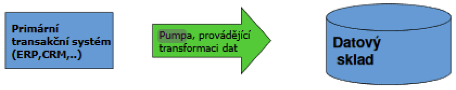

### 14 - Integrace IS na datové vrstvě, datová pumpa, EDI, proces extrakce, transformace a vložení dat (ETL). [KIV/EITM, KIV/DBM2]

- integrace je proces spojovani ruznych SW komponent a subsystemu (resp. jinych systemu) v jeden funkci celek - komplxni integrovany IS
- systemy jsou vetsinou vicevrstve
  - datova vrstva
  - aplikacni vrstva (business logika)
  - prezentacni vrstva
- => systemu mam vice a muzeme integrovat na vsech vrstvach

- integrace na datove vrstve
  - pravdepodobne nejsnazsi
  - predavani souboru, sql export / import, atd.
  - cilem je
    - eliminovat redundance a nekonzistence dat
    - poskytnuti aplikacim pristup k datum ostatnich systemu
      - treba i pohledem na celopodnikova data pomoci DW (= Data Warehouse?)

  

- data -> vyznam (hodnota napr 1.5) -> informace -> kontext (napr 1.5 stupne) -> znalosti (napr se zvysujicim tlakem roste teplota)
  - zakladni postupy
    - prenos souboru
    - sdilena DB / sdilene soubory (nutno resit soubeh viz distribuovane systemy)
    - datove pumpy (vyber nejakych dat a jejich prenost jinam -> typicky DB -> DB)
    - replikace dat (kopirovani a udrzba DB objektu ve vice databazich)
    - EDI (= Electronic Data Interchange)
    - ETL (= Extraction, Transformation, Loading)

  - datova pumpa
    - slouzi k provadeni ETL
    - informace se do datovych skladu ukladaji pomoci datovych pump z provoznich databazi jednotlivych aplikaci
    - nastroje datove pumpy se take oznacuji jako ETL nastroje
      - DTS (= Data Transformation Services) od Microsoftu (soucasti instalace MS SQL serveru)
      - Oracle Data Mart Builder

    

  - EDI (= Electronic Data Interchange)
    - napr americka firma si od japonske firmy objednava nejaky dil -> potrebuje se: objednavka, povrzeni objednavky, zpravy ridici dodavky, faktura, reklamace => to vse je nutne standardizovat
    - moderni zpusob komunikace mezi dvema nezavislymi subjekty pri ktere dochazi k vymene standardnich strukturovanych obchodnich a jinych dokumentu elektronickou formou
    - obvykle ve vyrobe - pozadavek na soucastky, zpatky faktura (napr automobilky, kde funguje JIT vyroba - vyroba urciteho mnozstvi soucastek v urcity cas dle pozadavku zakaznika)
    - zajistuje automatizaci (nemusi si napriklad volat)
    - obvykle propojeni dvou ERP (= Enterprise Resource Planning)
    - mohly by se posilat JSONy atd, ale historicky se prosadily binarni formaty (PDF)
    - formy EDI
      - direct EDI (point-to-point)
      - EDI via VAN operator
        - VAN (value-added-network) = poskytovatele EDI sluzeb

        

      - EDI via AS2
        - transportni protokol EDI
        - postaven nad HTTP, SSL, S/MIME
        - poskytuje napriklad
          - digitalni podpisy, sifrovani
          - potvrzeni doruceni

      - EDIFACT
        - obecna a mezioborova norma v ramci ktere vznikaji konkretni aplikacni normy pro jednotliva odvetvi
        - ukazka zprav
          - zakladni - objednavka, faktura, avizo a odeslani, katalog, ...
          - ridici - potvrzeni o prevzeti zpravy aplikaci

  - ETL (= Extraction, Transformation, Loading)

    

    - mechanismus ziskavani dat z provoznich systemu podniku (ekonomika, skladove hospodarstvi, ...), jejich zpracovani a poskytnuti aplikacim pro podporu rozhodovani (BI - datave sklady, decission support systemy)
    - dalsim duvodem mohou byt akvizice firem apod.
    - "kdyz to chceme resit trochu lepe nez jednorazovym SQL scriptem"
    - problemy
      - heterogenita zdroju
      - integrace dat do ciloveho uloziste
    - nastroje
      - existuji i moderni nastroje, ktere umoznuji vizualne si naklikat transformace - flow zpracovani
      - byvaji drahe, ale je to rychlejsi nez ad-hoc psat SQL a resit problemy, ktere se mohou vyskytnout - od vetsiho rozsahu se zrejme vyplati
        - navic mohou resit paralelizaci, coz by bylo nakladne, pokud bychom to resili sami
        - muze se stat ze pracujeme s objemy dat, ktere se nevejdou do pameti => taky to resi
      - napriklad IBM InfoSphere
    - extrakce
      - vyber dat z primarnich systemu
      - data jsou casto v ruznych nehomogenich prostredich a formatech (OS, HW, DB, ...)
      - extrakce nesmi ovlivnovat vykon zdrojoveho systemu
      - casto periodicke (napr. denne)
      - aktualizace dat podle schopnosti systemu!
        - aktualizacni notifikace (zdroj posle notifikaci o zmenach)
        - inkrementalni extrakce (zdroj je schopen urcit zda jsou zaznamy zmeneny)
        - plna exktrakce (nektere systemy nejsou schopny zmeny identifikovat)
    - transformace
      - zpracovani dat ze zdroje a prevedeni do formy, ktera odpovida pozadavkum ciloveho uloziste
      - vystupem jsou data ktera maji maximalizovanou informacni hodnotu
      - zahrnuje
        - cisteni (duplikace, filtrace)
        - konverze (0, 1 => muz, zena)
        - agregace (soucet, prumer, ...)
    - loading
      - naplneni ciloveho systemu (napr data warehouse)

  - datova kvalita & data governance
    - kvalita dat
      - obtizne se definuje, ale obecne ...
        - data jsou standardizovana
        - kazdy zaznam je unikatni
        - zaznamy jsou validovany vuci nejake autorite - napr adresa je platna podle registru platnych adres
      - kvalita nevznikne jen tak, musi se na to myslet dlouhodobe - je to proces:
        - a) porozumeni tomu jaka data jsou kvalitni, zpusobu mereni, ...
          - porozumeni datum obecne
        - b) vynucovani standardu kvality dat - napr constraints v databazich (ruzne druhy)
        - c) monitorovani kvality dat - opetovne mereni a reportovani stavu
    - data governance
      - proces rizeni dostupnosti, pouzitelnosti, integrity a zabezpeceni dat v podnikovych systemech
      - zajistuje ze data jsou duveryhodna a konzistentni a nejsou zneuzitelna
    - MDM (= Master Data Management)
      - MDM je jednim z piliru datove kvality (soucasti data governance)
      - cilem je zajistit kontrolovane a konzistentni vytvareni Master dat (MD) a jejich kvalitu
      - centralizace zamezuje pouzivani vice (nekonzistentnich) verzi MD, ktera jsou roztrousena na mnoha systemech a byt redundantni v ruzne kvalite a podrobnostech
      - MD (= Master Data)
        - = dulezita data ktera jsou v organizaci potreba na vice mistech
          - ZCU: studenti, mistnosti, ...
          - firma: info o produktech, zakaznicich, smluvnich stranach...
          - CR: centralni registry
        - maji pro organizaci velkou hodnotu (business critical)
        - jsou oficialni pro ostatni (pod)systemy
      - MDM server
        - datove servery v teto oblasti
        - vyhoda: kdyz pridavame novou aplikaci, nemusime ji kvuli datum napojovat na 10 systemu, staci na MDM server
      - muze byt vhodne verzovat master data - pro jejich historii (analyza)
      - zavedeni
        - identifikace master informaci v ramci aplikaci
        - presun nebo synchronizace do MDM serveru
