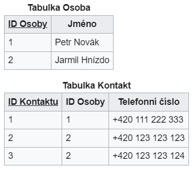

### 15 - Správa dat v podniku (Data Management). Kvalita dat a její řízení, master data management (MDM). Nestrukturovaná podniková data, správa podnikového obsahu (ECM). [KIV/EITM, (KIV/DBM2)]

- EDM (= Enterprise Data Management)
  - schopnost organizace definovat, integrovat a efektivne ziskat data pro interni i externi pouziti
    - => definovani pravidel pro zachazeni s daty, jejich ukladani a jejich kvalitu
  - EDM silne souvisi s MDM, DQA (= Data Quality Assurance) a ECM (= Enterprise Content Management)
  - vyzaduje strategicky pristup k reseni problemu => vybrat spravne procesy, technologie a zdroje
  - data governance
    - proces rizeni dostupnosti, pouzitelnosti, integrity a zabezpeceni dat v podnikovych systemech
    - zajistuje ze data jsou duveryhodna a konzistentni a nejsou zneuzitelna

- DMPBOK (= Data Management Body of Knowledge)
- MDM (= Master Data Management)
  - technologicky orientovana disciplina (spoluprae IT a businessu)
  - MDM je jednim z piliru datove kvality (soucasti data governance)
  - cilem je zajistit kontrolovane a konzistentni vytvareni Master dat (MD) a jejich kvalitu
  - centralizace zamezuje pouzivani vice (nekonzistentnich) verzi MD, ktera jsou roztrousena na mnoha systemech a byt redundantni v ruzne kvalite a podrobnostech => Single Source of Truth
  - MD (= Master Data)
    - = dulezita data ktera jsou v organizaci potreba na vice mistech
      - ZCU: studenti, mistnosti, ...
      - firma: info o produktech, zakaznicich, smluvnich stranach...
      - CR: centralni registry
    - maji pro organizaci velkou hodnotu (business critical)
    - jsou oficialni pro ostatni (pod)systemy
  - MDM server
    - datove servery v teto oblasti
    - vyhoda: kdyz pridavame novou aplikaci, nemusime ji kvuli datum napojovat na 10 systemu, staci na MDM server
    - muze byt vhodne verzovat master data - pro jejich historii (analyza)
    - zavedeni
      - identifikace master informaci v ramci aplikaci
      - presun nebo synchronizace do MDM serveru
  - muze souviset s ESB (= Enterprise Service Bus)

  

- kvalita dat, rizeni kvality dat
  - obtizne se definuje, ale obecne ...
    - data jsou standardizovana
    - kazdy zaznam je unikatni
    - zaznamy jsou validovany vuci nejake autorite - napr adresa je platna podle registru platnych adres
  - kvalita nevznikne jen tak, musi se na to myslet dlouhodobe - je to proces:
    - a) porozumeni tomu jaka data jsou kvalitni, zpusobu mereni, ...
      - porozumeni datum obecne
    - b) vynucovani standardu kvality dat - napr constraints v databazich (ruzne druhy)
      - nebo napr. 1NF, 2NF, 3NF, 4NF
    - c) monitorovani kvality dat - opetovne mereni a reportovani stavu
  - kvalita dat muze mit vicero dimenzi
    - napr.
      - pristupnost
      - spravnost
      - presnost
      - uplnost
      - konzistence
      - flexibilita
      - unikatnost
      - relevance
      - aktualnost
      - trasovatelnost
  - spatna kvalita muze mit zavazne financni dusledky
  - => kvalitu dat chceme nejak ridit
    - existuje vicero zpusobu a formalnich procesu pro rizeni kvality dat
    - napr. "Zero Defect Data"
      - vyuziva principu statickych procesu pro kontrolu kvality dat
    - pro zachovani kvality dat je musime prubezne analyzovat abychom byli schopni detekovat anlmalie (napr. duplicita)
      - => ty pak odstranime/vyresime
  - idealnim vysledkem je ze
    - kvalitu dat mame standardizovanou (vime co to je)
    - je merena napric casem
    - kvalitu dat pravidelne monitujeme
      - napr. cron task co pusti SQL nad MD repozitarem (nesmi ho prilis zatizit) protoze je aktivne pouzivan dalsimi aplikacemi
  - rizeni kvality muze byt do jiste miry zarucenu uz od zacatku napr spravnych navrhem ERA (= Entity Relationship Attribute) modelu
    - umozneni efektivniho ukladani, prohledavani a editace
    dat v relacni DB
    - v procesu normalizace jsou v DB meney atributy (sloupce) jednotlivych tabulek => je mezi nimy zavadenv vhodny vztah za ucelem omezeni redundance
    - pro splneni xNF musi byt splnena i (x-1)NF
    - 0NF = alespon 1 atribut obsahuje vice nez jednu hodnotu (napr. 2 telefonni cisla)
      - obcas povazovana jako soucast 1NF
      - jeji splneni byva v praxi automaticky zaruceno
    - 1NF = kazdy atribut obsahuje pouze atomicke hodnoty (dale nedelitelne)
      - poruseni pokud napr mame 2 telefonni cisla

        

        

      - pridani dalsiho sloupe (2. tel. cislo) sice splnuje 1NF ale => povazuje se za spatny navrh => lepsi rozdelit na 2 tabulky

        

    - 2NF: kazdy neklicovy atribut je plne zavisly na kazdem kandidatnim klici
      - klade duraz na odstraneni moznych duplicit v zaznamech

      

      - `jmeno kurzu` neni plne zavisle na primarnim klici (ktery je slozeny) => je zavisle pouze na `ID Kurzu` ale ne na `ID semestru` => dochazi k redundanci dat

      

    - 3NF: vsechny neklicove atributy musi byt navzajem nezavisle (neobsahuje tranzitivni zavislosti)

      

      - na prvni pohled je vse OK
      - nicmene: `ID zanru` je funkce zavisle na `ID filmu`
      - dalsi zavislost je ze `ID zanru` urcuje `Nazev zanru`
        - `Nazev zanru` je funkce zavisly na `ID zanru`!

      

    - BCNF: atributy ktere jsou soucasti primarniho klice musi byt vzajemne nezavisle
    - 4NF, 5NF, ... atd.

- DW (= Data Warehouse), big data
  - budovani datoveho skladu dve moznosti
    - mame vicero Data Martu (= podmnozina DW se zamerenim na konretni line of business)
      - do tech nacitame pres ETL
      - sloucenim vice data martu pak ziskame data ware house
      - snazsti a mozne delat inkrementalne
      - mohou nastat problemy s konzistenci, redundanci a kvalitou tim jak mame izolovane data marty
    - mame jeden data warehouse
      - plnime ho jednim ETL, z toho pak exportujeme data marty je jednotlive ulohy
      - vetsi flexibilita
      - je potrebas tim zacit hned od zacatku
      - vsechny data marty vychazeji ze stejneho zakladu
    - pokud budujeme datovy sklad typicky pouzivame inkrementalni metodu
      - postupne zacleneni jednotlivych datovych stil do datoveho skladu
  - datova pumpa ETL
    - slouzi k provadeni ETL
    - nastroj umoznujici efektivni zpracovani velkych objemu z ruznych droju a jejich ulozeni do datoveho skladu

    

  - dimenzionalni tabulky
    - zachycuji pohled na sledovane ukazatele
    - napriklad: cas, zakaznik, prodejna, produkt
    - obsahuje jednoznacny identifikator a potom atributy dimenze
    - muze v sobe nest hirearchie: minuta, hodina, den, mesic, kvartal, rok
    - "prurez" dat za dane casove obdobi
  
  - faktove tabulky
    - uchovavaji informace o sledovanych ukazatelich
      - napr. pocet prodanych kusu
    - typicky to jsou ciselne udaje ktere lze agregovat
    - granularitou faktove tabulky se rozumi mira podrobnosti sledovanych ukazatelu
      - napr. pocet prodanych kabatu vs pocet prodanych knofliku?

    

  - datove kostky
    - jiny pohled na datovy sklad
    - jedna se vlastne o spojene kontingencni tabulky

    

- ECM (= Enterprise Content Management) - nestrukturovana podnikova data
  - = soubor definovanych procesu a nastroju ktery pomaha zefektivnit zivotni cyklus informaci
  - velka cast dat neni strukturovanych (pdf, manualy, obrazky, zaznamy ze schuzek, ...)
    - => jsou neprehledna, tezko nalezitelna, neefektivne klasifikovatelna
  - ECP = dokumenty + workflow + pravidla
    - predevsim o nestrukturovanych informacich (grafika, dokumenty, email, atd.)
  - => cilem je zkratit cas hledani informaci
    - uzivatele nemohou najit co potrebuji
    - uzivatele nevi jak najit co potrebuji
    - uzivatele nemaji pristup k tomu co potrebuji
    - typicke priciny
      - kazda jednotka organizace ma svuj system
      - nejsou nastavena jasna pravidla
      - neni povedomi o ECM
    - v ramci ECM resime i elektronicke podpisy, sifrovani, atd.
  - hlavni funkce
    1) ziskavani (vytvareni nebo digitalizace obsahu)
        - -> presunuti do ECM systemu
        - OCR
        - primo v systemu, import, pluginy (napr. do wordu)
    2) sprava (spravna organizace dokumentu v dobe jeho zivota)
    3) distribuce (zajisteni vyuzivani spravneho obsahu ve spravnych procesech)
        - portaly, mail, ...
    4) ukladani a uchovani (zajistejni dlouhodobeho a bezpecneho uchovani)
    5) archivace (hlida skartacni archivacni lhuty)
    6) dalsi aspekty
       - metadata, verzovani, pristupova prava, vyhledavani
  - hlavni vyhody
    - poskytuje centralizovanou plaformu pro obsah, ktery splnuje dane predpisy (napr security)
    - zvyseni produktivity (zefektivnuje podnikove procesy, ...)
    - zdokumentovani vsech typu obsahu, se kterymi organizace pracuje
    - lze i identifikovat duplicitni obsah
