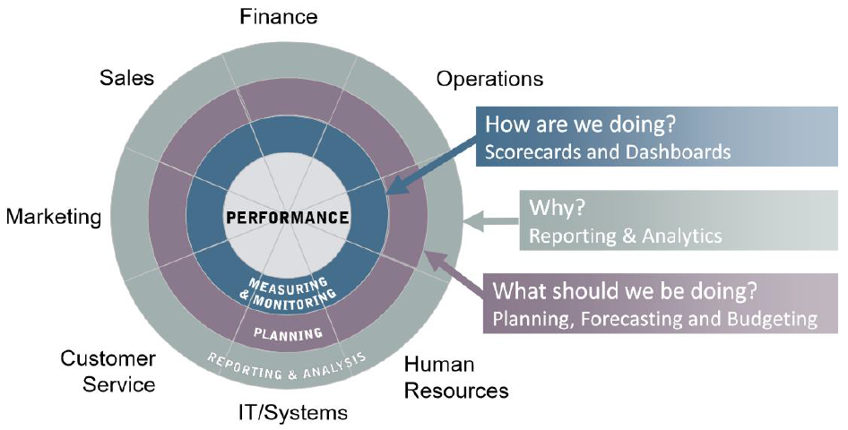
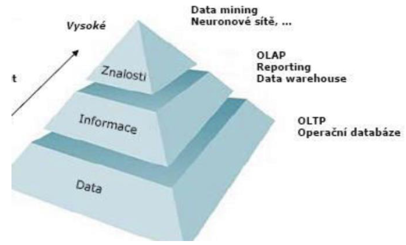
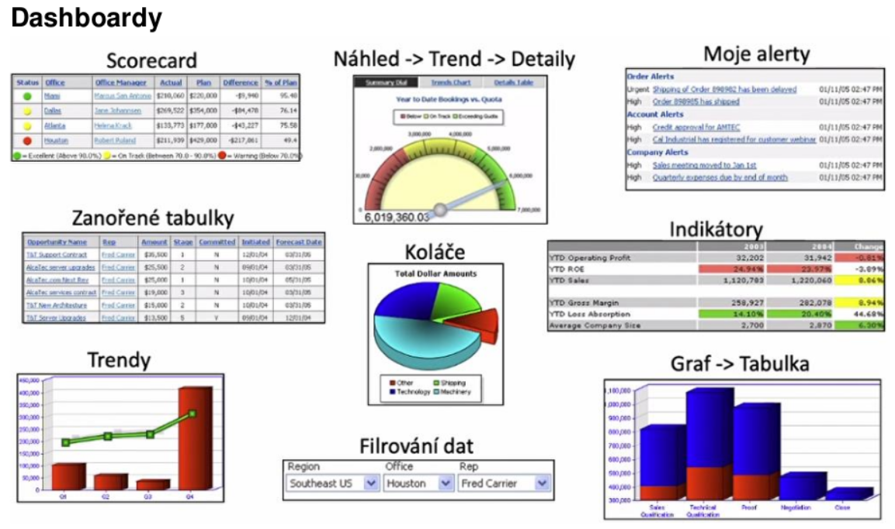
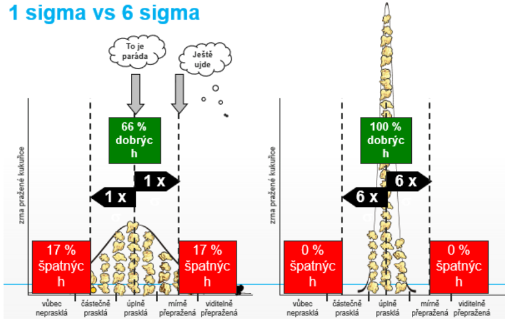
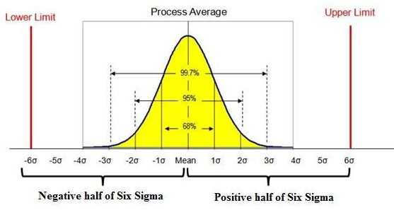

### 16 - Analytické nástroje pro sledování výkonu organizace, KPI a dashboardy, podpora rozhodování, Business Inteligence (BI). [KIV/EITM, (KIV/DBM2)]

- sledovani vykonu organizace
  - vetsinou chceme mit data na jednom miste, protoze analyticke selecty se spatne spousteji nad provoznimi databazemi (kterych muze byt vice) a nebo by je zatezovaly a ohrozovaly bezny provoz -> vznik data warehouse za pouziti technologie ETL - data se sjednoti, agreguje (count, sum, average, ...), odstrani se duplicity => prechoupe je do podoby ktera se dobre analyzuje

- BI (= Business Intelligence)
  - = znalost podniku ziskana za pouziti HW a SW technologii ktera umoznuje premenit data v organizaci v informaci
  - soubor nastroju, technologii a metod, ktere umoznuji nalezt v datech informace (resp. znalosti)
  - cilem je ziskavat podklady pro kvalitnejsi rozhodovani (decision support)
  - data vs infomace vs znalost!!
    - data = "25"
    - informace = "body za zapocet = 25"
    - znalost = "25 bodu je malo protoze na ziskani zapoctu je nutno mit alespon 30 bodu"
  - oblasti
    - prezentovani dat - reporty, dashboardy
    - analyza dat
    - planovani - na zaklade analyzy, prezentovanych dat
    - predikce - kdyz budes delat tohle, tak pristi rok dosahnes ...
  - performance management
    - => sleduje jak se nam financne dari (vydaje, rizeni aktivit, rizeni zdroju, atd.)
    - mereni - na zacatku chceme vedet jak se nam dari - zisk, ztrata, plneni planu
    - duvod - "Proc jsou hodnoty jake jsou?", na cem vydelavame? na cem prodelavame?
    - plan - "Jak to resit?" => zmenit plan? upravit procesy?

    

    - cas je v tom klicovy! => je potreba zmenit zamery vcas

  - KPI (= Key Performace Indicator), dashboardy
    - KPI jsou odvozene od cili a meri stav jejich dosazeni
    - metrika vykonu procesu
    - slouzi k analyze procesu, sledovani cilu
    - typicky agregace pres mnoho instanci procesu
      - napr: prumerna delka schvalovani objednavky, soucet cen objednavek, pomer vadnych vyrobku, navratnost investic
    - BAM (= Business Activity Monitoring)
      - sledovani KPI v realnem case (dashboards)
      - dashboardy vizualizuji KPI

  - vetsina dat je multidimenzionalnich
    - napriklad cas x oblast (napr geograficka + cas => 3 dimenze)

  - OLAP (online alaytical processing)
    - technologie ulozeni dat v databazi, ktera umoznuje usporadat velke objemy dat tak, aby byla data pristupna a srozumitelna uzivatelum zabyvajicim se analyzou obchodnich trendu a vysledku (Bussiness Intelligence)
    - OLAP krychle
      - ortogonalni (kolme) a nezavisle dimenze
      - casto jsou predpocitane napr. soucty v jednotlivych dimenzich
      - terminologie
        - dimenze - rozmer (napr zakaznik, cas)
        - hirearchie - popisuje vztah nadrazenosti mezi prvky dimenze
        - level - uroven hirearchie (rok, kvartal, mesic, ..)
        - member - hodnota na danem levelu (kveten)
        - fact = ciselne vyjadrene sledovani hodnot v ramci dimenzi
        - => napr: dimenze = cas, level = mesic, member = kveten, fact = 15 (neceho)

    

    - pokud v ramci BI delame analyzu, jsou 3 zakladni urovne
      - reporting - ad hoc dotazy
      - OLAP - pokrocile analyticke ulohy
      - data mining - analyza velkeho mnozstvi dat pro ziskani novych poznatku

    - OLAP operace
      - slicing - omezeni jedne nebo vice dimenzi na podmnozinu o jednom prvku napr jen rok 2020
      - dicing - omezeni dimenzi na podmnozinu (z velke `n` dimenzionalni kostky udelame mensi `m` dimenzionalni kostku)
      - drill-down - jedna se o navigaci v hierarchii dimenzi smerem k vetsimu detailu
        - napriklad rok -> mesic
      - drill-up - jedna se o navigaci v hierarchii dimenzi smerem k mensimu detailu
        - napriklad mesic -> rok
      - pivoting - umoznuje "otacet" datovou krychli tj. menit uhel pohledu na data na urovni prezentace obsahu datoveho skladu

    

  - datovy sklad
    - podnikovy strukturovany repozitar pouzivany pro ziskavani informaci a podporu rozhodovani (desicion making)
    - v datovem skladu jsou ulozena detailni a sumarni data
    - vlastnosti
      - casove nemenny - udaje se zpravidla nemeni, ani neodstranuji, jen predavaji
      - predmetove orientovany - uchovavaji se udaje podle predmetu zajmu, nikoliv podle aplikace, kde byly vytvoreny (predmet - napr zakaznik, dodavatel, ...)
      - integrovany - data pochazeji z nekolika ruznych systemu
      - historicky - data jsou extrahovana z produkcni DB v danem case (vetsinou po tzv. uzaverce dne), ne po kazde zmene

  - OLTP (= Online Transaction Processing)
    - technologie ulozeni dat v DB ktera umoznuje jejich co nejsnazsi a nejbezpecnejsi modifikaci v mohouzivatelskem prostredi - transakce, constraints
    - napriklad rizeni letoveho provozu - nemuzeme tam posilat analyticke dotazy protoze nemuzeme ohrozit kriticky provoz - musime si data vytahnout nekam jinam (pri tom je pripadne upravit)

  - Six sigma
    - rozptyl
    - sbirka technik a nastroju pro proces improvement
    - kvalita vyrobniho procesu
    - meritelne (statisticke) charakteristiky
    - sigma je interval ppst (1 sigma - hodne zmetku, 6 sigma - 99.99996 kvalitnich)

    

    

    - v ramci kategorie "uplne praska" chceme aby bylo 6σ (=> 99.99996%) vyrobku? nebo alespon na to cilime (chceme co nejvic)
