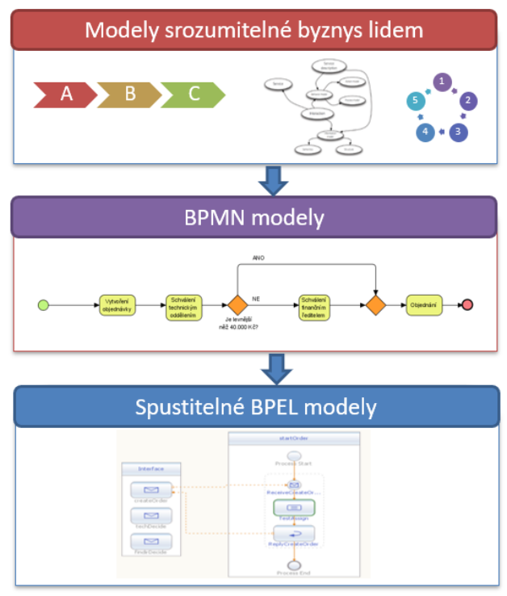
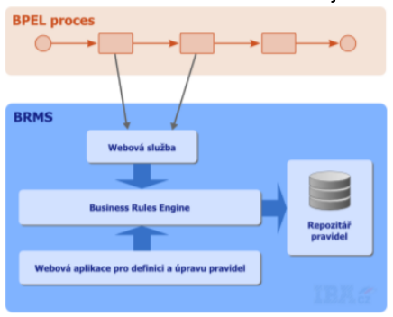
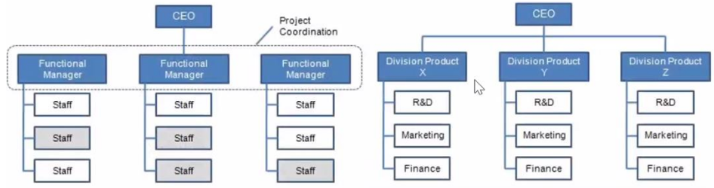

### 17 - Řízení komunikace a spolupráce v organizaci, workflow, ESN. Business process management (BPM). [KIV/EITM, (KIV/ZIM)]

- ECM (= Enterprise Content Management)
  - soubor definovanych procesu a nastroju ktery pomaha zefektivnit zivotni cyklus informaci
  - = dokumenty + workflow + pravidla - predevsim o nestrukturovanych informacich (grafika, dokumenty, email, ...)
  - cilem je hlavne zkratit cas hledani informaci!!
  - hlavni funkce
    - ziskavani (vytvareni nebo digitalizace obsahu)
      - OCR
      - primo v systemu, import, pluginy (napr do wordu)
    - sprava (spravna organizace dokumentu v dobe jeho zivota)
    - distribuce (zajisteni vyuzivani spravneho obsahu ve spravnych procesech)
      - portaly, mail, RSS, ...
    - ukladani & uchovani  (zajistejni dlouhodobeho a bezpecneho uchovani)
    - archivace (hlida skartacni archivacni lhuty)
    - dalsi aspekty
      - metadata, verzovani, pristupova prava, vyhledavani
  - hlavni vyhody
    - poskytuje centralizovanou plaformu pro obsah, ktery splnuje dane predpisy (napr security)
    - zvyseni produktivity (zefektivnuje podnikove procesy, ...)
    - zdokumentovani vsech typu obsahu, se kterymi organizace pracuje
    - lze i identifikovat duplicitni obsah

- BPM (= Business Process Management)
  - = systematicky pristup ke zavadeni a zlepsovani procesu v organizaci
  - BP - business process
    - sled cinnosti, ktere vedou ke specifickemu vysledku
    - typicky bezi dlouho a zasahuje do nej vice lidi
    - spojuje business systemy do nejakeho celku
    - realizuji nejaky podnikovy cil
  - workflow
    - pristup a technologie pro automatizaci business procesu
    - schema provadeni komplexnich cinnosti ktere rozdeluje proces na jednotlive aktivity mezi kterymi jsou vazby
    - muze byt linearni ale i vetveny (napr. pokud je cena zakazky > 40K tak neco)
    - workflow business procesu se ucastni lidi (napr. ziskani podpisu zakazky reditelem, atd.)
  - zakladni princip

    

    - faze BPM
      - a) navrh procesu
        - analyza existujicich procesu
        - specifikace noveho procesu (cil, vstupy, vystupy, vlastnik, role, ...)
      - b) modelovani procesu
        - popis pomoci diagramu
          - napr. BPMN (= Business Process Modeling Notation)
        - vetsinou shora dolu (od obecneho po detailni)
        - cilem je vytvorit takovou abstrakci procesu, ktera je citelna pro vsechny ucastniky zivotniho cyklu
      - c) implementace
        - zavedeni procesu do praxe
        - prevod do BPEL (= Business Process Execution Language)
          - jazyk pro tvorbu automatizovanych business procesu na bazi XML
          - tzv orchestrace sluzeb - popis vykonavani jednotlivych procesu, ktere se skladaji z volani webovych sluzeb
          - napojuje se na servisni architekturu (napr. ESB = Enterprise Service Bus)
      - d) monitorovani
        - podklady pro zlepseni procesu, vcasna detekce chyb, mereni vykonosti
        - KPI (= Key Performance Indicator)
          - metrika vykonu procesu
          - slouzi k analyze procesu, sledovani cilu
          - typicky agregace pres mnoho instanci procesu
            - napr: prumerna delka schvalovani objednavky
      - e) optimalizace
        - stale vylepsovani procesu
        - pouziva data z faze monitorovani!
        - postup:
          - detekce neefektivni casti (bottleneck, neefektivita, nakladnost na zdroje)
          - zpet na bod 1 (navrh a validace zmeny)
  
  - BR (= Business Rules)
    - deklarativne definovana pravidla ve tvaru "JESTLIZE" podminka, "TAK neco proved"
    - pokryva urcita rozhodunuti ktera jsou soucasti procesu
    - casto se meni (vice nez procesy) -> je vhodne je uchovavat v externim repository a ne je deklarovat primo v procesu
    - BRMS (= Business Rules Management System)
      - sprava BR
      - BRE (= Business Rules Engine) - proces pristupuje do repository pres BRE
      - pro IS zalozene na SOA - BR jsou implementovany jako sluzby

    

    - napr: urceni miry slevy podle platebni historie zakaznika

  - mereni procesu
    - nekolik pohledu
      - z hlediska pridane hodnoty
        - vystup (produkt procesu)
        - vlozenych zdroju (potreba na vytvoreni pridane hodnoty)
      - z hlediska vykonnosti
        - doba procesu (od vstupu prvniho zdroje po vytvoreni vystupu)
        - pruchodnost procesu (pocet vystupu / cas)

  - social business
    - vyuzivani principu socialnich medii
    - hlavni cile
      - zlepseni firemni kultury
      - zlepseni komunikace (omezeni mnozstvi emailu)
      - propojeni lidi a oddeleni
      - sdileni dat a znalosti
      - inovace, napady zevnitr
      - zvyseni produktivity

  - struktura firmy (muze se hodit pri popisu komunikace?)
    - "firma je kdyz vezmete hromady lidi a penez a date je do jednoho domecku"
    - zakladni modely
      - funkci
        - oddeleni podle toho co delaji
        - napriklad vyroba, zakaznicka podpora, marketing, finance, HR, R&D, atd.
      - divizni
        - "zvetseni" funkcniho
        - vzniknout jakesi firmy ve firmach (divize) ktere jsou do urcite miry autonomni
        - vedeni resi spise strategicke cile a neresi operacni (dilci) zalezitosti
      - maticova
        - nekdy je potreba delat projekty napric funkcni organizacni strukturou (napr projekt ve kterem je zapojeno jak marketingove tak financni oddeleni)
        - projektove / produktove vrstvy
          - produktova vrstva: cilem je vytvoreni co nejlepsiho produktu s co nejvetsim mnozstvim funkcionality
          - projektova vrstva: cilem je dokoncit projekt v cas, neprekrocit rozpocet a dodrzit normy a standardy
          - skupina zamestnancu se presouva mezi zakaznikami atd.
          - problem - clovek muze mit vice nez 1 sefa
          - velmi casta u velkych korporatu
          - => o to vic je dulezita kvalitni forma komunikace napric firmou? Abychom vedili napriklad kdo na cem +- dela atd (hlavne kdyz se lide neznaji)

    

  - ESN (= Enterprise Social Networks)
    - zpusob nalezeni toho spravneho cloveka, ktery vyreseni nas problem ve velke firme kde se lidi osobne neznaji
    - SW obsahujici nastroje pro podporu social businesses (vyuzivani principu socialnich medii)
    - efektivni firemni komunikace je klicova
    - obsahuje
      - profily uzivatelu
      - skupiny
      - sdilene soubory (vcetne historie, komentaru, ...)
      - wiki
      - blog
      - diskuzni fora
    - spoluprace
      - druhy
        - koordinace - kdyz dva kopou diru, tak aby se neumplatili
        - kooperace - delba prace, hladky postup praci
        - kolaborace - spoluvytvareni neco co neumime sami
      - dobra je heterogenni skupina => ruzne schopnosti
      - vetsina znalosti firmy je v hlavach lidi!!

    - Web 2.0
      - oznaceni etapy vyvoje webu ve ktere je pevny obsah webovych aplikaci vytvoreni a upraveny majitelem webu nahrazen obsahem, ktery vytvareji sami uzivatele. Mohou zde sdilet svuj obsah a vytvaret ho.
      - tento remin se nevztahuje k zadne konkretni technologii, ale ke zmenam ve zpusobech, jakym jsou webove stranky navrhovany a pouzivany
      - charakteristika
        - uzivatel se podili na tvorbe obsahu webu
        - webove stranky se stavaji platformou poskytujici webove aplikace koncovemu uzivateli
        - personalizace obsahu
      - priklady
        - socialni site a media
        - blogy
        - wiki stranky
        - stranky pro sdileni obsahu
        - web aplikace
        - mashup aplikace (googe news)
        - webova fora
        - otazky a odpovedi (stackoverflow)
