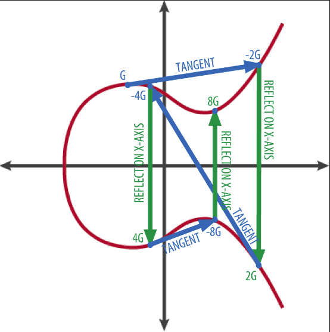
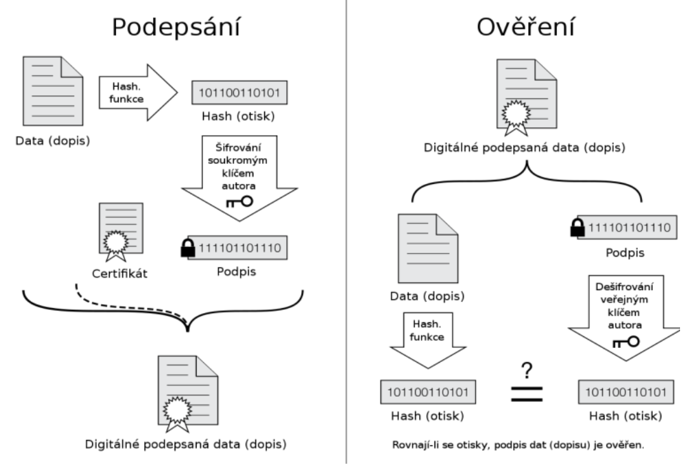

### 18 - Přehled problematiky bezpečnosti IT/IS, komplexní přístupy a nástroje pro řízení bezpečnosti [KIV/EITM, (KIV/BIT)]

- safety = zajisteni
  - odolnosti proti chybe a vypadku
  - redundance uchovani informaci
- security = zabezpeceni
  - rizeni o omezovani pristupu
  - "keep the bad guys outside"
  - je to proces, ne stav (musi se planovat, sledovat, ridit a vyhodnocovat)
  - bezpecnost musi byt soucasti navrhu systemu (dadatecne pridani je obtizne)
  - bezpecnost stoji hodne penez (a investovane penize nejsou videt), ale jeji naruseni muze state jeste vice (+
  reputaci)
  - zpracivla je treba volit kompromis mezi:
    - bezpecnosti
    - pouzitelnosti
    - pohodlim
  - v organizaci ma bezpecnost na starost CSO (= Chief Security Officer)

- oblasti podnikove bezpecnosti
  - zabezpeceni se resi v mnoha ruznych oblastech
  - kryptografie
    - sifrovani vs hashovani
      - hashujeme hesla v DB, pripadne obsah pro digitalni podpis
      - sifrujeme zpravy
    - symetricka vs asymetricka
      - symetricka
        - napr. AES (= Advanced Encryption Standard), DES (= Data Encryption Standard), Blowfish
        - mame jeden klic pro sifrovani a desifrovani
      - asymetricka
        - napr. RSA, ECC (= Elliptic Curve Cryptography)
          - princip RSA

            ```
            encryption pair: (5, 14)
            plain text: 2
            2^5 mod 14 = 4
            
            decryption pair: (11, 14)
            4^11 mod 14 = 2
            ```

          - princip ECC

            

        - pomala, typicky se pouziva pri inicializaci komunikace pro vymenu sytmetrickeho klice
          - respektive seedu ktery je vstup do PRNG => kazda sprava je zasifrovana unikatnim symetrickym klicem
        - pouziva se jak k sifrovani tak k digitalnimu podpisu
  - legislativa
    - nektere staty zakazuji export bezpecnostnich technologii
    - nektere staty zakazuji pouzivat konkretni bezpecnostni technologie (napr. silne sifrovani - AES, end-to-end sifrovani)
  - network security - VPN, firewall
  - emaily - fishing
  - OS security - izolace procesu a uzivatelu, access control, antivir, ACL prava (pro kazdeho uzivatele), ...
  - identity management
    - autorizace => opravneni provest urcitou akci (napr. cteni souboru)
    - autentizace => overeni totoznosti (overeni toho ze jsem kdo tvrdim ze jsem; potvrzeni pravosti)
    - IDM (= Identity Management)
  - zabezpecni (web) aplikaci - chyby v kodu, backdoor, SQL injection, atd.
  - fyzicka bezpecnost - zabezpeceni servroven, ...
  - bezpecnost dat - neautorizovany prenos, zabezpecni databazi, atd.

- sledovani bezpecnosti
  - proaktivni pristup pomaha indentifikovat rizika (predikce) - jen firewall a monitorovani logu dnes uz nestaci
    - vulnerability scanning - manualni kontrola nastaveni / logu, network a OS scanning
  - monitoring bezpecnosti (IDS, IPS)
    - IDS (= Intrusion Detection System)
      - pouze monitoring (nemeni sitovy provoz)
    - IPS (= Inrusion Prevention Systems)
      - zabranuje prenosu packetu (neco jako firewall)
  - penetracni testovani, externi overeni zabezpecni
  - audit = chceme vedet kdo co meni a kdo co cte

- Security Program Maturity
  - vyzralost security procesu
  - reaktivni -> proaktivni -> prediktivni

- elektronicky (digitalni podpis)

  

  - priklad 1:
    - mame SW co chceme digitalne podepsat
    - v kodu si rezervujeme pole pro signature co se propise do .hex/.exe souboru
    - napr. `ui8 signature[256U] = {0}`
    - z celeho souboru zpocitame hash a tu zasifrujeme nasim privatnim klicem = digitalni podpis
    - vysledek ulozime v postprocesu do rezerovaneho pole
    - pri stusteni aplikace aplikejeme reverzovany proces pro zjisteni jestli aplikace podopsana nebo ne

  - priklad 2:
    - sigrovani HTTP komunikace
    - pripojim se na `seznam.cz` a vyzadam si jeho public key a poslu mu svuj public key
    - server vyheneruje symtericky klic (reps. seed) a zasifruje ho mym verejnym klicem => jen ja to muzu desifrovat
    - pouziju svuj privatni klic pro desifrovani a oba prejdeme na symetrickou komunikace
    - problem => jak vim ze mi server poslal jeho public key a ne nkoho jineho?
      - = resenim je pouziti certifikatu
      - CA (= Certifikacni Autorita)
        - vydava certifikaty (vsichni ji veri)
      - certifikat ma vsobe metadata
        - doba platnosti
        - nazev autority
        - adresa komu se vydava
        - jmeno atd.
        - verejny klic daneho serveru komu se vydava!
        - pole pro CA signature (viz priklad 1)
          - spocitan hash z obsahu a zasifrovan privatnim klicem CA
      - od serveru si vyzadam nejen verejny klic ale i certifikat
        - vezmu verejny klic CA a overim signature certifikatu
        - zkontroluju ze sedi verejny klic co mi poslal server s tim co je v certifikatu
        - overim platnost certifikatu atd.

- typy malwaru
  - ransomware - sifruje data
  - spyware - sleduje co delame
  - worms - siri se pocitacovou siti
  - adware - spamovani zadadoucimi reklamami
  - keylogger - loguje a odesila na remote server co piseme na klavesnici
  - rootkit - data utocnikovi vzdaleny pristup k pocitaci
