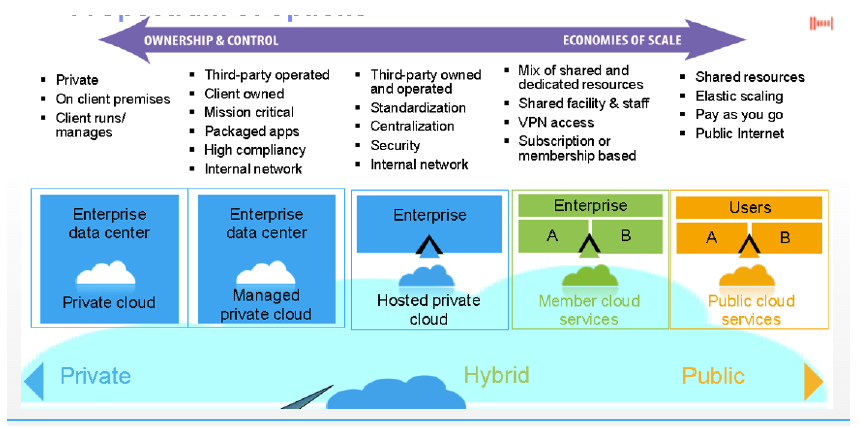

### 19 - Outsourcing IT. Poskytování IT jako služby (ITaaS), výhody a nevýhody cloudových technologií. [KIV/EITM]

- outsourcing
  - = vycleneni nejake cinnosti z firmy a jeji zajisteni externim dodavatelem
  - outsourcing znamena uzkou provazanost firmy a outsourcera, dochazi k vzajemne zavislosti (jedna se o vztah, ne poskytovani sluzeb)
  - outsourcuji se
    - podpurne cinnosti (uklid, vratna, ucetni)
    - nekdy dokonce i cely business process (BPO = Business Process Outsourcing)
      - napriklad podpora uzivatelu (Indie)
  - typy
    - offhore - indove atd
    - on-site - clovek prijde do firmy (uklizecka)
    - near-shore - napr. v ramci sousednich statu
    - problem s casovymi pasmy, jazykove bariery
  - priklady outsourcingu v SW
    - vyvoj, migracni a integracni sluzby, support (helpdesk), udrzba
  - duvody pro outsourcing vyvoje SW lze kategorizovat na
    - chci - strategicke rozhodnuti (napr expandace do zahranici)
    - musim - chybi mi zdroje, lidi s know-how
    - zkousim - podpurne cinnosti
  - prinosy
    - nekdy snizeni nakladu (predpoklad: outsourcovane firmy pracuji efektivne a smlouva je vyhodna)
    - lepsi podminky pro soustredeni na hlavni/kriticke cinnosti
    - vetsi flexibilita - nabor a propousteni zamestnancu je nakladne, i casove
    - snizeni mzdovych nakladu (zvysuji zisk na zamestnance - ekonomicky ukazatel)
  - rizika
    - zavislost na poskytovateli
    - moznost uniku citlivych informaci
    - uzka provazanost, vendor lock-in - spatna vratnost strategickeho rozhodnuti
    - nutnost ridit obchodni vztahy s poskytovatelem
  - insourcing
    - znovynabyti schopnosti interne
    - zajistit nejakou cinnost => reverzni proces k outsourcingu
  - platebni model
    - za lidske zdroje
    - za vykony - cena za kus (1 faktura)
    - pausal
    - plus penale - za nedodrzeni SLA = Service-level agreement, kvality atpd.
  - SLA (= Service Level Agreement)
    - = smlouva sjednana mezi poskytovatelem sluzby a jejim uzivatelem
    - definuje parametry sluzby
    - zakladni dokument pro obe strany, casto rozhoduje o uspesnosti outsourcingu
    - obsah
      - definice cinnosti
      - definice casoveho ramce (pracovni doba), doby reakce (response time), vyreseni (resolve time)
      - zpusob komunikace, zadavani pozadavku (helpdesk, IS, telefon, main)
      - definice priorit a severit
      - zpusob zpoplatneni a vyuctovani, penale
      - definice kvality
      - pravidelny reporting (napr mesicni) + jeho struktura
      - QA (= Quality Assurance) procesy, eskalace

- cloud
  - game changer v IT
  - cloud computing dodavani vypocetnich sluzeb jako jsou servery, uloziste, databaze, site, SW, analyticke nastroj a dalsi
    - pres internet
  - cloud jako cloudove sluzby z pohledu uzivatele/zakaznika
    - "cloud je pocitac nekoho jineho"
    - casto nabizi replikaci dat, vysokou dostupnost, snadne sdileni, ...
    - problem: co kdyz tady za par let nebude?
  - cloud vs hosting
    - neostra hranice, ale cloud se obvykle plati "as you go" zatimco hosting napr mesicne
      - jako taxik vs autopujcovna
  - chyby pri prechody na cloud
    - chybi strategie (co dat a co nedat do cloudu, integrace, ...)
    - o cloud se nikdo nestara (nulova sprava)
    - nevenuje se pozornost detailum (licencni podminky)
  - vyhody
    - neni pocatecni investice
    - jednoduche skalovani
    - odpada starot o HW, licence, podpory
  - nevyhody
    - casto vyssi cena
    - data mimo firmu a jeji kontrolu (jiste bezpecnostni riziko)
    - zavislost na poskytovateli (=> problematicky odchod z cloudu)
  - distribucni modely (XaaS = Anything as a Service)
    - IaaS (Infrastructure as a Service)
      - mam SW a chci infrastrukturu (typicky se jedna o virtualizaci)
      - o veskere problemy s HW se stara poskytovatel
      - napr.: AWS, Microsoft Azure
    - PaaS (Platform as a Service)
      - poskytovatel garantuje kompletni prostredky pro podporu celeho zivotniho cyklu tvorby a poskytovani aplikaci a sluzeb
      - koncepce zahrnuje ruzne prostredky pro vyvoj aplikaci (IDE, API, udrzba, ...)
      - napr.: Google App Engine
    - SaaS (SW as a Service)
      - aplikace je licencovana jako sluzba poskytovana uzivateli
      - uzivatel si kupuje pristup k aplikace, NE aplikaci samotnou
      - napr.: Office 365, Google Apps, Clion, ...
    - ITaaS (IT as a Service)
      - operacni model kde se IT organizace chovani jako podnik se zamerenim na poskytovani sluzeb koncovym zakaznikum kteri jsou povazovani za spotrebitele
      - i kdyz to neni model zalozeny na cloudovych technologiich, je primo podporovan dalsimi podely => IaaS, PaaS a SaaS

    
