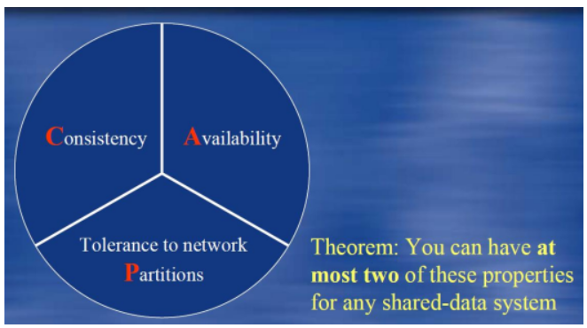
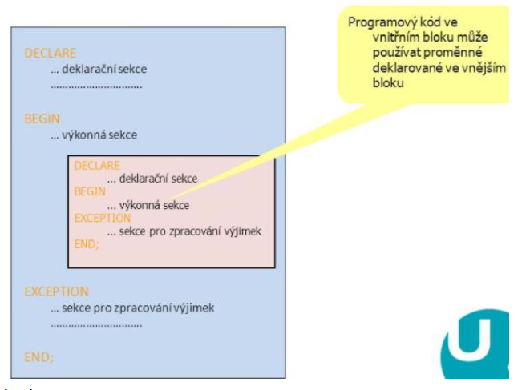
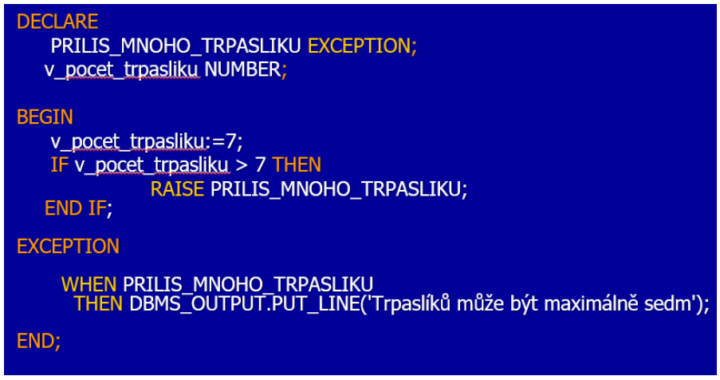
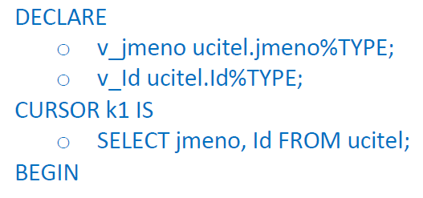
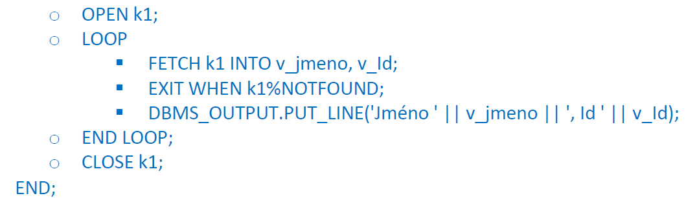

### 20 - Standardizace vývoje databázové technologie, norma ISO/IEC 9075 – rozšíření možností relačního modelu a trend vývoje databázové technologie - procedurální prostředky v rámci jazyka SQL. Kurzory – definice, klasifikace, použití kurzorů. Uložené procedury a funkce, balíky (packages), kompilace, spouštění. Standard SQL/PSM. [KIV/DB2]

- norma ISO 9075
  - vyplynulo z procesu standardizace SQL
  - norma ktera definuje jazyk SQL - respektive nutne minimum ktere by databazovy engine mel podporovat co se tyce SQL syntaxe
  - v roce 1986 by jazyk standardizovan americkou ANSI a o rok pozdeji mezinarodnim standardem ISO
  - novejsi verze normy SQL:2023
  - definuje prikazy pro
    - definici dat
    - editaci dat
    - vyber dat
    - definici pristupovych prav
    - transakce databaze (SAVEPOINT, COMMIT, ROLLBACK)

- rozsireni moznosti relacniho modelu
  - drive se pouzivaly hirearchicke sitove modely
  - pak prisly relacni ktere zustaly ale zacaly byt nahrazovany v mnoha aplikacich - ne vzdy je ACID pro aplikace kriticky
    - transakcni orientovanost relacnich DB muze byt omezujici co se tyce vykonu a horizontalniho skalovani
  - => zacaly se rozsirovat NoSQL DB (napr. Elastic Search, Mongo DB, Redis, ...)
    - velke vyuziti pri zpracovani BigData
      - ulozeni velkeho mnozstvi dat (typicky v realnem case)
      - provadeny masivni paralelni operace
      - => klasicke relacni DB na tyto aplikace nejsou vhodne
      - napr. v IoT
      - nejsou strukturovana, centralizovana
      - vlastnosti 4V
        - volume (objem)
          - dat je mnoho a zpracovani trva prilis dlouho
          - exponencialne roztouci mnozstvi dat
          - twitter, uzaverky obchodovani...
        - velocity (rychlost)
          - data mohou vznikat i kontinualne
          - obrovske mnozstvi dat je potreba analyzovat v kratkem case
          - detekce podvodu, optimalizacni ulohy
        - veriety (ruznorodost, nehomogenost)
          - ruznoroda data maji ruznou strukturu
            - nestrukturovana: video, senzoricka data, text
            - semistrukturovane: XML, JSON
          - rozpoznani pozadovane situace (udalosti) v zivem videostreamu
        - veracity (verohodne)
          - jak moc jsou data duveryhodna (napr. rozbity senzor?)
          - rosouci mnozstvi zdroju dat a problematicka duvera v data
          - fake news
    - nerelacni datovy model
    - podporuji distribuovanou architekturu
    - zamereny na vysoky vykon a horizontalni skalovatelnost
    - typy
      - dvojice klic-hodnota
        - pristup podkle klice pres hash (rychle)
        - napr: redis
      - dokumentove
        - jako klic-hodnota, ale hodnota je strukturovana
        - hodnota = JSON, XML, ...
        - napr: MongoDB
      - grafove
        - graf = uzly + vlastnosti a hrany mezi nimi
        - moznost pouziti grafovych algoritmu
        - napr.: Neo4J
    - neresi transakcni zpracovani (ACID) ale data jsou dostupna vzdy, i kdyz obcas pouze v castecne konzistentnim stavu
    - ACID vs BASE
      - ACID
        - "striktni/pesimisticky"
        - transakcni DB
        - Atomicity - atomicnost operaci (povede se cela nebo vubec)
        - Consistency - v DB jsou pouze konzistentni platna data (neni porusena integrita - napr. znamka 1-5)
        - Isolation - transakce se navzajem neovlivnuji
        - Durability - jakmile je transakce dokoncena, tak ji nevymaze ani napriklad nasledny vypadek proudu
      - BASE
        - "soft/optimisticky"
        - ridi se jim distribuovane systemy
        - CAP teorem vyreseni omezenim konzistence dat
          - prokazano jako teorem v roce 2002
          - nema silnou konzistenci -> pri cteni neni zajisteno ze se ctou aktualizovana (nejnovejsi) data
          - consistency
          - availability
          - partition tolerance (pocitacove site)
          - => zle zajistit pouze 2 ze 3 vlastnosti

          

        - Basically avaiable - pracuje vice mene porad
        - Soft state - nemusi byt stale konzistentni
        - Eventually constistent - v blizke dobe ale do konzistentniho stavu dojde

  - NewSQL
    - jednim z poslednich trendu
    - primarne zameren na skalovatelnost
      - => chceme vyhody a funkce relacniho modelu (ACID) a skalovatelnost/distribuovanost (BASE)
    - garantuji ACID
    - poskytuji vyssi vykon nez tradicni DB
    - priklad:
      - zpracovani transaktnich informaci velkou bankou
      - => je potreba zajistit konzistenci a zaroven rychlost
      - rychlost pribyvani a objem dat jsou moc velke na to aby se pouzila klasicka relacni DB
      - => moznost pouziti specialniho HW (mainfram) -> ty jsou ale drahe
      - => NewSQL se snazi zamezit nutnosti pouziti specialniho HW

- PL/SQL (proceduralni SQL)
  - oproti datum vkladanych do programu musime resit integritni omezeni
    - nektere hodnoty nemohou byt vkladany (napr. znamka 1-5 => nemuzu vlozit 6)
    - je lepsi resit integritni omezeni na urovni DB nez na urovni aplikace
  - deklarativni vs proceduralni jazyk
    - deklarativni
      - co se ma udelat (ale uz ne zpusob jak)
      - vyhoda: jeden prikaz
      - nevyhoda: zadna kontrola nad procesem ziskavani dat
    - proceduralni (imperativni)
      - jakym zpusobem ziskat sekvenci prikazu
      - vyhoda: kontrola nad provadenymi prikazy
      - nevyhoda: vireco prikazu
  - SQL je deklarativni jazyk
    - => v zakladu nepodporuje proceduralni konstrukce
  - existuji nadstavby ktere proceduralni konstrukce zavadeji
    - napr.: ANSI/ISO norma SQL/PSM nebo PL/SQL od Oracle
    - ruzne DB systemy mohou mit ruzne proceduralni nadstavby - napr. Postgres ma PL/pgSQL
    - do jiste miry kompatibilni s ANSI standardem
  - SQL/PLM
    - v zadase pridava flow-control struktury a moznost definovat procedury/funkce a ukladat je
    - FOR, LOOP, IF THEN a dalsi
    - dale se pridavaji promenne a vyjimky
    - uzce integraovany s SQL
    - umoznuje prenest aplikacni logiku primo do DB!
      - napr.:  je lepsi mit if (znamka < 1 || znamka > 5) { throw(...) } jednou primo na strande DB nez v kazde instanci aplikace co vydame na GooglePlay

  

  

- kurzory
  - privatni pracovni oblast
  - vytvoreny DB serverem pro kazdy SQL
  - ukazatel do pameti kam se ulozi vysledek dotazu
    - napr. SELECT s pojmenovanym vysledkem
    - => pomoci jmena pak s vysledekem muzu pracovat tak ze vysledek bude nekde ulozen -> k tomu slouzi kurzor
  - pres kurzor lze pak prochazet jednotlive radky vysledku SELECTu pomoci FETCH
  - nekde take popisuji kurzor jako promennou ktera umoznuje iterovat pres vsechny vysledky dotazu
  - kurzor = iterator
  - nastroj rozsireni sady vysedku
  - v PLSQL jinak vzdy jedna hodnota = jeden radek, ale cokdyz jich je vic a chci je prochazet?
  - typy kurzoru
    - implicitni
      - neni nutne otevirat, zavirat, deklarovat, nacitat data
      - vytvaren automaticky DB serverem v PL/SQL bloku
      - obecne efektivnejsi a vykonnejsi nez explicitni
      - uspora zhlediska kodu
      - Oracle pouziva implicitni kurzory pro DML (= Data Manipulation Language - INSERT, UPDATE, DELETE)
        - kurzory ukazuji na jednotlive zaznamy
        - zaroven jsou kurzory pouzity pro SELECTy ktere vraceji jednu radku - `SELECT <...> INTO <x1, ..., xn>`
      - implicitni kurzor je neco jako `for (const auto& x : arr)`
        - => na pozadi se stejne pouziva iterator
    - explicitni
      - deklaruje programator v kodu (PL/SQL bloku)
        - `CURSOR <name> IS <query>`
      - pred pouzitim je kurzor potreba otevrit (OPEN) a pak ho zase zavrit pres CLOSE a dealokovat pres DEALLOCATE
      - ziskani jedne radky (jednoho vysledku dotazu)
        - `FETCH FROM <name> INTO <x1, x2, ..., xn>`
        - kurzor se pak automaticky presune na dalsi vysledek
      - muze navic akceptovat parametry
      - lze ho predavat mezi procedurami

      

      

  - kurzor umoznuje zjistit
    - jestli je otevreny pomoci %ISOEPN
    - jestli byl vybran dalsi validni zaznam nebo ne pomoci %FOUND / %NOTFOUND
    - kolik zaznamu kurzor ma, resp. operace s nim pojena, zpracoval pomoci %ROWCOUNT

- ulozene procedury a funkce, baliky, kompilace, spusteni
  - zaznamy
    - = struktura zapouzdrujici vice polozek i rozdilnych datovych typu
    - neco jako `struct` v C?
  - procedury i funkce jsou ulozeny v DB
  - myslenka je takove za si chceme ulozit casto pouzivany kod logiku a znovu ji pouzit na vicero mistech (omezit copy-paste)
  - jsou to v podstate pojmenovane bloky SQL/PSM prikazu
  - pokud je chceme spustit, udelame to pres EXEC nebo obalenim do BEGIN-END bloku
  - v Oraclu se kompiluji procedury i funkce a pak se zase spousteji
  - mazani pomoci DROP
  - rozdil mezi procedurou a funkci
    - procedura
      - posloupnost prikazu ktere se provedou v okamziku jejiho spusteni
      - ma 0 nebo vice vystupu
      - ma libovolne mnozstvi vstupu
      - muze mit IN/OUT parametry
      - nemuze byt soucasti dotazu

      

      - procedura ma nasledujici strukturu
        - DECLARE
        - konstaty a promenne
        - BEGIN
        - telo
        - EXCELTION
        - obsluha vyjimek
        - END
      - v tele lze bez omezeni pouzit DML ale SELECT musi byt proveden jako INTO nebo pres kurzor

    - funkce
      - ma presne jednu navratovou hodnotu!
      - muze mit libovolne mnozstvi vstupu
      - muze mit IN/OUT parametry
      - muze pouzivat SELECT
      - nesmi pouzivat DDL (= Data Definition Language) a DML (= Data Manipulation Language)
      - nezle z ni volat proceduru
      - nemuze obsahovat obsluhu vyjimek
      - neni mozne v ni provest transakci
      - muze byt pouzita jako soucast dotazu (napr. SELECT)

      

    - => hlavni rozdil je v tom ze zatimco funkce se typicky pouzivaji v ramci SELECT, INSTERT nebo DELETE prikazu, procedury se typicky pouzivaji pro implementaci business logiky

  - balicky
    - zpusob logickeho seskupeni typu, promennych, konstant, procedur, funkci, kurzoru a vyjimek
    - zkompilovan a ulozen v DB kde je mozno jeho obsah vyuzivat
    - kazdy balicek ma specifikaci ktera rika jake jeho komponenty jsou verejne dostupne
    - pokud specifikace obsahuje procedury, funkce nebo kurzory, tak musi mit balicek i telo
      - telo pak muze deklarovat promenne potrebne pro fungovani balicku ale nepristupne zvenci
    - jak presne se balicek chova zavisi na jeho implementaci
      - typicky jsou ale zkompilovany a ulozeny do DB
      - DB pak umi chytre rekompilovat jen ty casti balicku ktere se zmenily
    - z dokumentace PL/SQL (Oracle) mohou byt balicky stavove nebo bezstavove
      - stavove balicky maji alespon jednu promennou, konstantu nebo kurzor
      - pro kazdou session se vytvori vlastni instance balicku ktera obsahuje stav pokud je balicek stavovy
