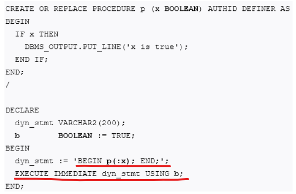
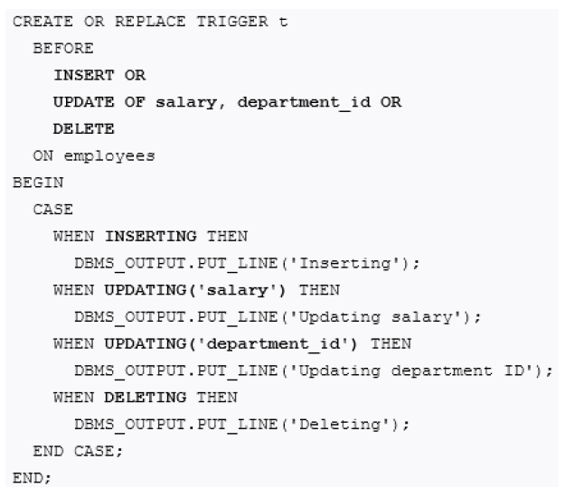

### 21 - Dynamické a statické SQL, aktivní databáze – charakteristika, význam, příklady využití, porovnání s jinými možnostmi ovládání integrity a konzistence databáze. [KIV/DB2]

- dynamicke a staticke SQL
  - je to z dokumentace Oracle -> takze PL/SQL; je mozny ze to jinde funguje jinak (nechce se mi prohrabavat SQL/PSM)
  - staticke SQL
    - PL/SQL featura ktera umoznuje pouzivat SQL syntax primo v PL/SQL prikazdu
    - podle dokumentace maji stejnou syntaxi jako SQL prikazy ale umoznuji pouzivat staticke promenne tam kde by se v klasickem SQL pouzivaly bindovane promenne
    - alternativne DB2
      - staticke SQL = SQL musi byt zname v dobe prekladu
      - binding promenny se tedy provadi rovnou pri kompilaci a ne za runtime
    - "natvrdo" napsany SQL ktere neobsahuje zadne promenne ktere by se vlozily za runtime
      - `SELECT count(*) INTO x FROM some_table;`
      - za runtime neni dovoleno uzivateli SQL prikaz/dotaz nijak modifikovat
    - trochu vetsi zabezpeceni proti SQL injection?
      - `strings my_file` najde a vypise vsechny stringy v binarce -> muzeme je rucne prepsat a tim udelat SQL injection (trochu vic omezene nez kdyz berem parametry primo od uzivatele)
  - dynamicke SQL
    - umoznuje generovat a spoustet SQL prikazy za behu programu
    - napriklad pokud nezname nazev tabulky nebo substring ktery chceme vyhledavat
    - definujeme SQL jako string a bindujeme promene az za behu
    - SQL prikaz pak pustime pres `EXECUTE IMMEDIATE <sql_string> USING <x1, ..., xn>`
    - `EXECUTE IMMEDIATE 'select count(*) from some_table' INTO x`;
      - dynamicky nam dovoluje zjistovat pocet radku v tabulce (napr. nazev tabulky = vstup od uzivatele)
    - poskytuje vyssi flexibilitu
    - trochu horsi vykon
      - kompilace SQL a bindovani promennych = overhead
    - je potreba parsovat ze stringu (SQL dotaz je definovan jako string, ne jako cisty SQL)

    

- aktivni databaze
  - rozsireni DB systemu o aktivni pravidle = triggery
  - uzivatelsky blok PL/SQL sdruzeny s urcitou tabulkou je implicitne spusten jestlize je nad danou tabulkou proveden aktualizacni prikaz
  - = umi aktivne reagovat na udalosti
    - podporuje triggery nebo jim podobny mechanismus
  - triggery
    - pro vyhodnoceni slozitych podminek kladenych na data
    - kontrola na databazove urovni
      - => usnadneni prace
    - = ulozeny pojmenovany PL/SQL blok kodu ktery muze byt spousten opakovane
    - narozdil od procedury nebo funkce ho neni mozne explicitne zavolat!!
      - => lze ho pouze povolit/zakazat
    - trigger muze specifikovat udalosti pro ktere se aktivuje
    - muze take specifikovat aktivacni bod
      - to jestli se aktivuje pred nebo az po udalosti
      - pripadne pro kazdy radek ovlivneny udalosti
    - je spojeny s DB objektem (tabulka, view, schema nebo cela DB)

    

    - triggery nejsou nahrada za kontrolu integrity a konzistence DB!
      - na to mame integritni omezeni na urovni jednotlivych atributu?
    - typicky se pouzivaji pro
      - loggovani
      - ziskavani statistik
      - auditovani
      - modifikaci tabulek pokud je DML (= Data Manipulation Language - INSERT, UPDATE, DELETE) pouzita na view
      - vynuceni referencni integrity u distribuovanych DB
      - zabraneni nevalidnim transakcim
      - implementaci business logiky
    - muzou fungovat neco jako `cron` na Linuxu?
    - umoznuji vynutit integritu a konzistenci pouze po jeho vytvoreni
      - pokud napriklad chceme zabranit vkladani `NULL` hodnot do sloupce, tak existujici hodnoty ktere jsou `NULL` jiz trigger neovlivni
      - contraints jako `NOT NULL` jsou jednodussi na pouziti nez pouziti triggeru? (ty ale take nemodifikuji existujici data)
        - => triggery toho ale zvladnou vice
    - obecne je lepsi pouzivat contraints (napr. jmeno max 50 znaku) a triggery pouzivat jen v nutnych pripadech
    - existuji DML triggery a systemove triggery
    - systemove triggery
      - lze je napojit na databazovou udalost (napr. start DB nebo serverovy error)
      - lze je napojit na schema uzivatele
        - veci jako CREATE, REPLACE, DROP
    - DML triggery
      - lze je napojit na udalost - INSERT, UPDATE, DELETE
      - lze specifikovat jestli se spusti BEFORE nebo AFTER
      - lze specifikovat poradi vuci ostatnim triggerum - PRECEDES nebo FOLLOWS \<trigger\>
    - existuji prikazove triggery
      - ty jsou vazany na prikaz a tabulku
      - spousti se jako dany prikaz a pouze jednou
    - existuji radkove triggery
      - poskytuji pristup k ovlivnenym radkum tabulky (vlozenym, aktualizovanym i smazanym)
      - lze specifikovat podminku WHEN
      - provedou se nad kazdou radkou - FOR EACH ROW
      - mohou byt vazany na vice udalosti
        - v tele triggeru je pak mozne zjistit ktera konkretni udalost nastala
      - vychozi chovani je ze se provedou BEFORE prikazove triggery, BEFORE radkove triggery, samotrny SQL prikaz ktery spustil triggery, AFTER radkove triggery a nakonec AFTER prikazove triggery
