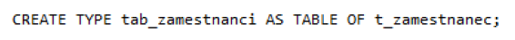
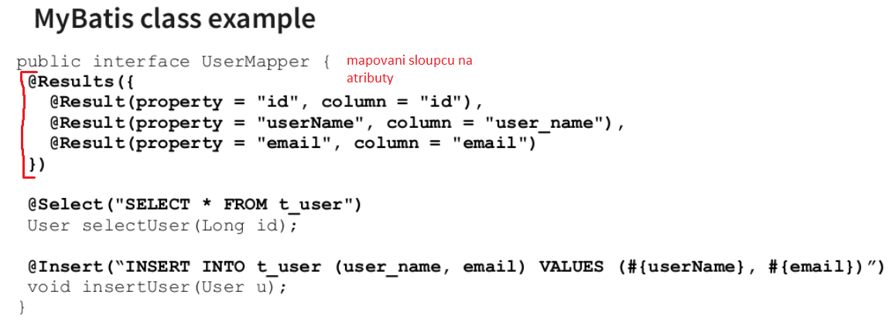

### 22 - Objektové vlastnosti jazyka SQL99, rozšíření datových typů. Vlastnosti objektově orientovaného datového modelu, možnosti použití, porovnání s relačním a objektově-relačním modelem. Standard SQL/OLB. [KIV/DB2]

- standard SQL/OLB
  - = standard pro integraci SQL v Jave
  - publikovany jako cast 10 standardu SQL:1999
  - puvodne se jednalo o SQLJ - na internetu je malo informaci a placeny normy, takze nic moc

- objektove vlastnosti jazyka SQL99, rozsireni datovych typu
  - objektove orientovane + relacni DB
    - pridavani objektovosti do tabulek
  - objektovy model - v souladu s videnim sveta (entita => objekt)
    - chtelo se vyuzit "pruznosti" a prodoktivite ktery prinasi OOP navrh a analyza
  - motivace
    - pozadavky novych aplikaci
      - nove typy objektu a funkci
      - OO analyza vs relacni DB
    - => cilem je integrace a sprava dat v jednom systemu

    

  - OOSRDB (= Objectove Orientovany System Rizeni Baze Dat)
    - operace na slozitych datovych typech
    - rekurzivni struktury
    - abstraktni datove typy (asociativni pole, zasobnik, seznam, strom, ....)
    - rozhrani OOP jazyku
    - slozite transakce
    - zapozdreni (napr. private) -> vynuceni integritniho omezeni ze hodnota je hodnota spravovana vnitrne (uzivatel nema pristup)
    - => napr. Oracle

  - SQL99 pridalo podporu mnoha objektovych paradigmat do SQL
  - umoznilo definici strukturovanych datovych typu ADT (= Abstraktni Datovy Typ)
  - UDT (= User-Defined Types)
  - v SQL99 je podpora pouze dedeni od jednoho predka
    - uzivatelsky definovany ADT lze pouzivat jako jakykoliv jiny typ - vsude kde se pouzivaji SQL typy
    - definici provadime pomoci `CREATE TYPE <name> AS OBJECT` nasledovany definici atributu
    - takovy ADT lze pak pouzit jako sloupec tabulky
  - objekty mohou mit krome atributu i metody
    - => v tom pripade je nutne definovat ADT a jeho telo oddelene
    - ADT obsahuje hlavicky metod
    - telo ADT obsahuje implementaci
    - priklady ADT
    - OID (= Object ID)

    

  - objekty mohou byt FINAL nebo NOT FINAL (muze byt oddeden)
    - stejne to plati i pro metody (NOT FINAL -> muze byte pretizena)
  - pokud chceme reprezentovat obejt radkem tabulky
    - muzeme tabulku definovat jako `CREATE TABLE <table> OF <adt_name>`
  - atribut muze byt i pole VARRAY -> umozneni vlozeni vicero instanci do stejneho typu
    - musime ale definovat maximalni velikost
    - pristupovat pak k jednotlivym prvkum pole muzeme pretypovanim pole na tabulku
    - `CREATE <arr_adt_name> AS VARRAY(<size>) OF <another_adt_name>`
    - nevyhodou poli je ze s nimi pracuje jako s atomickymi hodnotami
      - pokud je potreba pole zmenit => je potreba ho redefinovat, resp. prepsat
    - tento problem lze vyresit vnorenymi tabulkami => ty je mozne aktualizovat protoze pristupujeme k jednotlivym radkum (narozdil od poli)
    - nadefinujeme ADT

      

    - a pak jeho tabulku jako ADT

      

    - tento tabulkoidni ADT pak muzeme pouzit jako klasicky ADT (tedy jako sloupec)
    - je to ale trochu komplikovanejsi
      - pokud definujeme tabulku ktera obsahuje jako sloupec ADT ktery je TABLE tak musime definovat kam se budou zaznamy z teto vnorene tabulky ukladat

        

      - vnorena tabulka je sice viditelna ale neni pristupna pres DML (= Data Modification Language)
      - v nekterych pripadech nechceme ukladat objekty ale jen reference na ne
        - => proto existuje typ REF
        - pokud sloupec odkazuje na instanci ADT, definujeme ho jako `REF <adt_name>`

          

  - kazdy object ma sve OID (= Object ID)
    - unikatni
    - neni recyjlovane
  - reference nevynucuji integritni omezeni
    - reference nemusi odkazvovat na existujici objekt (=> neni zarucene integritni omezeni)
    - referenci ziskame jako REF(object)

- vlasnostni OO datoveho modelu, moznostu pouziti
  - OO DB reprezentuji informace jako objekty ktere mezi sebou maji vazby
  - vyhodou OO DB je jejich rychlost pri ukladani komplexnich dat
    - protoze se neprovadi mapovani objektu na radky v tabulce ale pouzivaji se primo pointery
    - je mozne prochazet DB rychleji

- porovnani s relacnim a objektove relacnim modelem
  - relacni DB
    - jsou tabulkove orientovane
    - pro ukladani objektu lze pouzit nejakou formu ORM
    - zavislosti (vztahy) v relaci DB

      

  - objektove-relacni DB
    - jsou hybridem obou pristupu - SQL/OLB (= Object Language Bindings)
    - v podstate zavadi podporu objektu do jinak relacni DB
    - hlavnim rozdilem bylo preklenuti rozdilu mezi relacnimi DB a OOP

- ORM mapovani
  - ORM v SQL
    - JDBC (= Java Database Connectivity) priklad

        ```java
        Statement psmt = new PreparedStatement(“SELECT * FROM Users”);

        ResultSet set = psmt.execute();
        List<User> users = new ArrayList();

        while(set.next()) {
            String name = set.get(“name”);
            String email = set.get(“email”);
            User u = new User(name, email);
            users.add(u);
        }
        ```

    - ORM priklad napr JPA = javovska specifikace pro ORM

        ```java
        List<User> users = repository.findAll(User.class);
        ```

  - ORM (= Object-Relational Mapping)
    - premosteni mezi objektovym a relacnim svetem
      - tridy = tabulky
      - atributy = sloupce
      - nejsou stejny! (dedicnost, public/private)
    - zjednodusseni - vyvojari se nemusi starat o to jak vypada SQL
    - jednoduche na pouziti
    - past pokud nerozumime relacnim databazim nebo frameworkum - proste tomu jak to vnitrne funguje
    - ma to smysl?
      - pokud je aplikace mala - je pomalu i lepsi si SQL + mapovani psat sam
    - typy
      - plne automatizovane - dela uplne vsechno
        - jednoduche na pouziti
        - slozite na SPRAVNE pouziti

        

        - Linux neni case-sensitive => je lepsi presne specifikovat nazav tabulky a nenechat ORM si to odvodit z nazvu tridy

      - manualni ORM
        - programator si musi psat SQL
        - ORM pomaha s mapovanim objektu

        

    - vykonost
      - ORM je obecne pomalejsi
      - programator by mel vedet jaky SQL se generuje
      - asociativni nacitani (napr Post ma Liky) -> pres ORM jeduche, defakto automaticke, ale na pozadi vyzaduje vice SQL dotazu -> jeste vetsi problem je to pri hirearchii trid -> nehoraznej pocet pristupu do DB
      - reseni problemu SELECT N+1
        - LAZY loading = nacti mi jen zakladni atributy a nenacitej asociativni objekty (vzdy kdyz mame relaci *-to-many)
          - nevyhoda: kdyz pote zavolame getter -> vyusti v dodatecne SQL (donacteni)
          - v pripade relace *-to-one je lepsi pouzit LEFT JOIN nez vice selectu

          ```sql
          SELECT * FROM user WHERE;
          // for all users
          SELECT * FROM address a WHERE = a.user_id = :userId
          ```

          ```sql
          SELECT u.username, a.city FROM user u LEFT JOIN address a ON u.id = a.user_id;
          ```

          - mame pouze jeden SQL dotaz ale zas muzeme prenaset duplicitni data v pripade ze jeden uzivatel ma vice adres (obecne u *to-many)

  - problem mezi relacnim a objektovym svetem
    - v relacni DB neexistuje koncept private atributu -> vsechno je public -> kdokoliv se k DB pripoji si muze precist jaky sloupecky chce
    - abychom mohli tridu ulozit do DB pouzijem gettery/settery -> poruseni OOP navrhu
      - dalsi moznosti je napr pouzit DTO (= Data Transfer Object) -> ulozime jen cast tridy do DB, po nacteni namapujeme DTO na reaalny objekt -> casove pomalejsi
    - dedicnost
      - realcni DB neumi vyjadrit dedicnost
      - moznosti reseni
        - kazda trida v dane hirearchii = 1 tabulka
          - duplicitni atributy
          - pri prochazeni hierarchii musime volat vice dotazu nad danou DB
        - jedna tabulka ktera obsahuje vsechny tridy z dane hirearchie
          - hodne "blank" policek
          - neefektivni zpusob uchovavani dat
          - jednoduchy SQL query
        - jedna tabulka pro rodicovskou tridu
          - samostatne tabulky pro potomky
          - propojeni pres cizi klice
          - nejsou duplicitni sloupce
          - pri vyhledavani musime delat join
          - efektivni ulozeni
        - prijdeme o typ vztahu (kompozice? agregace?)
          - v pripade tridy je prochazeni jeho komponent jednodussi nez kdyz musime v DB "skakat" pres vice tabulek
          - agregace

          

          - kompozice

          

        - => vsechny tyto nedostatky = leaky abstraction

- typy joinu v SQL

  

  - priklad:
    - ma dve tabulky
      - transactions

        

      - customers

        

  - INNER JOIN
    - spojeni informaci ze dvou tabulek (napr. `customer ID`)
    - muzeme taky specifikovat jen ty slupce ktere chceme zobrazit

    

  - LEFT JOIN
    - z leve tabulky vybereme vsechno, i ty radky ktery nemaji zadny link na druhou tabulku
    - pokud najdeme shodu v customer_id => pridej i data z druhe tabulky

    

  - RIGHT JOIN
    - opak left join
    - zobrazime vse z prave tabulky + radky kde je shoda v customer_id, pridame i data z leve tabulky

  - FULL OUTER JOIN
    - kombinace LEFT a RIGHT joinu
    - zobrazime vsechna data z obou dvou tabulek
    - kde je shodne customer_id pridame data z druhe tabulky
