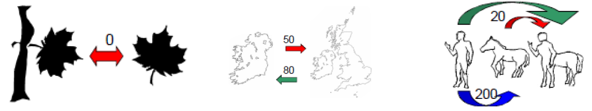
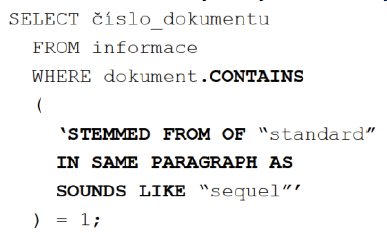
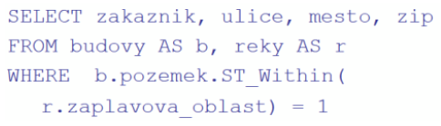
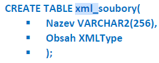

### 23 - SQL/MM – multimediální databáze - základní rámec normy ISO/IEC 13249, full-textová data, prostorová data, obrázky (statické i videa). Možnosti dotazování, oblasti využití. XML databáze – charakteristické vlastnosti, výhody a nevýhody. Standard SQL/XML. [KIV/DB2]

- SQL/MM je rozsireni SQL ktere zahrnuje praci s multimedialnimi daty
- stavi na objektovem rozsireni SQL:1999
- motivace
  - klasicke relacni DB
    - pevne dana struktura i semantika
      - schema DB, typove atributy, tabulky, integritni omezeni, funkci zavislosti, ...
      - "umela" povaha dat (clovekem vytvorene atributy a jednoznacne interpretovatelne atributy)
      - vime co hledame => staci dotaz na uplnou shodu
  
  - multimedialni DB
    - kolekce obrazku, audia, videa, casovych rad, textu, XML, atd.
    - obecne kolekce nestrukturovanych dat (dokument)
    - vnitrni struktura i semantika je skryra a nejednoznacna!
      - zavisi na aplikaci, datech i subjektivite uzivatele
    - "analogova" pohava dat (digitalizace signalu / senzorovych dat)
    - nevime poradne co hledame ani jak se ptat => nestaci dotazy na uplnou shodu
  
  - priklady multimedialnich dat
    - obrazove DB
      - biometricke DB (otisky prstu, ocni duhovky, oblicejove rysy, ...)
      - medicinske snimky (rentgen, ultrazvuk, ...)
      - satelitni snimky
    - video kolekce
      - TV zpravodajstvi
      - filmova kolekce
      - zaznamy z bezpecnostnich kamer
    - geometricke kolekce
      - CAD modeluy
      - geograficka, kartograficka a GIS data
    - casove rady, audio
      - vyvoj kurzu akcii nebo men
      - medicinska data (EKG, EEG, ...)
      - rec (obecne zvuk)
    - biologicke DB
      - checmicke latky (molekuly, slouceniny, ...)
      - sekvence DNA, bilkovin
    - melodie
      - notove partitury
      - MIDI soubory
    - text, hyper-text
      - digitalni knihovny, archivy, e-mail
      - web

  - dotazy
    - klasicke relacni DB
      - dotaz lze jednoduse formulovat (napr. SQL dotaz)
      - dotaz na uplnou shodu presne urcuje jak vypada relevantni a plne nerelevantni mozny vystup
      - vysledek dotazu neni dale strukturovany
        - => vsechno je stejne relevantni
      - propracovane (sofistikovane) pristupove metody = rychle vykonani dotazu
    - multimedialni DB
      - jak to vubec formulovat?
      - jak dopredu kvantifikovat co pro mne jeste je a co uz neni relevantni?
      - co je vlastne relevance k dotazu?
      - jak dotaz provest efektivne (rychle)?

  - metody reseni
    - prvni cast (obecne aspekty, architektury, modelovani)
      - struktura MDB (= Multidimensional Database) systemu, modality vyhledavani,
      dotazy na podobnost
      - extrakce vlastnosti, miry podobnosti, kvalita a rychlost vyhledavani
      - mapovani a redukce dimenze
      - aplikace, ukazky existujicich systemu
      - (duraz na kvalitu vyhledavani)
    - druha cast (implementace, indexovani)
      - MAM (= Metricke Pristupove Metody) vs SAM (= Prostorove Pristupove Metody)
      - principy indexovani pomoci MAM
      - staticke MAM, dynamicke MAM
      - priblizne a pravdepodobnostni vyhledavani

  - typy MDB (= Multidimensional Database) systemu
    - text-based retrival systemy
      - vyhledavani podle textove anotace (meta-informace)
        - automaticke anotovani (napr. pres images.google.com vyuziva textu na strankce kde je obrazek odkaz; pripadne nazev obrazku)
        - rucni anotace (vetsinou kvalitnejsi; experti; vice casove narocna)
      - vyhledavani pak funguje na zaklade mnoziny klicovych slov
      - vyhody
        - vyuziti stavajici implementace fulltextovych vyhledavacu
      - nevyhody
        - nelze aplikovat na neanotovane kolekce
        - rucni anotovani je drahe
        - ziskane dokumenty mohou byt uplne nerelevancni (neodpovida to ocekavani uzivatele)
    - content-based retrival systemy
      - vyhledavani pouze na zaklade obsahu
        - ruzne metody popisu obsahu
      - vyhody
        - vyhledavani podle skutecneho obsahu
        - nezavislost na anotaci
      - nevyhody
        - existuje mnoho metod modelovani struktury a semantiky obsahu => kterou vybrat?
    - hybridni systemy
      - kombinuje predchozi zminene
    - => pomer rychlosti a kvality => je tezke udelat oboje najednou

  - modality vyhledavani
    - dotazovni (querying)
      - dotaz v kontextu dokumentu
        - dokument chapan jako databze kde hledame dilci fragment
        - rozpoznavani/analyza obrazu, vyhledavani v DNA sekvencich, retezcich, atd.
      - dotaz v kontextu kolekce
        - cely dokument predstavuje semantickou jednotku
        - dtabazovy pristup
    - prohlizeni (browsing)
      - navigace v cele kolekci
        - hirearchicka struktura kolekce
        - okoli (web, ontologie)
      - vhodne pro interaktivni hledani formou zpresnovani (napr. Elastic Search?)

  - dotazovani podle podobnosti
    - query-by-example typy dotazu
      - ptame se primo nejakym dokumentem
        - at dokument z databaze ve ktere hledame nebo jinym
      - navic specifikujeme rozsah dotazu nebo vysledku
        - bodovy dotaz
        - rozsahovy dotaz - prah `r`
        - `k` nejblizsich soustedu

  - kriteria metrikovych vlastnosti!!
    - refelexivita: objekt musi byt sam sobe podobny
    - pozitivita: objekt je maximalne podobny (totozny) jinemu objektu
    - symetrie: objekt 1 je podobny objektu 2 jinak nez je tomu naopak
    - trojuhelnikova nerovnost: obecne neplati tranzitivita

    

- je rozdelen do 6 casti
  - part 1 - framework - spolecna cast ostatnich (zakladni ramec)
  - part 2 - full-text (plnotextova data)
  - part 3 - spatial (prostorove)
  - part 4 - general purpose facilities
  - part 5 - still image
  - part 6 - data mining

- part 2 - full-text
  - v podstate retezec dost velky na to aby se nedal jako retezec indexovat
  - misto toho se k nemu chovame jako k dokumentu po zvoru KIV/IR
  - umoznuje
    - vyhledavani dle frazi (CONTAINS)
    - ranking (RANK)
    - wildcards
    - odvozena slova (STEMMED - koren slova?)
    - vyhledavani dle synonym

    

- part 3 - spatial (prostorove)
  - jedna z tech nejvyuzivanejsich casti
  - kombinace formatovanych a prostorovych dat
  - potrebujeme vhodny dotazovaci jazyk
    - => rozsirujeme SQL tak aby podporovalo prostorove dotazy
      - priklad prostoroveho dotazu: vsechna mesta rozdelena rekou
      - priklad neprostoroveho dotazu: kolik lidi zije v Ostrave
  - spatial definuje zpusob ukladani, vyber, dotazovani a aktualizaci prostorovych objektu
    - objekty jsou body, krivky, plochy, polygony
    - tyto objekty jsou definovane v geometrii spatial
  - stejne tak musime podporovat souradnicove prostory s nejakym z nichz je kazdy objekt asociovan
  - lze provadet operace typu prunik, sjednoceni, sousedi s, obsahuje, atd.
  - podporuje konverzi z pouzivanych formatu - well known text, well known binary, geography markup language
  - pouziva se v GIS nebo CAD systemech

    

- part 4 - general purpose facilities
  - pokus o obecnou implementaci matematickych operaci - zatim ve standardu neni

- part 5 - still image
  - obsahuje typy pro data (obrazky) a vlastnosti
  - vlastnosti jsou uzitecne pro vyhledavani
    - kazda ma metodu pro vypocet podobnosti mezi obrazky
  - pro obrazova data mame jako featury napr. SI_AverageColor, SI_ColorHistogram, SI_Texture nebo SI_PositionalColor
    - => z toho vyplyva ze score pro podobnost se pocita na zaklade barev a textur primo v obrazovych datech
  - kazda vlastnost je spojena s SI_Score pro vypocet podobnosti
  - SI_FeatureList je seznam vsech featur

- part 6 - data mining
  - aplikacni balicek s metodami pro hledani vztahu v datech
  - algoritmy RULE MODEL, CLUSTERING MODEl, REGRESSION MODEL (predikce hodnot), CLASSIFICATION_MODEL (klasifikace hodnot)
  - nejprve vytvorime DM MODEL, pote ho natrenujeme, otestujeme a pak aplikujeme na data

- SQL/XML
  - standard SQL/XML zavadi datovy typ XML, funkce pro praci s nim a moznost embedovat XQuery do SQL
  - typicky databaze nejsou XML-only ale doplni se XML do existujicich databazi
  - to znamena ze XML je ukladano jako Large Text Object nebo BLOB (= Binary Large Object)
  - je rozlozeno do relacnich tabulek podle schematu nebo muze byt implementovano podle SQL/XML standardu
  - podpora XML znamena
    - podpora zpusobu dotazovani aplikovaneho na XML dokumenty
      - napr. XQuery nebo XPath
  - existuji ale i XML-only DB (napr. BaseX nebo eXist)
    - poskytuji vyssi vykon co se tyce XML nez XML-enabled RDBMS (= Relacni Databazovy Management System) protoze mohou pouzivate efektivnejsi datove struktury pro uchovani informaci
  - vyhodou je moznost zpracovavat a vyhledavat v XML souborech

    
