### 24 - NoSQL databáze – charakteristika, porovnání ACID a BASE, CAP teorém. Kategorie NoSQL databází na základě datového modelu, příklady architektur. [KIV/DB2]

- NoSQL
  - databaze ktere nejsou zalozene na relacnim datovem modelu
  - podporuji distribuovanou architekturu
  - rozvoj hlavne take kvuli BigData
  - zamereny na vysoky vykon a horizontalni skalovatelnost
    - dovedou zpracovani obrovskeho mnozstvi dat v realnem case
  - nereseni transakcni zpracovani (ACID)
    - => data jsou dostupna vzdy ale mozna i v castecne nekonzistentnim stavu
  - vetsina z nich je OpenSource
  - neresi transakcni zpracovani (ACID) ale data jsou dostupna vzdy, i kdyz obcas pouze v castecne konzistentnim stavu

- ACID vs BASE
  - internetove aplikace jako jsou socialni siste, bloky, znalostni DB a dalsi vytvareji obrovske mnozstvi dat ktera musi byt dale zpracovana
    - => provozovatele takovych aplikaci si musi urcit priority (viz CAP teorem -> 2/3)
    - dostupnost a tolerance k vypadku se stavaji dulezitejsim nez konzistence
    - internetove aplikace musi byt vykonne a spolehlive
    - vykonnosti lze dosahnout moci horizontalniho skalovani a spolehlivosti vyssi redundanci
      - => velmi obtizne pri dodrzovani ACID => proto se aplikuje BASE pristup
  - ACID
    - koncept ACID je zaklad transakcniho zpracovani dat
    - nejvice rozsireny a pouzivany v relacnich DB
    - transakce = vice operaci najednou (zabalene do jedne transakce)
      - napr. poslani penez = odepsani penez z jednoho uctu + pripsani na druhy
    - A (= Atomicity)
      - transakce jsou atomicke => bud se provede cela nebo vubec
      - neexistuje zadny rozpracovany stav
        - a to i ve vztahu k mozne chybe OS nebo HW
    - C (= Consitency)
      - konzistence DB
      - v DB jsou pouze platna data podle danych pravidel (viz. napr. integritni omezeni?)
      - provadeni transakci zachovavaji konzistenci DB
    - I (= Isolation)
      - soubezne provadene transakce se navzajem neovlivni
      - viz napriklad bankovni problem nebo false sharing (falesne sdileni - cache a RAM)
    - D (= Durability)
      - trvanlivost
      - uskutecnena transakce nebude zptracne
        - ani po padu SW nebo HW
    - nevyhody
      - netrivialni
      - omezuje zmeny dat (zamykani) a pristup k datum (rychlost)

  - BASE
    - vyuzivan pri navrhu distribuovanych systemu
    - BA (= Basically Available)
      - system vetsinu casu pracuje
    - S (= Soft State)
      - uloziste nemusi byt konzistentni se zapisem
      - repliky nemusi byt vzajemne konzistentni po celou dobu
    - E (= Eventually Consistent)
      - nakonec se do konzistentniho stavu dostanou
      - uloziste vykazuji konzistenci v pozdejsim okamziku
        - => lazy at read time!
        - nekonzistence reseny pri
          - cteni (vezrovani, nevalidni cache)
          - zapisu (distribuce zmen)
          - nebo asynchrone (replikace dat)
        - nema silnou konzistenci
          - => pri cteni neni zajisteno ze kdo cte dostane nejnovejsi data
          - osetreni chyb ne na datove ale na aplikacni vrstve

  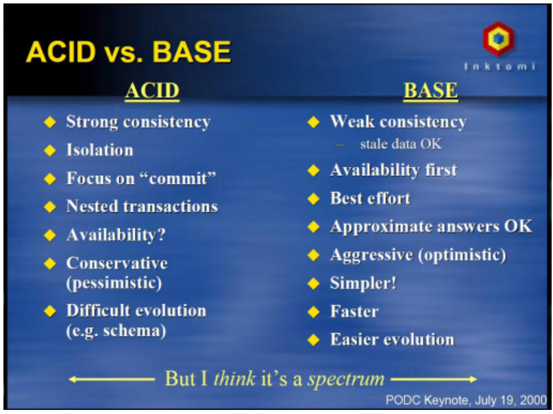

  - ACID vs BASE
    - silna konzistence X slaba konzistence
    - izolovanot X dostupnost na prvnim miste
    - orientace na commit X priblizne odpovedi jsou OK
    - vnorene transakce X jednodussi, rychlejsi
    - dostupnost? X dodavka jak to pujde
    - ACID = databazovy system, striktni (pesimisticky)
    - BASE = distribuovany system, soft (optimisticky)

- CAP teorem
  - prokazano jako teorem v 2002 (Gilbert & Lynch)
  - prijat v NoSQL komunite -> ovlivnuje navrh nerelacnich DB
  - pro DS (= Distribuovany System) je NEMOZNE soucasne garantovat nasledujici vlastnosti (lze pouze zarucit 2/3)
    - C (= Consitency)
      - konzistence nezavisle na bezicich operacich ci jejich umisteni
      - vsechny operace cteni vraci verzi dat vlozenou posledni operaci zapisu
    - A (= Availability)
      - kazdy pozadavek oblouzen uspecne ci neuspesne
      - nepretrzity provoz => vzdy moznost zapsat/cist data
    - P (= Partition Tolerance)
      - funkcni (tolerantni) navzdory chybam pocitacove site nebo vypadkum uzlu
      - moznost vypadku casti infrastruktury (odstavka pro udrzbu)
  - lze zarucit pouze 2/3 vlastnosti
    - CA (= Consistency + Availability)

      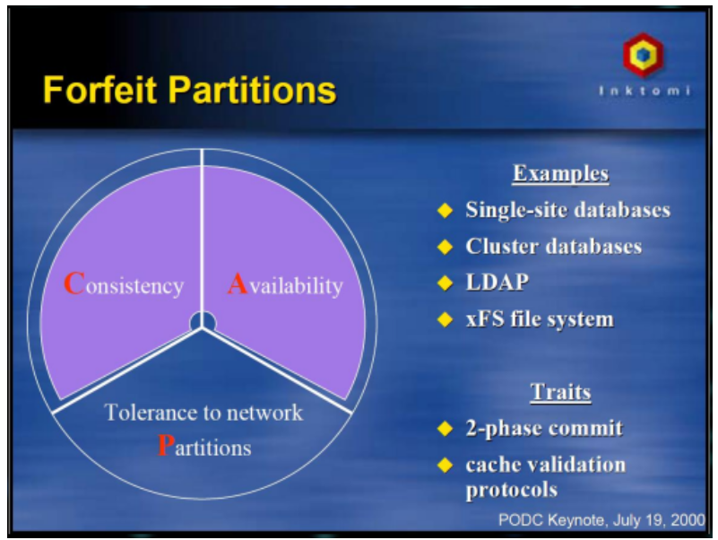

      - dvoufazovy commit
        - Update, ACK, Commit/Rollback

        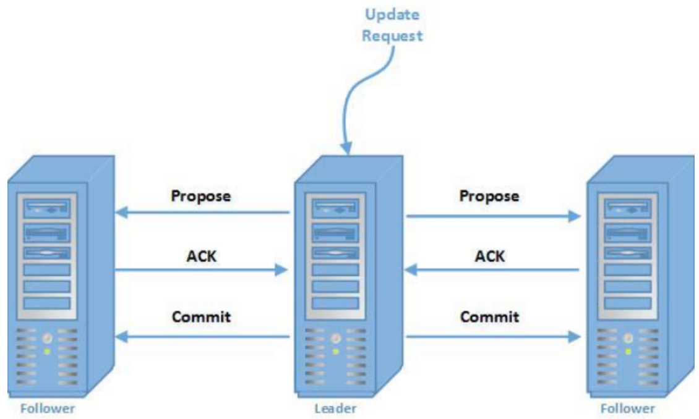

      - protokoly pro (in)validaci cache
      - napr. LDAP, xFS file system, Postgres, MySQL

    - CP (= Consistency + Parition Tolerance)

      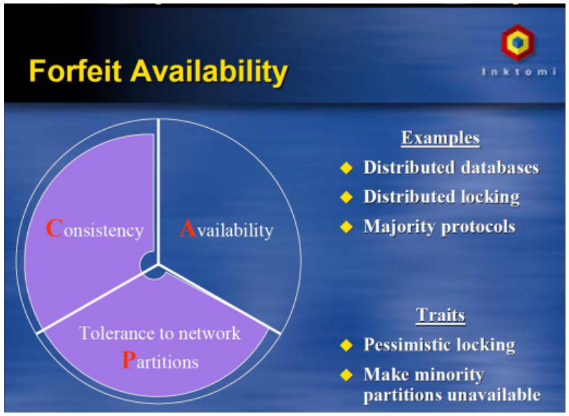

      - agresivni zamykani
      - ustoji male vypadky
      - napr. distribuovane DB a protokol pro vetsinovou shodu
      - napr. MongoDB

    - AP (= Availability + Partition Tolerance)
      - stridani uzlu
      - reseni konfliktu
      - optimisticka strategie
      - napr. Voldemort (key-value DB), DNS systemy

      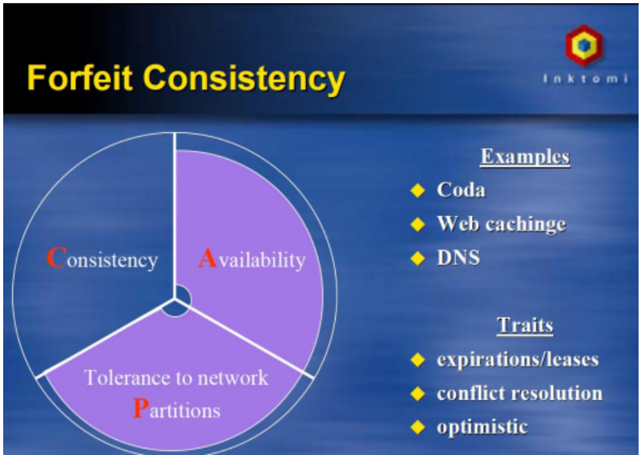

- kategorie NoSQL DB
  - typy
    - klic-hodnota
      - dvojice klic-hodnota
      - napr. pro cache
      - pristup podkle klice pres hash (rychle)
      - napr: Redis
    - dokumentove
      - jako klic-hodnota, ale hodnota je strukturovana
      - pro data s fixni nebo stromovou strukturou
      - nehodi se pokud je potreba znat vazbu mezi daty
      - naopak se hodi pokud jednotlive zaznamy nepotrebuji odkazovat na jiny
      - hodnota = JSON, XML, ...
      - napr: MongoDB
    - grafove
      - Grag = uzly + vlastnosti a hrany mezi nimi
      - moznost pouziti grafovych algoritmu
      - napr.: Neo4J
    - wide-column
      - sloupcove DB
      - ke kazdemu klici je mozne ulozit vice hodnot odpovidajici prislusnemu sloupci
      - organizuji data podle sloupcu namisto radku
      - pouzivaji se v pripadech kdy je vice zapisu nez cteni a data se pak uz neaktualizuji
      - napr. Cassandra, Hadoop, DynamoDB

- architektura NoSQL dtabazi
  - jednotlive implementace NoSQL DB systemu se od sebe hodne lisi
  - lze vsak vysledovat nejaka opakujici se architektonicka reseni
    - partitioning
      1) virtualni nody
          - NoSQL DB system je tvoreny velkym poctem nodu (serveru) ktere se lisi v konfiguraci
          - na jednom fyzickem serveru muzu bezet nekolik virtualnich nodu
          - virtualni nody pouziva napr. MongoDB
      2) deleni (sharding)
          - = metoda ktera rozdeluje velke soubory dat na nekolik serveru
          - pouziti napr. v MongoDB nebo Redis
          - shard v pojeti MongoDB je skupina serveru ktere udrzuji identicke kopie urcene casti dat
      3) hashing
          - nejjednodussi zpusob rozdeleni dat spociva v rozdeleni rozsahu primarniho klice
          - pomoci hash funkce na stejne casti, kdy kazda cast lezi na jednom serveru
          - klient pomoci hash funkce zjisti na jakem serveru lezi pozadavovana cast
          - nevyhoda
            - pri vypadku jednoho ze serveru nebo pri pridani dalsiho musi byt rozdeleni dat provedeno znovu
      4) consistent hashing
          - pouziti napr. v Cassandra nebo MongoDB
          - cely rozsah primarniho klice lezi na pomyslnem kruhu
          - kazda hodnota primarniho klice ma sveho spravce = prvni node na pomyslne kruznici ve smeru hodinovych rucicek
          - vyhoda
            - pridani, odebrani, nebo vypadek nodu se dotkne pouze sousednich nodu
            - redistribuce dat je nutna pouze mezi temito sousednimi nody

          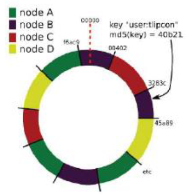

      5) replikace
          - k zajisteni odolnosti proti vypadkum serveru
          - velmi caste u horizontalniho skalovani
          - k zajisteni dostupnosti dat jsou data urdrzovana ve vice kopiich pomoci replikace

      6) sprava clenskych serveru (membership)
          - pridani/odebrani nodu musi probehnou bez dopadu na dostupnost DB
          - pridani noveho nodu
            - nodu nahodne vybere svoji pozici na pomyslne kruznici (hodnot primarniho klice)
            - oba nejblizsi sousedi predaji cast svych rozsahu a provedou zmeny v replikach
            - novy nody si zkopiruje data od svych sousedu a informuje o zmenach vsechny zbyvajici nody
            - to jestli je node down/up se da resit pomoci health-checku (pravidelny ping ktery musi nody posilat)
            - data zustavaji v jeho replikach
            - sousedni nody si opet upravi sve rozsahy vcetne vsech replik

      7) gossip
          - = protokol pro sireni stavovych informaci a detekci havarovanych nodu
          - gossip nepouziva broadcasty => kazdy node posila zpravy jen omezenemu poctu dalsich nodu
            - postupnym predavanim se zprava dostane ke vsem nodum

  - konzistence data
    - podle CAP teoremu nemuze byt dosazeno striktni konzistence s polecne s vysokou dostupnosti a toleranci k rozdeleni
    - => striktni konzistence je zamenena za pristup eventually consistent
    - => je zapotrebi rozhodnout ke ketere z konkurencich aktivit se priklonit (ktere nastaly drive)
      - casova znacka
        - zavisi na synchronizovanych hodinach na vsech serverech
        - velmi obtizne na implementaci
      - verzovani
        - udrzovani vice verzi dat jednotlivych radku DB
        - u kazde verze je ulozen casovy udaj
          - nemusi byt skutecny cas
          - => muze to byt jakakoliv hodnota co umoznuje urcit poradi aktualizaci
        - na dotaz klienta vraci databaze nejaktualnejsi hodnotu
          - take muze vracet nejaktualnejsi hodnotu pred zadanym casem
      - vektorove hodiny
        - zachycuje klauzolitu udalosti => umi resit konflikty
        - definovan jako N-tice hodin na kazdem nodu - `Vx{t_node1, ...., t_node_N}`
        - kazdy node si drzi citac -> inkrementace s kazdou provednou udalosti
        - aktualizace dat napr. pres gossip protokol
          - s daty se pouziva i casovy vektor (slozen ze vsech hodin na vsech serverech)
        - poradi je urceno porovnanim vektorovych hodin

        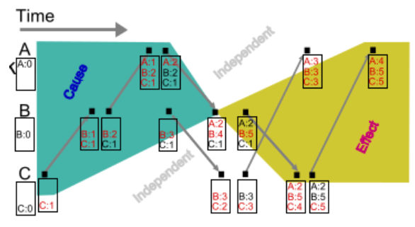

  - vyhledavani
    - mezi ruznymi NoSQL DB je velky rozdil v moznostech vyhledavani
    - DB skupiny klic-hodnota (key-value)
      - nabizeji vetsinou jen moznost vyhledavni pomoci primarniho klice a veskere dalsi operace jsou provadene na strane klientske aplikace
    - nekdete dokumentove a grafove DB majibohatsi dotazovaci jazyk pro provadeni komplexnejsich dotazu

    1) Companion SQL databaze
        - DB do ktere nakopiruji atributy podle ktere chci vyhledavat
        - schopnosti vyhledavani SQL jsou pouzity pro vyhledavani primarnich klicu podle kterych se potom pristupuje k datum v NoSQL DB

        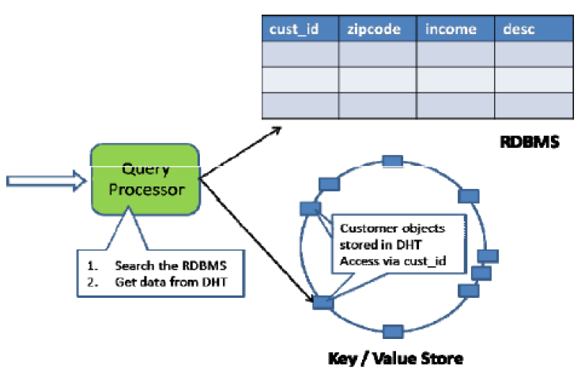

    2) Scatter-Gather lokalni vyhledavani
        - NoSQL DB umoznuje vyhledavani na jednotlivych nodech
        - dotaz od klienta je nejdrive pripraven dotazovacim zpracovatelem (queru processor)
        - dotaz rozesle na vsechny nody databaze kde je provedeno lokalni vyhledavani
        - kazdy z nodu posle vysledek lokalniho vyhledavani zpet zpracovateli ktery vysledek agreguje a posle klientovi

        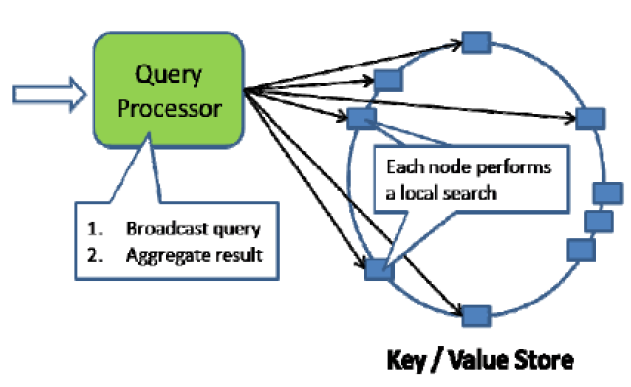

    3) Distributed B-tree
        - lze udelat hash atributu podle ktereho se bude vyhledavat a najit korenovy uzel distibuovaneho B-tree indexu
        - ten obsahuje hodnota ktera je identifikatorem jeho potomka
        - klient potom vyhledava uzel potomka
        - opakovanim toho procesu je dostazeno nodu, kde lezi vyhledavana data

        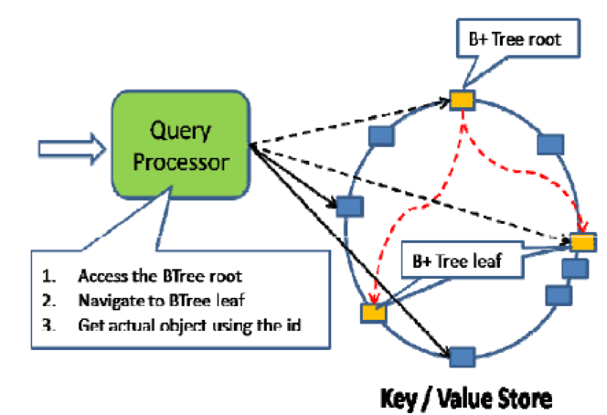

    4) Prefix Hashtable (Distributed Trie)
        - trie je stromova datova struktura kde kazdy uzel obsahuje vsechny podretezce, kterymi muze retezec pokracovat v dosud prohledavane ceste
        - => vsichni naslednici maji spolecny prefix
        - koren je asociovany s prazdnym retezcem
        - hodnoty nejsou obvykle asociovany se vsemi uzly ale jen s listy a nekterymi uzly ktere odpovidaji klicum

        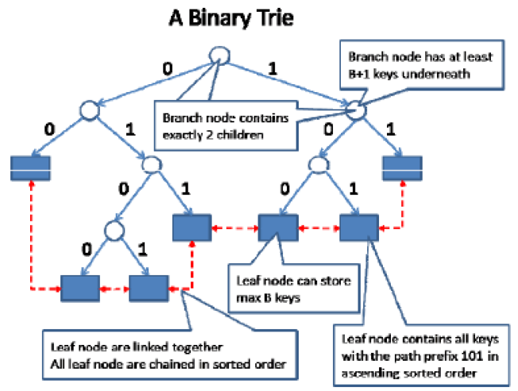

        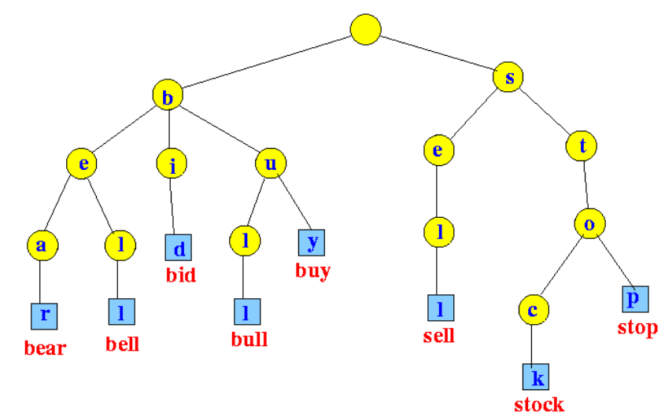
