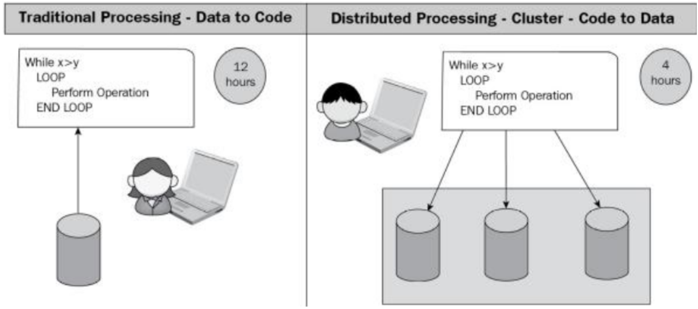
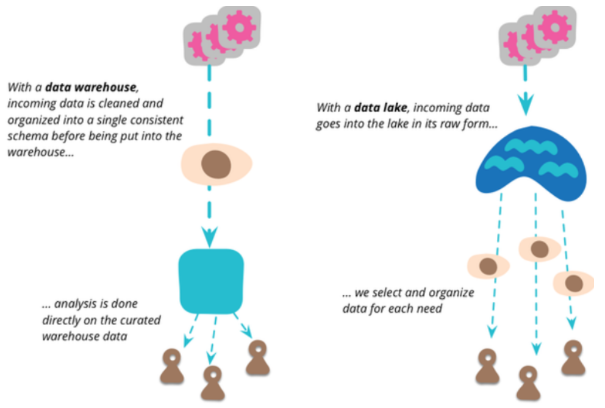
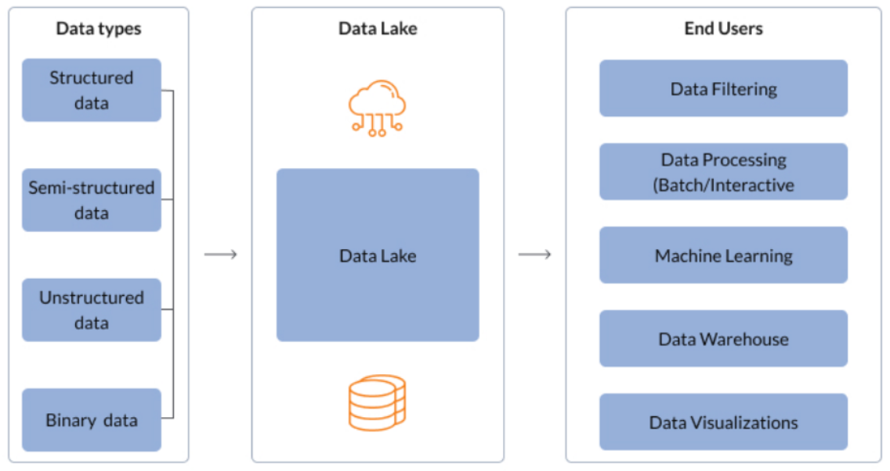
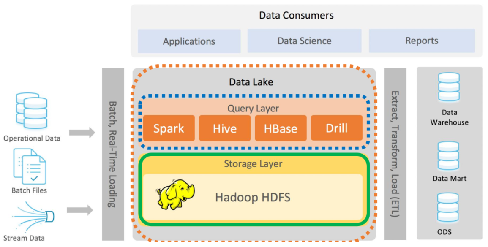
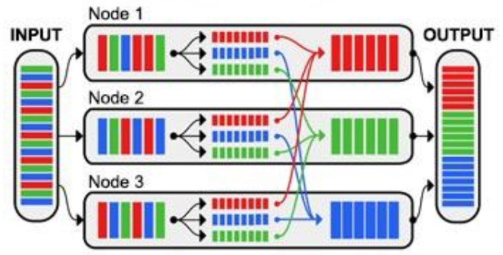
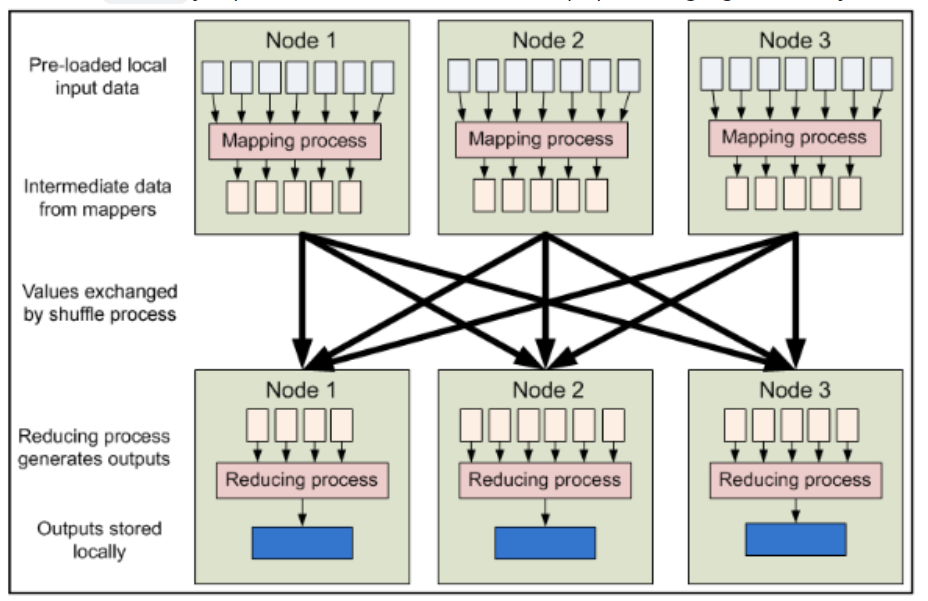
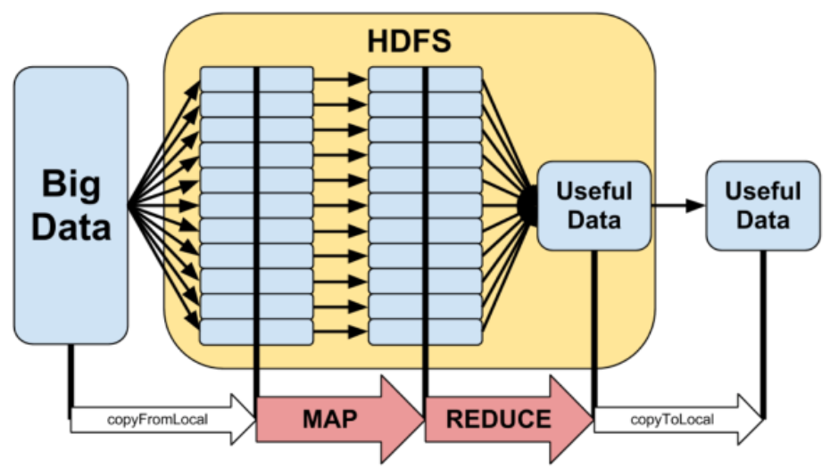
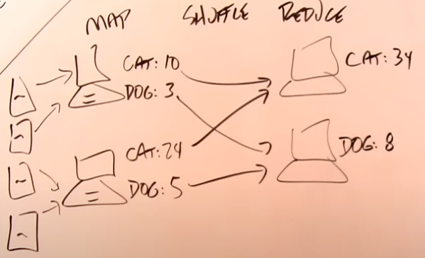

### 25 - Problém zpracování velkých dat, Big Data – charakteristické vlastnosti (5V), příklady uvedeného typu dat, alternativy zpracování, princip Map Reduce, Hadoop. [KIV/DB2, (KIV/DBM2, KIV/EITM)]

- Big Data
  - 5V
    - vlasnosti big data
    1) volume (hodne)
        - dat je mnoho a zpracovani trva prilis dlouho
        - exponencialne roztouci mnozstvi dat
        - twitter, uzaverky obchodovani...
    2) velocity (rychle)
        - data mohou vznikat i kontinualne
        - obrovske mnozstvi dat je potreba analyzovat v kratkem case
          - nekdy je treba i real-time zpracovani dat
        - detekce podvodu, optimalizacni ulohy
    3) variety (ruznorode)
        - ruznoroda data maji ruznou strukturu
            - => typicky tezko zpracovatelne pomoci relacni DB
            - nestrukturovana: video, senzoricka data, text
            - semistrukturovane: XML, JSON
        - rozpoznani pozadovane situace (udalosti) v zivem videostreamu
    4) veracity (verohodne)
        - rosouci mnozstvi zdroju dat a problematicka duvera v data
        - fake news
        - nebo napriklad kvalita dat (viz napr. rozbity senzor)
    5) value
        - jakou maji data hodnotu
    - => BigData jsou data ktera splnuji alespon 2V

  - problemy s definici (viz PPR)
    - vetsinou je zpracovani spolejene s distribuovanou zalezitosti ale co to vlastne je?
    - nikdo nevi presnou definici
    - "Big data is where parallel computing tools are needed to handle data"?
      - vagni definice
      - nezohlednuje neefektivni datove struktury, neefektivni program a shopnosti daneho programatora
      - neexistuje zadne ospravedlneni toho ze mnozstvi obrovskeho objemu dat je rozumne
    - historie
      - na starych PC (diskety 1.44 MB)
      - dnesni image OS by tehda predstavovali "BigData"
      - jak se to dnes lisi?
    - IoT (= Internet of Things)
      - hodne malych zarizeni produkuje ohromne mnozsvi dat
      - kam je ulozit?
      - jak je zpracovavat?
      - je to skutecny "BigData" problem? nebo jen preagregovany problem zpusobeny nadprodukci dat?
    - Kilometer Square Array
      - skutecny BigData problem
      - IoT zarizeni na rozloze 1km ctverecnim
  
  - viz EITM
    - data jejihz velikost je mimo schopnosti spravovat a zpracovavat (zachycovat) bezne pouzivanymi SW nastroji v rozumnem case
    - data NEJSOU centralizovana, vysoce strukturovana
    - napr meteorologie, IoT, prispevky na socialnich sitich, bankovni transakce, burza, ...
    - nelze udelat snadno globalni dotaz, nelze analyzovat vsechna data
    - kazde 3 roky se data zdvojnasobi

  - big data processing (viz DS)
    - paradigma code-to-data
      - zajistuje to ze se sit neucpe posilanim velkeho mnozstvi dat
    - distribuovane zpracovani dat predpoklada ze jsou data jiz ulozena distribuovana napric systemem
    - pri zpracovani dat si nody pouze vymenuji vysledky zpracovani (agregace)
      - vypocet probiha lokalni na kazdem uzlu
    - exekuce programu je imunni vuci selhani PC site nebo uzlu
      - pokud node selze, jeho prace je prirazena jinemu uzlu
    - distributed processing je implementovano s pouzitim znamych frameworku (Hadoop, Spark, Flink, ...)

    

  - reseni problemu velkych dat zahrnuje kombinaci nekolika veci
    - HW
    - distribuce dat
    - data management
    - analyza a vizualizace

  - zpusoby ukladani big data
    - data lakes
      - = centralni repozitar ktery nam dovoluje ulozit vsechny nase strukturovana i nestrukturovana data v jakemkoli meritku
      - muzeme zde ulozit vsechna data "tak jak je mame" bez toho abychom je strukturovali
      - analyza dat pomoci dashboardu
      - real-time analyza
      - strojove uceni (machine learning)
      - Data Warehouse vs Data Lake
        - Data Warehouse -> data ukladame pomoci ETL

        

      - date Lake kontext

        

      - umoznuji nam importovat libovolne mnozstvi dat ktere mohou prichazet real-time
      - data jsou shromazdena z vicero zdroju a jsou prestehovana do data lake ve svem originalnim formatu
      - tento proces nam dovoluje libovolne skalovat data bez toho aniz bychom ztraceli cas definovanim struktur, schemat a transformaci
        - jako je tomu napri u ETL a Data Warehousu
      - data lake architektura

         

  - stejne tak jsou podstatne distribuovane systemy
    - zajistuji distibuovane ukladani dat
    - napr.:
      - GFS (= Google File System)
        - distribuovany souborovy system
      - HDFS (= Hadoop Distributed File System)
        - soucasti Hadoop ekosystemu

- Apache Hadoop
  - = programove prostredi ktere umozunje paralelni beh data aplikaci v ramci vypocetniho clusteru
  - zahrnuje sadu nastroju pro distribuovane porizovani, ukladani a zpracovani velkych dat
  - framework - sada open-source komponent urcenych pro zpracovani velkeho mnozstvi nestrukturovanych a distribuovanych dat
  - podstata spociva v uloze dat na velkem mnozstvi samostatnych PC!
  - muze jit o bezny HW a tak je ulozeni techto dat levnejsi nez ukladani na specializovanem HW s vysokou dostupnosti
  - pro ulozeni je potom pouzit distribuovany souborovy system
    - napriklad HDFS (Haddop Distributed File System) - rozdeluje data na bloky + replikace
  - YARN (Yet Another Resource Negotiator) - resource manager & job scheduling - ridi zpracovani jobu (map-reduce) a spravuje zdroje

- Map-Reduce
  - programovaci model pro zpracovani mnoziny dat pomoci distribuovaneho zpracovani
  - Hadoop tento model vyuziva, ale MapReduce je obecna technika zpracovani
  - funkce Map
    - rozdeluje data jednotlivym uzlum
    - rozdeleni ulohy/dat + lokalni zpracovani
      - napr.: rozdeleni dokumentu mezi stroje a ty spocitaji vyskyt jednotlivych slov v nich
    - funkce shuffle - rozdeluje mezivysledky podle urciteho klice
      - napr: na jeden uzel pujdou pouze vyskyty slov "cat" a na dalsi "dog"
  - funkce reduce
    - je zpracovani dat na danem uzlu (pripadna agregace dat z jineho uzlu)
    - spojeni (agregace) vysledku z map faze
      - napr: jeden uzel spocte celkovy vyskyt slov "cat" ve vsech dokumentech (secte mezivysledky z map faze)

   

   

   

  - musi byt robustni, selhani jednoho nodu nesmi sundat cely system
  - map-reduce framework
    - uzivatel jen naprogramuje map a reduce funkci

  
