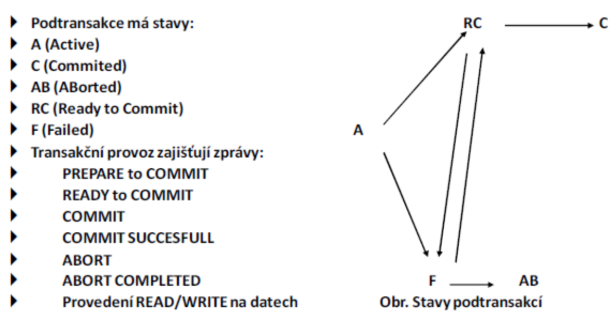
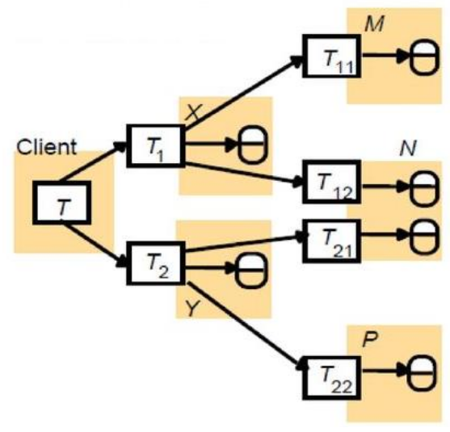
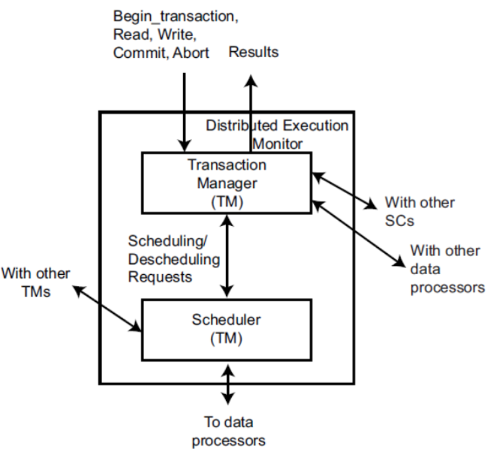
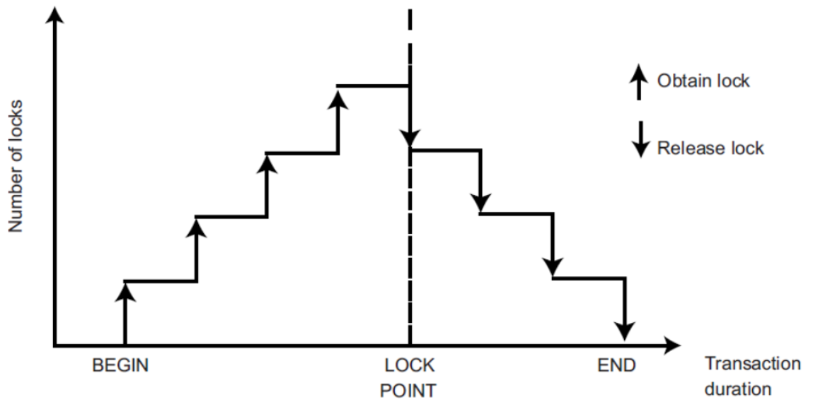
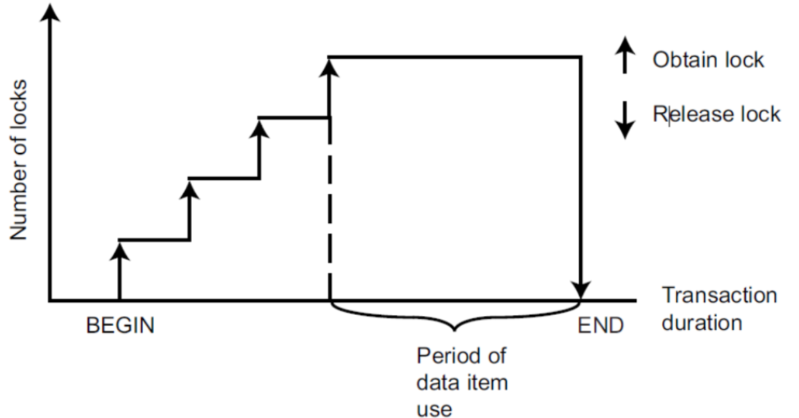
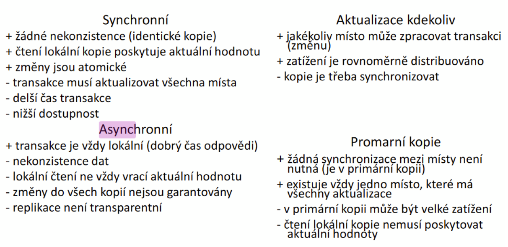
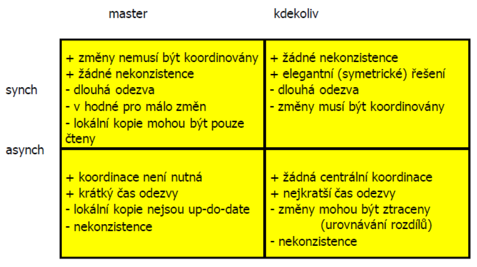

### 26 - Distribuované databáze – koncepce distribuovaného databázového systému, replikace a fragmentace dat, distribuovaná správa transakcí. [KIV/DB2]

- definice
  - distribuovany system je takovy system propojeni mnoziny nezavislych uzlu, ktere poskytuje uzivateli dojem jednoho systemu
  - jednotny obraz systemu, virtualni uniprocesor
  - HW nezavislost
    - uzly jsou tvoreny nezavislymi pocitaci s vlastnim procesorem a pameti
    - komunikace typicky pres sitove rozhrani
  - dojem jednoho systemu
    - clovek i SW komunikuje s distrubuovanym systemem jako s celkem
    - => nemusi se starat o pocet uzlu, topologii, komunikaci, atd.
  - v databazi neexistuje zadny centralni uzel nebo proc
    => - vyrazne zvyseni odolnosti proti padu systemu

- pozadavky na idealni DDBS (= Distribuovany Databazovy System)
  - distribuovane zpracovani dotazu
  - distribuovana sprava transakci
  - system se na venek jevi jako nedistribuovany
  - nespoleha se na centralni uzel
  - nezavislost na fragmentaci
  - nezavislost na umisteni dat (transparentnost)
  - nepretrzita cinnost
  - spolehlivost
  - skalovatelnost
  - nezavislost na HW, OS, komunikacni siti

- nevyhody distribuovanych DB
  - slozitejsi
  - drazsi
  - vyzaduji vice udrzby
  - je slozite je migrovat
  - je potreba resit transakce v distribuovanym prostredi
  - komunikace po siti je pomala
    - => nutne optimalizovat pocet posilanych zprav a jejich velikost
    - implementace napr. pres MPI (= Message Passing Interface)
    - jednotlive uzly site mohou mit ruznou uroven autonomie

- taxonomie
  - autonomie
    - tesna integrace
      - kazda dilci DB ma kompletni informace o datech v jinych DB
    - poloautonomie
      - databaze jsou nezavisle a castecne sdileji data
    - uplne izolace
      - dilsi DB nemaji poneti o ostatnich DB
      - jsou schopny plne fungovat samostatne
      - komunikace mezi nimi musi byt zajistena ve vyssi aplikacni vrstve pres vymenu zprav
  - databaze mohou byt heterogenni -> ne vsechny uzle DB jsou stejne

- distribuovane zpracovani transakce
  - transakce = posloupnost operaci ktere se provedou bud vsechny nebo zadna (viz ACID)
  - transakce v distirbuovanym prostredi jsou rozdeleny na podtransakce
    - provadeny na ruznych mistech

  

  - dvoufazovy potvrzovaci protokol
    - faze 1
      - koordinator zasle vsem nodum (kde se provadeji podtransakce dane transakce) zpravu s pozadavkem na pripravenost (PREPARE to COMMIT)
      - pokud nekdo hlasi nepripravenost, koorndinator transakce provede ROLLBACK
        - vsem mistup (podtransakcim) posle ABORT
    - faze 2
      - pokud vsechny nody oznami READY to COMMIT tak koordinator transakce potvrdi transakci (oznaci si ji jako provedenou) a vsem zainteresovanym nodum posle zpravu COMMIT -> ta bude drive nebo dorucena
    - umi vyresit velke mnozstvi problemu spojenych se siti a selhanim HW pomoci logu a dostat system do konzistentniho stavu
    - existuje ale posloupnost udalost ktere obnovu znemozni (na ktere je dvoufazovy commit kratky)
      - => existuje trifazovy commit

  

- transakcni model
  - API
    - begin: zapocni transakci (zacatek)
    - read: cteci operace
    - write: zapisova operace
    - end: konec transakce
    - commit: zajisti trvale ucinky transakce
    - abort: rollback do predchoziho konzistentniho stavu

  - architektura

    

- Concurrency Control
  - cilem: serializovatelnost
  - pouzity mechanismus: klasifikace
  - Control Mechanisms Classification
    - nejbeznejsim kriteriem klasifikace je synchronizacni primitivum
  - pro serializovatelnost?
    - je to nejrozsirenejsi kriterium spravnosti pro algoritmy soubezneho rizeni
  - dve hlavni tridy algorimu
    - pouziti vzajemneho vylouceni pri pristupu ke sdilenym datum (zamykani)
    - snaha udporadat vykonani transakci dle dane mnoziny pravidel (protokolu)
  - algoritmy s dve ruznymy uhly pohledu
    - persimisticky: hodne transakci bude v konfliktnich
    - optimisticky: jen par transakci bude konfliktnich

- dvoufazove zamykani
  - jednoduse rika ze zadna transakce by nemela pozadat o uzamceni po tom co uvolni jeden ze svych zamku
  - alternativne: transakce by nemela uvolnit zamek dokud neni jiste ze nepozada o dalsi zamykani (dalsi zamek)
  - dve faze: Growing (nahoru), Shrinking (dolu)
  - dvoufazove zamykani

     

  - striktni dvoufazove zamykani

    

- transparence
  - u distribuovanych DB a obecne distribuovanych systemu resime transparenci = jak moc si je uzivatel vedom toho ze je dystem distribuovany
    - datova: pro uzivatele je pruhledna fyzicka a logicka organizace dat
    - sitova: pro uzivatele je pruhledna sitova strana operaci
    - replikacni: uzivatel nevi o tom ze existuje vice kopii dat
    - fragmentacni: uzivatel nevi o tom ze ne vsechna data jsou na jednom miste

- fragmentace
  - vhodne pokud se v kazdem uzlu systemu pracuje pouze s casti tabulky
  - rozdeleni relace na nekolik subrelaci, ktere se umisti do jednotlivych DB
  - data jsou umistena tam kde jsou nejcasteji pouzivana => rychlost odezvy!
  - omezeni sitovych prenosu
  - vyssi bezpecnost -> data pouze tam kde jsou potreba
  - musi byt - uplna, disjunktni, rekonstruovatelna
  - typy
    - horizontalni (selekce) = podmnozina radku
    - vertikalni (projekce) = podmnozina sloupcu
    - smisena - kombinace

- replikace dat
  - udrzovani kopii tabulek nebo fragmentu ve vice DB
  - omezovani sitovych prenosu
  - zvyseni dostupnosti dat pri vypadku castu DS
  - narocna udrzba kopii
  - vhodne pro castopouzivana data ktera se malo aktualizuji
  - typy
    - synchronni
      - aktualizace na vsech uzlech
      - soucasti transakce je i synchronizace
      - vykon vs spolehlivost
    - asynchronni
      - synchronizace na vyzadani nebo v pravidelnych intervalech
      - nemusi byt vzdy aktualni
  - typy podle zpusobu provadeni repliky
    - pouze zmenene radky => nutny log zmenenych radku
    - uplna (poslem vse i kdyz se to nezmenilo)
    - DML prikazy (provedou se stejne operace jako nad originalni kopii dat)
  - podle typu zachazeni s replikami
    - pouze pro cteni (master-slave)
      - zmeny jsou mozne provest jen u mastera
      - repliky jsou read-only
    - pro transakcni zpracovani
      - zmeny je mozne provadet i v replikach
        - => musi se sychronizovat obousmerne
      - prinasi radu problemu (napr. konflikty pri zmene)

  

  
