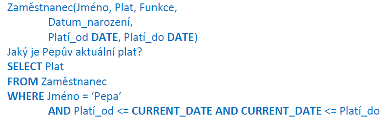
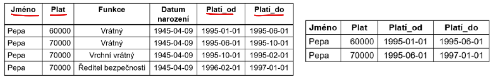
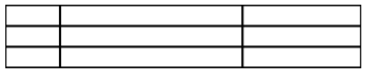
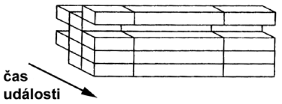
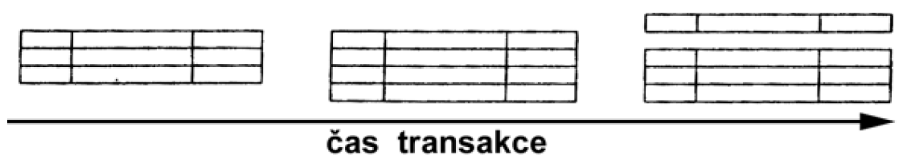
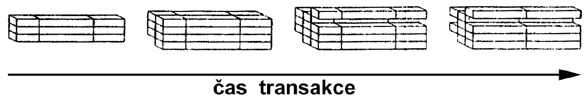
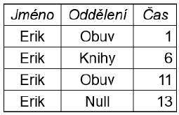
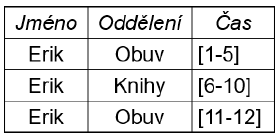
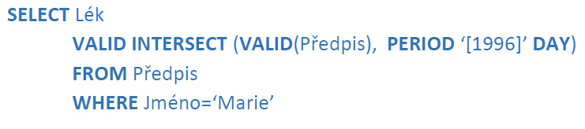
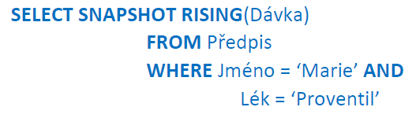

### 27 - Temporální databáze, porovnání klasických a temporálních databází, modely času, vztah událostí a času (snapshot), temporální SQL. [KIV/DB2]

- temporalni DB umoznuji praci s case, narozdil od normalnich DB - ty praci s casem podporuji ale jen v omezenem rozsahu nebo za pouziti komplikovanych dotazu

- motivace
  - potrebujeme cas v DB?
  - studijni informacni system
  - skladova evidence
    - zbozi ktere je autkalne na sklade, jeho mnozstvi
    - zajima je take historie pro konkretni druhy zbozi
      - kolik se ho za danou dobu prodalo
  - ucetni a bankovni systemy
  - dochazkove systemy
    - kdo kdy prisel, zda byl v danou hodinu v budove

- klasicke vs termporalni DB
  - klasicky databazovy system
    - zachycen stav systemu v aktualnim casovem okamziku
      - pridani novych, mazani starych
    - problem: co delat se starymi daty
    - neobsahuji informaci o case
    - chceme-li uchovavat historii zmen musime do DB doplnit informaci o case
      - => aktualizaci a operace s casem musi zajistit clovek -> neni trivialni
  - temporalni databazovy system
    - urcitym zpusobem podporuji cas
    - vhodny dotazovaci jazyk zahrnujici praci s casem
    - vyhodou jsou jednodussi dotazy v nihz se vyskytuje cas => mene chyb v aplikacnim kodu

- priklad
  - chceme znat zamestnancuv aktualni plat

  

  - chceme-li jen aktualni stav -> nepotrebujeme temporalni DB
  - temporalni BD -> klasicky pridavame dva sloupce s daty od do => evidence historie zmen
  - pokud by jsme brali v uvahu napr. i jeho vsechna pozice => potreba data hodnote transformovat a joinovat

- temporalni projekce
  - jako projekce v klasickych DB = podmnozina atributu (sloupcu)
  - navic ale i kazda n-tice obsahuje cas
  - v klasickych DB predstavuje netrivialni problem a zeslozituje udrzbu aplikace

  

- temporalni spojeni
  - stejne jako spojeni (join) v klasickych DB
  - sloupce + podminka kdy jsou radky spojeny
  - v temporalnich DB ale nemusime zadavat sloupce uchovavajici cas
    - pouze nutnou podminku na spojeni pro cas

- modely casu
  - temporalni logika = cas je libovolna mnozina okamziku s danym usporadanim
  - modely casu podle usporadani
    - linearni
      - cas roste od minulosti k budoucnosti linearne
    - vetveny (cas moznych budoucnosti)
      - linearni minulost az do ted
      - pak se vetvi do nekolika casovych linii reprezentujicich mozny sled udalosti
      - kazda linie se muze dale vetvit
    - cyklicky
      - opakujici se procesy
      - priklad: tyden - kazdy den se opakuje po sedmi dnech
  - modely casu podle hustoty
    - diskretni
      - spolu s linearnim usporadanim
      - kazdy okamzik ma prave jednoho naslednika
      - kazde prirozene cislo odpovida nerozlozitelne jednotce casu (= chronon)
      - chronon je nejmensi casova jednotka reprezentovatelna v diskretnim modelu
        - neni to okamzik ale doba!
    - husty
      - isomorfni s racionalnymi nebo realnymi cisly
      - mezi kazdymi dvema okamziky existuje nejaky dalsi
    - spojity
      - isomorfni s realnymi cisly
      - narozdil od racionalnich cisel neobsahuje "mezery"
      - kazde realne cislo odpovida bodu v case (okamziku)
  - omezenost casu
    - omezeny - nutnost zejmena kvuli reprezentace v PC
    - neomezeny
  - absolutni vs relativni cas
    - absolutni - vyjadri se hodnoutou (take ale potrebuje pocatek)
    - relativni - vyzauje nejaky pocatek, cas se pak vyjazdri jako vzalenost a smer od pocatku

- datove typy pro cas
  - casovy okamzik (DATE, TIME, TIMESTAMP)
  - casovy usek
    - dobe mezi dvema casovymi okamziky
    - napr. 15:30 - 15:50
  - casovy interval
    - doba o specifikovane delce
    - bez konkretnich krajnich bodu
    - napr. 30 min
  - datove typy reprezentujici cas musi byt reprezentovatelne v PC!
  - nejjednodussim zpusobem je omezena diskretni reprezentace celociselnym poctem casovych okamziku od pevneho pocatku
  - husta reprezentace
    - pomerne jednoducha na implementaci protoze racionalni cisla jsou "husta" a daji se vyjadrit podilem dvou celych cisel
  - spojita reprezentace je slozitejsi

- vztah udalosti a casu
  - cas platnosti
    - cas kdy byla udalost pravdiva v realnem case
    - muze byt v minulosti, pritomnosti i budoucnosti
    - nezavisly na zaznamenavani udalosti do DB
  - transakcni cas, cas transakce
    - cas kdy byl fakt reprezentovan v DB
    - nabyva pouze aktualni hodnoty
    - monotonne roste
    - identifikuje transakci ktera vlozila data do DB
  - cas platnosti a transakcni cas jsou ortogonalni, v nekterych pripadech mohou byt i korelovane
  - snapshot = podoba DB v jeden okamzik
    - datovy model nepodporujici cas platnosti ani transakcni cas
    - snapshot relace
      - klasicky relacni model
      - kazda n-tice je fakt platny v realnem case
      - pri zmene realneho sveta jsou do relace prvky pridavany nebo z ni odebirany
        - => nevytvari se snapshoty jako u trasakcniho casu ale pouze se modifikuje existujici relace (tabulka)

    

  - valid time
    - datovy model podporujici pouze cas platnosti
    - valid-time relace
      - cokoliv v relaci muze byt upraveno
      - hodnoty n-tic
      - cas udalosti (zacatek i konec)
      - umoznuje klast dotazy o faktech platnych v minulosti i budoucnosti
      - nelze zjistit stav DB v konretnim casovem okamziku (transaction time)

    

  - transaction time
    - datovy model podporujici pouze transakcni cas
    - transaction-time relace
      - posloupnost snapshotu indexovane transakcnim casem!
      - umoznuje ziskat informace ze stavu DB v nejakem okamziku minulosti
      - je mozne uvazovat i vetveni
      - priklad
        - na zacatku byla transakce prazdna
        - prvni instrukce do relace vlozila tri fakty (n-tice) => coz znamena pridani noveho snapshotu s casem commitu do posloupnosti
        - dalsi transakce vlozila jednu n-tici
        - posledni transakce odstranila prvni n-tici a jinou vlozila

        

      - narozdil od snapshot relaci transakce nemodifikuji existujici data v transaction-time relacich
      - zmena provedena ve snapshotu aktualniho stavu = nove vznikly pridany stav do relace
      - transaction-time relace jsou read-only

- bitemporalni
  - = datovy model podporujici cas platnosti i transakcni cas
  - bitemporalni relace
  - append-only
  - priklad
    - na zacatku byla transakce prazdna
    - prvni transakce vlozila tri fakty (n-tice)
    - dalsi transakce vlozila do relace jednu n-tici
    - posledni transakce ukoncila jednu udalost
      - logicky odstranila z relace prvni n-tici a jinou vlozila
    - byl zmenen cas platnosti (pocatek na pozdejsi cas) udalosti ktera byla vlozena v prvni transakci

    

- temporalni
  - = datovy model podporujici cas platnosti NEBO transakcni cas
  - obvykle zalozeno na realnem datovem modelu nebo objektove orientovanem datovem modelu
  - reprezentace casu platnosti
    - casovy okamzik
    - doba
    - casovy sek
    - mnozina useku
    - cas platnosti muze byt pridruzen k
      - atributu
      - mnozine atributu
      - cele n-tici nebo objektu
    - => rozsireni operaci relacni algebry
  - reprezentace transakcniho casu
    - casovy okamzik
      - nova n-tice se stejnym klicem => logicke odstraneni puvodni
    - casovy usek
      - "ted, dokud nezmeneno"
    - tri casove okamziky
      - cas zaznamenani zacatku udalosti v realnem svete
      - cas zaznamenani konce udalosti v realnem svete
      - cas logickeho odstraneni udalosti z DB
    - mnozina casovych useku

  - priklady temporalnich datovych modelu
    - Segevuv
      - podporuje jen cas platnosti
      - razitko oznacuje cas kdy fakt zacal platit

      

    - Sarduv
      - podporuje jen cas platnosti
      - razitko ma podobu intervalu
      - narozdil od Segevovo modelu nepotrebujeme `Null` hodnotu pro indikaci toho ze Erik skoncil praci

      

    - datovy model HRDM

- temporalni SQL
  - podpora v SQL puvodne TSQL2
    - => pokus o zacleneni TLSQL2 do SQL3
    - ale nakonec jenom cast jako SQL/Temporal
    - v roce 2011 podpora transaction-time, valid-time a bi-temporal v SQL
  - podporuje definici transaction-time a valid-time pro tabulky!
  - umoznuje nad temito informacemi provadet dotazy
    - napr
      - `BETWEEN x AND y`
      - `AS OF x`
      - `CONTAINED IN x`
      - `PRECEDES / SUCCEEDS x`
      - `OVERLAP x`
      - a dalsi
  - priklady dotazu
    - kdo bral (bere) lek proventil?

      

      - komu byl predepsany nejaky lek a kdy?

        

      - TSQL2 provede automaticky slevani a tak je vysledkem mnozina radku, kazdy asociovany s jednou nebo vice maximalnich period behem kterych pacient bral alespon jeden lek

    - restrukturalizace
      - na urovni klauzole FROM se provede projekce a slevani
      - kdo mel (ma) brat nejaky lek dele nez 6 mesicu (v souhrnu)?

      

    - parcializace
      - kdo mel predepsany jeden lek dele nez 6 mesicu neprerusovane?
      - nekdy potrebujeme zjisit maximalni souvisle obdobi

      

    - klauzole VALID
      - Jake leky mela Marie predepsane v roce 1996?

      

    - rising
      - jake bylo nejdelsi obdobi kdy davka Proventilu pro Marii rostla?

      

  - shrnuti
    - vysledek bez podpory casu - SELECT SNAPSHOT
    - restrukturalizace
      - provede projekci na vybrane sloupce a provede sliti casu platnosti ekvivalentnich radku
    - paritioning (particializace)
      - vybere nejdelsi interval(y) casu platnosti pro kazdou radku
